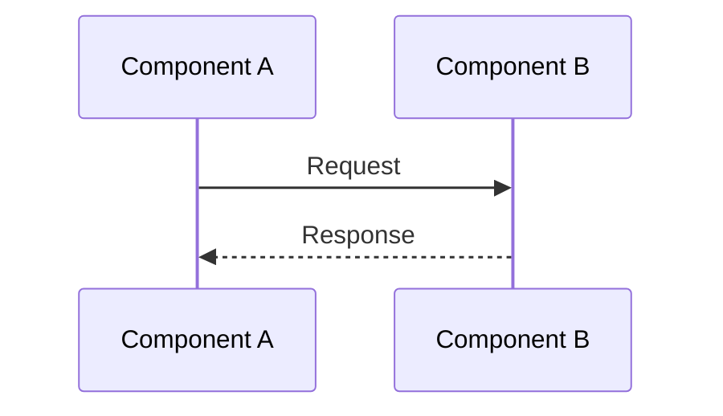
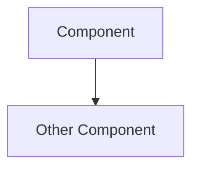
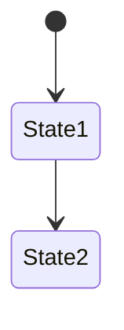

# SPIKE Architecture Diagrams

Comprehensive sequence diagrams, architecture diagrams, and technical
documentation for the SPIKE secret management system.

**Generated:** 2025-12-02

**Note:** These diagrams complement the official documentation under
`docs-src/`. While documentation may lag the codebase after major
refactorings, these diagrams are generated directly from current code analysis.

---

## Table of Contents

1. [Break-the-Glass Recovery and Restore](#1-break-the-glass-recovery-and-restore)
2. [Bootstrapping Flows](#2-bootstrapping-flows)
3. [SPIKE Cipher Modes](#3-spike-cipher-modes)
4. [Nexus-Keeper Interaction](#4-nexus-keeper-interaction)
5. [Policy Creation Flow](#5-policy-creation-flow)
6. [Database Schema](#6-database-schema)
7. [Encryption Flows](#7-encryption-flows)
8. [Root Key Management](#8-root-key-management)
9. [Root Key Sharding](#9-root-key-sharding)
10. [System Overview](#10-system-overview)
11. [Secret Lifecycle](#11-secret-lifecycle)
12. [mTLS with SPIFFE](#12-mtls-with-spiffe)
13. [Demo Application](#13-demo-application)

---

## Diagrams

### 1. Break-the-Glass Recovery and Restore

**File:** [`claude_diagrams_01_break_glass_recovery.md`](claude_diagrams_01_break_glass_recovery.md)

**Contents:**
- Recovery flow: Generate shards from running Nexus
- Restore flow: Rebuild root key from operator-held shards
- Shard validation and threshold logic
- Security considerations

**Key Concepts:**
- Operator-initiated recovery procedure
- Shamir Secret Sharing for disaster recovery
- Shard distribution to `~/.spike/recover/`
- Threshold requirement (e.g., 3 of 5 shards)

**Use Cases:**
- Disaster recovery when all Keepers fail
- Planned maintenance requiring root key backup
- Emergency access to secrets

---

### 2. Bootstrapping Flows

**File:** [`claude_diagrams_02_bootstrapping.md`](claude_diagrams_02_bootstrapping.md)

**Contents:**
- Root key generation process
- Shard creation with Shamir Secret Sharing
- Distribution to Keepers
- Verification process
- Kubernetes vs. bare-metal differences

**Key Concepts:**
- One-time system initialization
- Cryptographically secure root key generation
- P256 elliptic curve scalar
- Keeper shard distribution
- Bootstrap completion marker (ConfigMap or env var)

**Use Cases:**
- Initial SPIKE deployment
- Fresh cluster setup
- Development environment initialization

---

### 3. SPIKE Cipher Modes

**File:** [`claude_diagrams_03_cipher_modes.md`](claude_diagrams_03_cipher_modes.md)

**Contents:**
- JSON mode: Structured request/response
- Stream mode: Binary for large data
- Encryption and decryption flows
- Format specifications
- Performance considerations

**Key Concepts:**
- AES-256-GCM encryption service
- Two operational modes (JSON and stream)
- Client-side encryption without secret storage
- 12-byte GCM nonce
- mTLS authentication

**Use Cases:**
- Application-level encryption
- Large file encryption
- Encrypt-before-store patterns
- Zero-knowledge architectures

---

### 4. Nexus-Keeper Interaction

**File:** [`claude_diagrams_04_nexus_keeper_interaction.md`](claude_diagrams_04_nexus_keeper_interaction.md)

**Contents:**
- Periodic shard distribution (Nexus → Keeper)
- Shard retrieval during recovery (Nexus ← Keeper)
- mTLS communication
- Retry logic and failure handling
- Deterministic shard generation

**Key Concepts:**
- Bidirectional shard flow
- 5-minute periodic updates (configurable)
- Threshold-based root key reconstruction
- In-memory shard storage (not persisted)
- Keeper redundancy for high availability

**Use Cases:**
- Nexus restart recovery
- Keeper failure tolerance
- Continuous shard synchronization
- Distributed key management

---

### 5. Policy Creation Flow

**File:** [`claude_diagrams_05_policy_creation.md`](claude_diagrams_05_policy_creation.md)

**Contents:**
- Policy creation via SPIKE Pilot CLI
- Input validation (regex patterns)
- Authorization checks (admin role)
- Encryption at rest
- Policy matching at runtime

**Key Concepts:**
- Regex-based patterns (NOT globs)
- SPIFFE ID pattern matching
- Path pattern matching (namespace-based)
- Permission hierarchy
- First-match grant access

**Use Cases:**
- Access control configuration
- Multi-tenant isolation
- Fine-grained authorization
- Role-based access control

**Important:** Paths are namespaces (e.g., `secrets/db/creds`), not Unix paths
(never start with `/`).

---

### 6. Database Schema

**File:** [`claude_diagrams_06_database_schema.md`](claude_diagrams_06_database_schema.md)

**Contents:**
- Entity-Relationship diagram
- Table definitions (policies, secrets, secret_metadata)
- Encryption details
- Indexing strategy
- Version management

**Key Concepts:**
- SQLite backend (`~/.spike/data/spike.db`)
- All sensitive data encrypted (AES-256-GCM)
- Secret versioning with metadata
- Soft delete support
- Automatic version pruning

**Tables:**
- `policies`: Access control rules (encrypted)
- `secrets`: Secret data with versioning (encrypted)
- `secret_metadata`: Version tracking and lifecycle

---

### 7. Encryption Flows

**File:** [`claude_diagrams_07_encryption_flows.md`](claude_diagrams_07_encryption_flows.md)

**Contents:**
- Secret encryption process
- Secret decryption process
- Policy encryption process
- Policy decryption and caching
- Nonce management

**Key Concepts:**
- AES-256-GCM authenticated encryption
- Unique nonce per secret version
- Shared nonce per policy (atomic update)
- Root key as encryption key
- Policy authorization flow with database queries per check

**Security Properties:**
- Confidentiality (256-bit key)
- Integrity (authentication tag)
- Authenticity (AEAD)

---

### 8. Root Key Management

**File:** [`claude_diagrams_08_root_key_management.md`](claude_diagrams_08_root_key_management.md)

**Contents:**
- Root key generation (Bootstrap)
- In-memory storage (never persisted)
- Initialization flow
- Lifecycle state machine
- Validation logic

**Key Concepts:**
- 32-byte cryptographically secure random seed
- P256 elliptic curve scalar
- Memory-only storage (global variable)
- Mutex-protected concurrent access
- Automatic recovery from Keepers

**Security:**
- Never touches disk
- Erased on process termination
- Protected by OS-level ASLR and DEP
- No rotation (current limitation)

---

### 9. Root Key Sharding

**File:** [`claude_diagrams_09_root_key_sharding.md`](claude_diagrams_09_root_key_sharding.md)

**Contents:**
- Shamir Secret Sharing mathematics
- Shard generation process
- Deterministic shard creation
- Shard reconstruction
- Distribution scenarios

**Key Concepts:**
- Threshold scheme (t+1 shards needed)
- Polynomial interpolation
- Lagrange reconstruction
- Information-theoretically secure
- Deterministic from root key (same key = same shards)

**Configuration:**
- `SPIKE_SHAMIR_THRESHOLD`: Minimum shards needed
- `SPIKE_SHAMIR_SHARES`: Total shards generated
- Example: 5 shards, need any 3 to reconstruct

---

### 10. System Overview

**File:** [`claude_diagrams_10_system_overview.md`](claude_diagrams_10_system_overview.md)

**Contents:**
- Complete architecture diagram
- Component descriptions
- Data flows
- Security architecture
- High availability design
- Deployment architectures (Kubernetes and bare-metal)

**Components:**
- SPIRE Server: Certificate authority
- SPIRE Agents: Workload attestation
- SPIKE Nexus: Secret management service
- SPIKE Keepers: Shard storage (5 instances)
- SPIKE Pilot: CLI tool
- SPIKE Bootstrap: Initial setup
- Applications: Secret consumers

**Key Flows:**
- Secret write (Pilot → Nexus → DB)
- Secret read (App → Nexus → DB)
- Shard distribution (Nexus → Keepers)
- Recovery (Keepers → Nexus)

---

### 11. Secret Lifecycle

**File:** [`claude_diagrams_11_secret_lifecycle.md`](claude_diagrams_11_secret_lifecycle.md)

**Contents:**
- Secret creation (put)
- Secret read (get)
- Secret updates (versioning)
- Secret versioning
- Soft delete and undelete
- Secret list
- Version pruning

**Lifecycle Stages:**
1. Creation (version 1)
2. Reading (current or specific version)
3. Updating (create new version)
4. Soft deletion (reversible)
5. Undelete (restore)
6. Pruning (automatic old version removal)
7. Hard deletion (permanent)

**Operations:**
- `spike secret put path key=val` - Create/update
- `spike secret get path` - Read current version
- `spike secret get path --version N` - Read specific version
- `spike secret delete path` - Soft delete
- `spike secret undelete path` - Restore
- `spike secret list` - List accessible secrets

---

### 12. mTLS with SPIFFE

**File:** [`claude_diagrams_12_mtls_svid.md`](claude_diagrams_12_mtls_svid.md)

**Contents:**
- SVID acquisition from SPIRE
- mTLS server setup
- mTLS client setup
- SPIFFE ID extraction and validation
- Peer validation with predicates
- Complete mTLS handshake flow
- SVID rotation

**Key Concepts:**
- X.509 SVID (SPIFFE Verifiable Identity Document)
- SPIFFE ID in certificate SAN
- Workload API (Unix domain socket)
- Automatic SVID rotation (~1 hour TTL)
- Mutual TLS authentication
- Zero-trust architecture

**Security:**
- No shared secrets
- No password management
- Certificate-based authentication
- Short-lived certificates
- Automatic rotation (zero downtime)

---

### 13. Demo Application

**File:** [`claude_diagrams_13_demo_app.md`](claude_diagrams_13_demo_app.md)

**Contents:**
- Complete demo app flow
- SVID acquisition
- SPIKE SDK integration
- Put and get secret operations
- Prerequisites (SPIRE registration, policies)
- Error scenarios
- Integration patterns

**Key Operations:**
1. Acquire SVID from SPIRE Agent
2. Create SPIKE API client
3. Put secret to Nexus
4. Get secret from Nexus
5. Use secret in application

**Prerequisites:**
- SPIRE registration entry
- SPIKE policy granting access
- SPIKE Nexus running

**Integration Patterns:**
- Initialization secret fetch
- On-demand secret fetch
- Cached secrets with refresh

---

## Quick Reference

### Key File Locations

**Entry Points:**
- `app/nexus/cmd/main.go` - SPIKE Nexus
- `app/keeper/cmd/main.go` - SPIKE Keeper
- `app/spike/cmd/main.go` - SPIKE Pilot (CLI)
- `app/bootstrap/cmd/main.go` - SPIKE Bootstrap
- `app/demo/cmd/main.go` - Demo application

**Core Logic:**
- `app/nexus/internal/state/` - State management
- `app/nexus/internal/route/` - HTTP handlers
- `app/nexus/internal/initialization/recovery/` - Root key recovery
- `internal/auth/` - Authentication and authorization
- `internal/crypto/` - Cryptographic primitives

**Database:**
- `app/nexus/internal/state/backend/sqlite/ddl/statement.go` - Schema
- `app/nexus/internal/state/backend/sqlite/persist/` - Persistence

---

### Key Environment Variables

**SPIKE Nexus:**
```bash
SPIKE_NEXUS_TLS_PORT=8553
SPIKE_KEEPERS=https://keeper1:8554,https://keeper2:8554,...
SPIKE_SHAMIR_THRESHOLD=3
SPIKE_SHAMIR_SHARES=5
SPIKE_BACKEND_STORE_TYPE=sqlite
SPIKE_DATA_DIR=~/.spike/data
SPIKE_RECOVERY_KEEPER_UPDATE_INTERVAL=5m
```

**SPIKE Keeper:**
```bash
SPIKE_KEEPER_TLS_PORT=8554
```

**SPIRE:**
```bash
SPIFFE_ENDPOINT_SOCKET=unix:///run/spire/sockets/agent.sock
```

---

### Common Commands

**Secret Operations:**
```bash
# Put secret
spike secret put path key=value

# Get secret (current version)
spike secret get path

# Get specific version
spike secret get path --version 2

# Delete secret (soft delete)
spike secret delete path

# Undelete secret
spike secret undelete path

# List secrets
spike secret list
```

**Policy Operations:**
```bash
# Create policy
spike policy create my-policy \
  --spiffe-id-pattern "spiffe://example\.org/app/.*" \
  --path-pattern "secrets/app/.*" \
  --permissions read,write

# List policies
spike policy list

# Delete policy
spike policy delete my-policy
```

**Operator Commands:**
```bash
# Generate recovery shards
spike recover

# Restore from shards
spike restore ~/.spike/recover/shard-1
spike restore ~/.spike/recover/shard-2
spike restore ~/.spike/recover/shard-3
```

---

## Architecture Highlights

### Security Model

**Defense in Depth:**
1. **Network**: mTLS with SPIFFE (transport security)
2. **Identity**: SPIFFE ID-based authentication
3. **Authorization**: Policy-based access control
4. **Encryption at Rest**: AES-256-GCM
5. **Key Management**: Shamir Secret Sharing
6. **Audit**: Comprehensive logging

**Zero-Trust Principles:**
- Every request authenticated (mTLS)
- Every request authorized (policies)
- No implicit trust (even within cluster)
- Least privilege (fine-grained policies)

---

### High Availability

**Keeper Redundancy:**
- 5 Keepers (configurable)
- Need 3 for recovery (configurable)
- Tolerate 2 Keeper failures
- Shards redistributed every 5 minutes

**Nexus Availability:**
- Single instance (simple)
- Active-passive (with failover)
- Active-active (future, with PostgreSQL)

---

### Scalability

**Current Limits:**
- Secrets: Millions (SQLite 281TB limit)
- Policies: Hundreds (queried from database per authorization check)
- Concurrent requests: Thousands (Go concurrency)
- Keepers: Dozens (Shamir overhead increases)

**Performance:**
- Policy checks: Milliseconds (database query + decryption + regex
  compilation per check)
- Secret operations: Milliseconds (SQLite + crypto)
- mTLS handshake: Milliseconds (TLS 1.3)

---

## Cryptographic Details

### Algorithms

**Encryption:**
- AES-256-GCM (Galois/Counter Mode)
- Key size: 32 bytes (256 bits)
- Nonce size: 12 bytes (96 bits)
- Authentication tag: 16 bytes (128 bits)

**Secret Sharing:**
- Shamir Secret Sharing
- P256 elliptic curve
- Threshold: t+1 shards needed
- Information-theoretically secure

**TLS:**
- TLS 1.3
- ECDHE (Ephemeral Diffie-Hellman)
- AES-GCM cipher suites
- Forward secrecy

---

## Glossary

**SPIKE Components:**
- **Nexus**: Central secret management service
- **Keeper**: Shard storage for redundancy
- **Pilot**: CLI tool for operators
- **Bootstrap**: One-time initialization component

**SPIFFE/SPIRE:**
- **SPIFFE**: Secure Production Identity Framework For Everyone
- **SVID**: SPIFFE Verifiable Identity Document (X.509 certificate)
- **SPIFFE ID**: URI identifying a workload (e.g., `spiffe://example.org/app`)
- **SPIRE**: SPIFFE Runtime Environment (implementation)
- **Workload API**: gRPC API for SVID acquisition

**Cryptography:**
- **AES-GCM**: Advanced Encryption Standard in Galois/Counter Mode
- **AEAD**: Authenticated Encryption with Associated Data
- **Shamir Secret Sharing**: Threshold cryptography scheme
- **P256**: NIST P-256 elliptic curve
- **mTLS**: Mutual TLS (both client and server authenticate)

**General:**
- **Root Key**: Master encryption key (32 bytes, memory-only)
- **Shard**: Piece of root key (from Shamir Secret Sharing)
- **Policy**: Access control rule (SPIFFE ID + path + permissions)
- **Secret**: Encrypted key-value data
- **Version**: Numbered revision of a secret

---

## Additional Resources

**Official Documentation:**
- Main docs: `docs-src/content/`
- Configuration: `docs-src/content/usage/configuration.md`

**SDK Documentation:**
- Go SDK: https://pkg.go.dev/github.com/spiffe/spike-sdk-go
- SDK source: `/Users/volkan/Desktop/WORKSPACE/spike-sdk-go`

**External Resources:**
- SPIFFE: https://spiffe.io/
- SPIRE: https://spiffe.io/docs/latest/spire-about/
- Shamir Secret Sharing: https://en.wikipedia.org/wiki/Shamir%27s_Secret_Sharing

---

## Diagram Conventions

### Mermaid Notation

All diagrams use Mermaid markdown for rendering:

**Sequence Diagrams:**


**Architecture Diagrams:**


**State Diagrams:**


### Rendering

View these diagrams in:
- GitHub (native Mermaid support)
- VS Code with Mermaid extension
- Online editors: https://mermaid.live/

---

## Contributing

These diagrams are generated from codebase analysis. To update:

1. Review code changes
2. Update relevant diagram(s)
3. Verify accuracy with code
4. Update this README if new diagrams added

**Principle:** Diagrams should reflect actual implementation, not ideal design.

---

## Notes

**Accuracy:** Diagrams generated from codebase analysis as of 2025-12-02. Code
may change; refer to actual implementation for authoritative behavior.

**Coverage:** These diagrams cover major flows. Some edge cases and error
handling paths may be simplified for clarity.

**Complement, Don't Replace:** These diagrams complement official
documentation. For deployment instructions, API reference, and detailed
configuration, refer to `docs-src/`.

**Feedback:** Report inaccuracies or suggest improvements via GitHub issues.

---

## License

These diagrams follow the same license as the SPIKE project. Refer to the main
repository LICENSE file.

---

**Generated with Claude Code**
