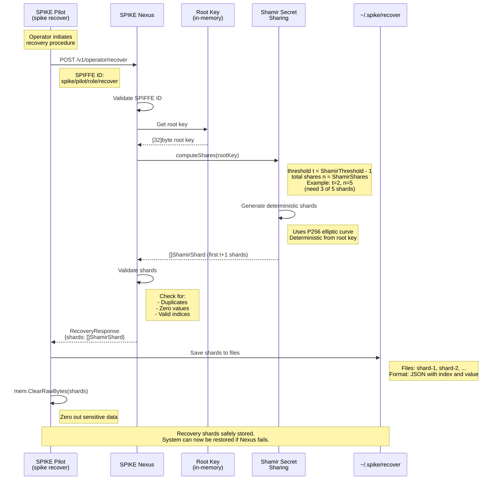
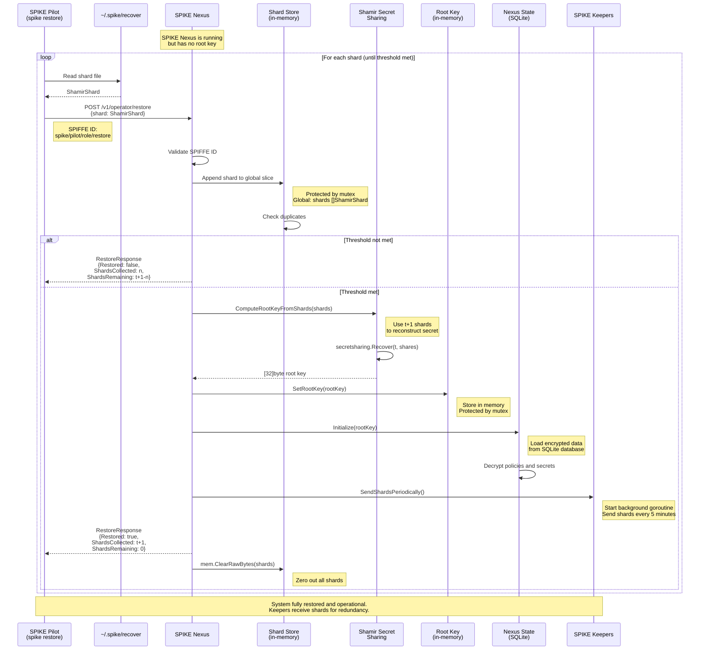

# Break-the-Glass Recovery and Restore Procedures

## 1. Recovery Flow (spike recover)

Generate recovery shards from the running SPIKE Nexus instance.

**Key Files:**
- `app/spike/internal/cmd/operator/recover.go` - CLI command
- `app/nexus/internal/route/operator/recover.go` - HTTP handler
- `app/nexus/internal/initialization/recovery/recovery.go::NewPilotRecoveryShards()`
- `app/nexus/internal/initialization/recovery/shamir.go::computeShares()`

**Security Notes:**
- Only operators with SPIFFE ID `spiffe://$trustRoot/spike/pilot/role/recover` can
  recover
- Shards are deterministic (same root key produces same shards)
- Shards are zeroed from memory after save
- Threshold scheme: need ShamirThreshold shards to reconstruct

---

## 2. Restore Flow (spike restore)

Restore the root key in SPIKE Nexus from recovery shards.

**Key Files:**
- `app/spike/internal/cmd/operator/restore.go` - CLI command
- `app/nexus/internal/route/operator/restore.go` - HTTP handler
- `app/nexus/internal/initialization/recovery/recovery.go::RestoreBackingStoreFromPilotShards()`
- `app/nexus/internal/initialization/recovery/root_key.go::ComputeRootKeyFromShards()`

**Flow Details:**
- Shards submitted one at a time (stateful accumulation)
- Global `shards` variable protected by mutex
- When threshold reached, immediate restoration
- Shards sent to all keepers immediately after restore
- All shards zeroed from memory after reconstruction

**Configuration:**
- `SPIKE_SHAMIR_THRESHOLD`: Number of shards needed (default: 3)
- `SPIKE_SHAMIR_SHARES`: Total shards generated (default: 5)
