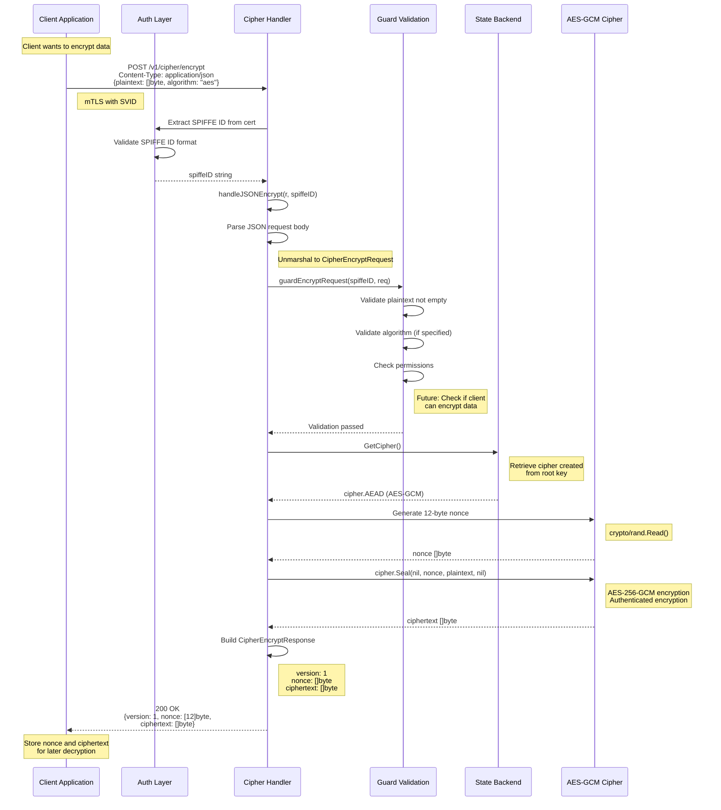
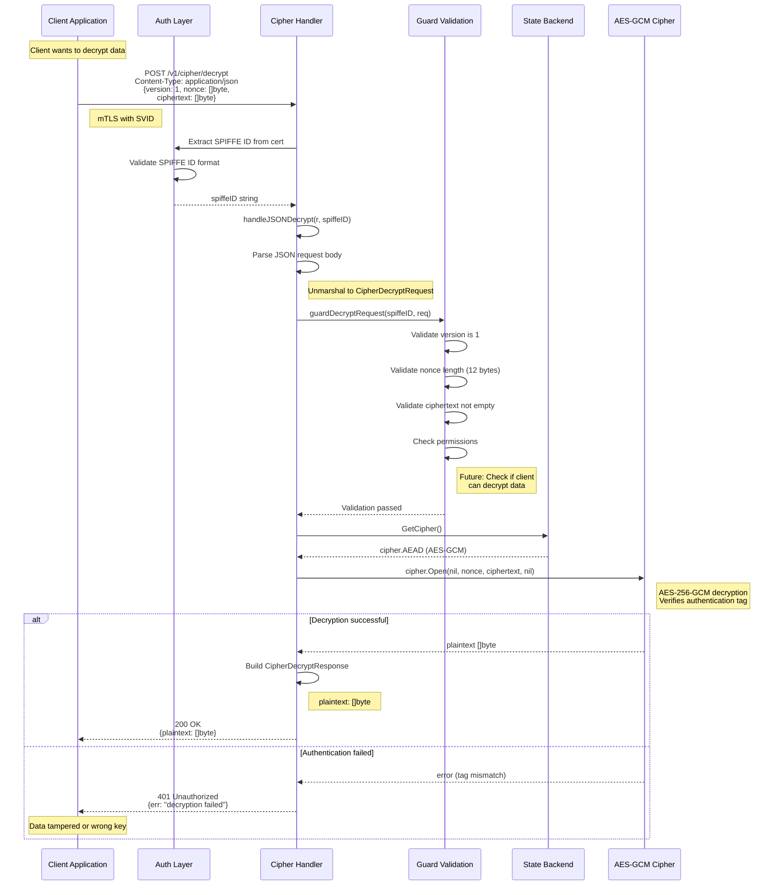
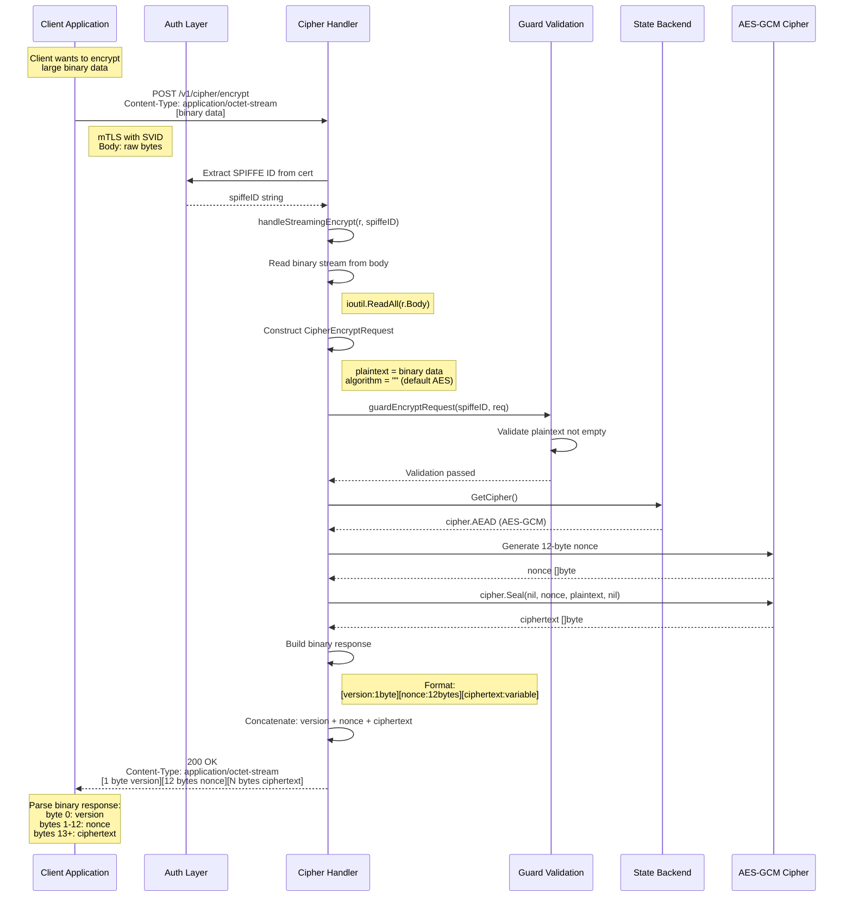
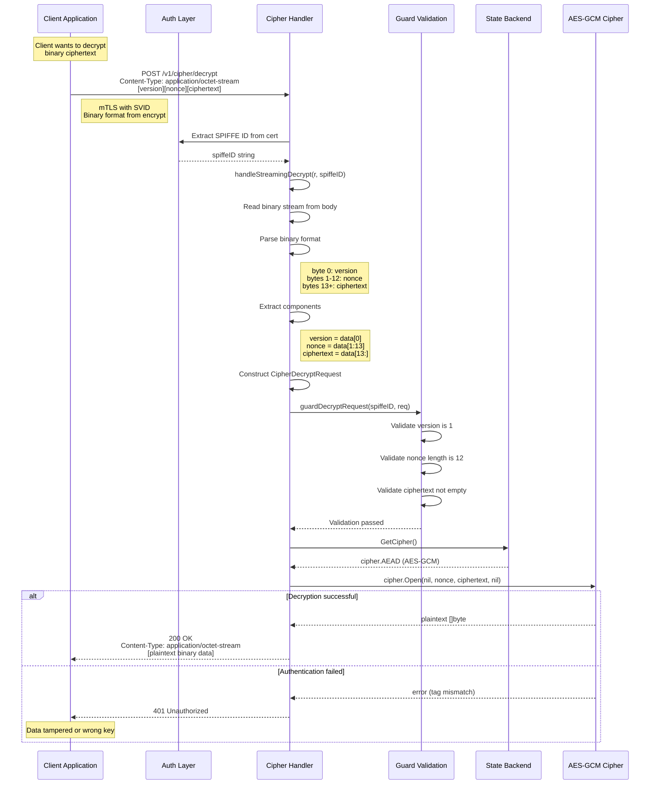

# SPIKE Cipher Operations (JSON and Stream Modes)

## Overview

SPIKE Nexus provides encryption and decryption services through two modes:
1. **JSON Mode**: Structured requests/responses with JSON encoding
2. **Stream Mode**: Binary data for efficiency with large payloads

Both modes use AES-256-GCM for authenticated encryption.

---

## 1. JSON Mode Encryption



---

## 2. JSON Mode Decryption



---

## 3. Stream Mode Encryption

Binary mode for efficient handling of large data.



**Binary Response Format:**
```
+--------+-------------+------------------+
| Byte 0 | Bytes 1-12  | Bytes 13 to end  |
+--------+-------------+------------------+
| 0x01   | Nonce (GCM) | Ciphertext       |
+--------+-------------+------------------+
```

---

## 4. Stream Mode Decryption



---

## Key Differences Between Modes

| Aspect | JSON Mode | Stream Mode |
|--------|-----------|-------------|
| Content-Type | `application/json` | `application/octet-stream` |
| Request Format | JSON object | Binary bytes |
| Response Format | JSON object | Binary bytes |
| Overhead | Higher (JSON encoding) | Lower (raw binary) |
| Use Case | Small data, structured | Large data, efficiency |
| Nonce Location | JSON field | Bytes 1-12 of response |
| Version Location | JSON field | Byte 0 of response |

---

## Key Files

- `app/nexus/internal/route/cipher/encrypt.go` - Encryption handler
- `app/nexus/internal/route/cipher/decrypt.go` - Decryption handler
- `app/nexus/internal/route/cipher/handle.go` - Mode detection and routing
- `app/nexus/internal/route/cipher/crypto.go` - Crypto operations
- `internal/crypto/gcm.go` - GCM constants (nonce size, etc.)

---

## Cryptographic Details

**Algorithm:** AES-256-GCM (Galois/Counter Mode)

**Key Size:** 32 bytes (256 bits)
- Derived from root key
- Root key is 32-byte random value

**Nonce Size:** 12 bytes (96 bits)
- GCM standard size
- Randomly generated for each encryption
- MUST be unique for each encryption with same key

**Authentication Tag:** Automatically included in ciphertext
- GCM provides authenticated encryption (AEAD)
- Detects tampering or corruption
- No additional HMAC needed

**Security Properties:**
- **Confidentiality**: Plaintext hidden
- **Integrity**: Tampering detected
- **Authenticity**: Verifies data from correct source
- **Freshness**: Unique nonce prevents replay

---

## Configuration

Environment variables:
- `SPIKE_NEXUS_URL`: SPIKE Nexus endpoint
- `SPIKE_NEXUS_TLS_PORT`: mTLS port (default: 8553)

---

## Example Usage

### JSON Mode (Go SDK)
```go
client := api.NewClient(source)

resp, err := client.Encrypt([]byte("sensitive data"))
// resp.Nonce, resp.Ciphertext

plaintext, err := client.Decrypt(resp.Nonce, resp.Ciphertext)
```

### Stream Mode (cURL)
```bash
# Encrypt
echo "data" | curl -X POST \
  --data-binary @- \
  -H "Content-Type: application/octet-stream" \
  https://spike-nexus:8553/v1/cipher/encrypt > encrypted.bin

# Decrypt
curl -X POST \
  --data-binary @encrypted.bin \
  -H "Content-Type: application/octet-stream" \
  https://spike-nexus:8553/v1/cipher/decrypt
```
