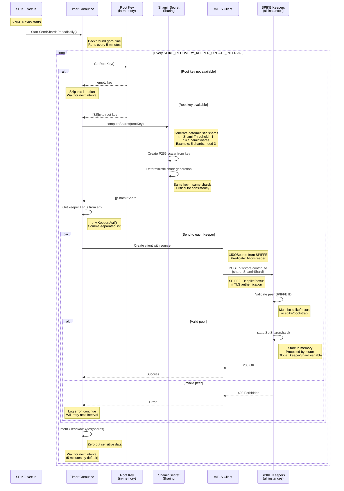
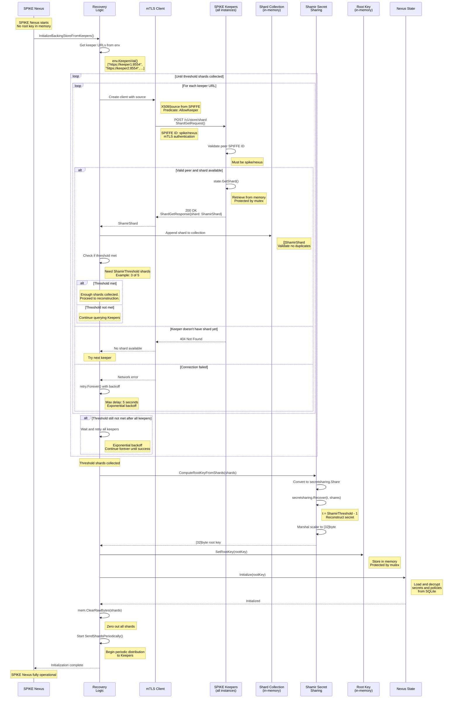

# SPIKE Nexus and Keeper Interaction

## Overview

SPIKE Keepers store shards of the root key for redundancy and disaster
recovery. The interaction is bidirectional:
1. **Nexus → Keeper**: Periodic shard distribution
2. **Nexus ← Keeper**: Shard retrieval during recovery

---

## 1. Periodic Shard Distribution (Nexus → Keeper)

SPIKE Nexus periodically sends shards to all Keepers to ensure redundancy.



**Key Files:**
- `app/nexus/internal/initialization/recovery/recovery.go::SendShardsPeriodically()`
- `app/nexus/internal/initialization/recovery/update.go::sendShardsToKeepers()`
- `app/nexus/internal/initialization/recovery/shamir.go::computeShares()`
- `app/keeper/internal/route/store/contribute.go::RouteContribute()`

**Flow Details:**
- Timer starts when Nexus initializes
- Runs in background goroutine
- Interval configurable via `SPIKE_RECOVERY_KEEPER_UPDATE_INTERVAL`
- Default: 5 minutes
- Continues even if some Keepers are unreachable
- Deterministic shards: same root key produces same shards
- Critical for handling Nexus restarts

**Keeper Storage:**
```go
var (
    keeperShard *ShamirShard
    keeperShardMu sync.RWMutex
)

func SetShard(shard *ShamirShard) {
    keeperShardMu.Lock()
    defer keeperShardMu.Unlock()
    keeperShard = shard
}
```

---

## 2. Shard Retrieval During Recovery (Nexus ← Keeper)

When SPIKE Nexus starts without a root key, it retrieves shards from Keepers.



**Key Files:**
- `app/nexus/internal/initialization/recovery/recovery.go::InitializeBackingStoreFromKeepers()`
- `app/nexus/internal/initialization/recovery/keeper.go::iterateKeepersAndInitializeState()`
- `app/nexus/internal/initialization/recovery/shard.go::shardGetResponse()`
- `app/keeper/internal/route/store/shard.go::RouteShard()`

**Flow Details:**
- Nexus queries Keepers on startup if no root key
- Uses retry logic with exponential backoff
- Continues forever until threshold met
- Max retry delay: 5 seconds
- Validates shards (no duplicates, valid indices)
- Immediately starts periodic distribution after recovery

---

## 3. Keeper Shard Management

### Shard Storage in Keeper

```go
// Global state in SPIKE Keeper
var (
    keeperShard   *ShamirShard
    keeperShardMu sync.RWMutex
)

func SetShard(shard *ShamirShard) {
    keeperShardMu.Lock()
    defer keeperShardMu.Unlock()
    keeperShard = shard
}

func GetShard() *ShamirShard {
    keeperShardMu.RLock()
    defer keeperShardMu.RUnlock()
    return keeperShard
}
```

**Characteristics:**
- Stored only in memory (not persisted)
- Protected by read-write mutex
- Single shard per Keeper
- Shard index corresponds to Keeper instance
- Lost on Keeper restart (recovered from Nexus)

---

## 4. Authorization and Security

### SPIFFE ID Validation

**Nexus → Keeper (Contribute):**
- Peer MUST be `spiffe://$trustRoot/spike/nexus` OR
- Peer MUST be `spiffe://$trustRoot/spike/bootstrap`
- Validated in `app/keeper/internal/route/store/contribute.go`

**Nexus ← Keeper (Shard Retrieval):**
- Peer MUST be `spiffe://$trustRoot/spike/nexus`
- Validated in `app/keeper/internal/route/store/shard.go`

### mTLS Configuration

```go
// Nexus creates client to Keeper
client := network.CreateMTLSClientWithPredicate(
    source,
    predicate.AllowKeeper,  // Only talk to Keepers
)

// Keeper server configuration
net.ServeWithPredicate(
    source,
    routeHandler,
    predicate.AllowKeeperPeer,  // Only allow Nexus/Bootstrap
    env.KeeperTLSPortVal(),
)
```

---

## 5. Failure Scenarios

### Scenario 1: Keeper Unavailable During Distribution

```
Nexus tries to send shard → Keeper unreachable
↓
Log error, continue to next Keeper
↓
Wait for next interval (5 minutes)
↓
Retry all Keepers
```

**Impact:** Minimal. Other Keepers still receive shards.

### Scenario 2: Insufficient Keepers During Recovery

```
Nexus starts, needs 3 shards
↓
Only 2 Keepers are online
↓
Retrieve 2 shards, threshold not met
↓
Retry with exponential backoff
↓
Continue until 3rd Keeper comes online
↓
Retrieve 3rd shard, reconstruct root key
```

**Impact:** Nexus waits until sufficient Keepers online.

### Scenario 3: All Keepers Lost Shards (Restart)

```
All Keepers restart (shards in memory lost)
↓
Nexus periodic distribution sends new shards
↓
Keepers store shards in memory
↓
System recovers within 5 minutes
```

**Impact:** Temporary. Nexus continuously redistributes.

---

## 6. Configuration

Environment variables:

**SPIKE Nexus:**
- `SPIKE_KEEPERS`: Comma-separated Keeper URLs
  - Example: `https://keeper1:8554,https://keeper2:8554`
- `SPIKE_RECOVERY_KEEPER_UPDATE_INTERVAL`: Shard distribution frequency
  - Default: `5m` (5 minutes)
  - Format: Go duration string (e.g., `10m`, `1h`)

**SPIKE Keeper:**
- `SPIKE_KEEPER_TLS_PORT`: mTLS listen port
  - Default: `8554`

---

## 7. Shard Distribution Guarantees

### Deterministic Shards

**Why Deterministic?**
- Same root key always produces same shards
- Critical for Nexus restarts
- Keepers can verify shard consistency
- Enables idempotent operations

**Implementation:**
```go
// Use root key as seed for deterministic reader
reader := deterministicReader(rootKey)

// Generate shares with deterministic randomness
ss := shamir.New(reader, threshold, secret)
shares := ss.Share(numShares)
```

### Consistency

**Invariants:**
1. All Keepers receive same shard index consistently
2. Shard indices are stable across Nexus restarts
3. Any threshold number of shards reconstruct same root key
4. Keepers can independently verify shard validity

---

## 8. Operational Visibility

### Logging

**Nexus logs:**
- Shard distribution start/complete
- Individual Keeper successes/failures
- Threshold checks during recovery
- Root key reconstruction success

**Keeper logs:**
- Shard receipt from Nexus/Bootstrap
- SPIFFE ID validation results
- Shard requests from Nexus

### Monitoring

**Key metrics to monitor:**
- Shard distribution interval
- Keeper availability
- Failed shard distributions
- Recovery attempts and duration
- Threshold status during startup

---

## Summary

**Bidirectional Flow:**
1. **Nexus → Keeper**: Periodic distribution for redundancy
2. **Keeper → Nexus**: On-demand retrieval for recovery

**Key Properties:**
- Deterministic shards for consistency
- Continuous redistribution for resilience
- Retry logic for fault tolerance
- mTLS with SPIFFE ID validation
- Memory-only storage (no disk persistence)
- Threshold scheme: need `t` of `n` shards
