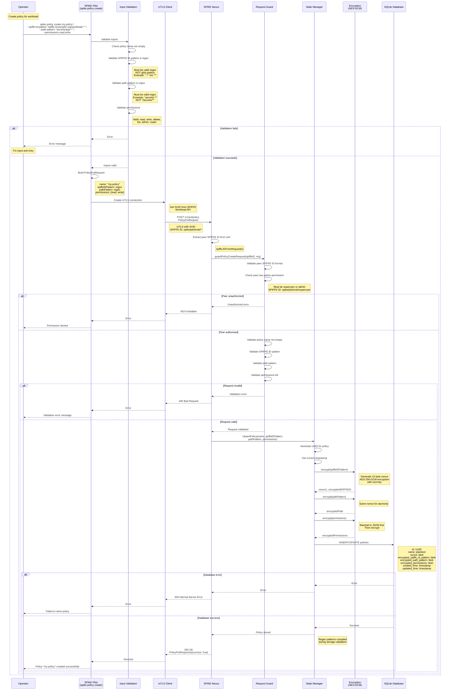
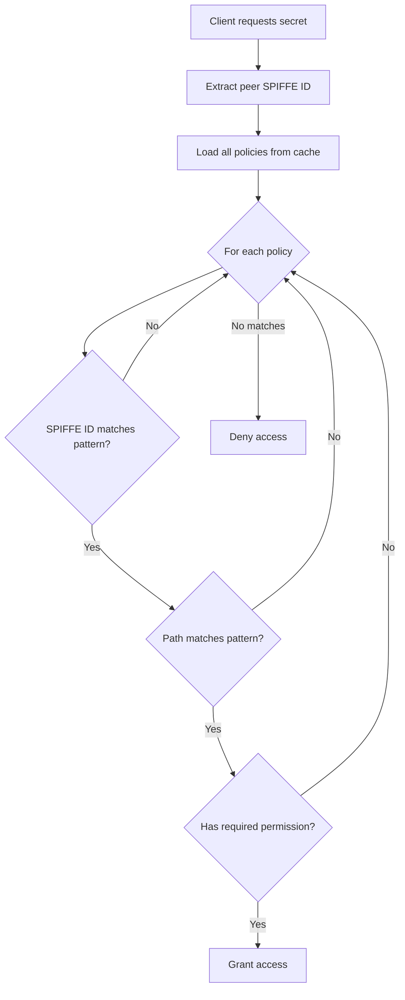

# Policy Creation Flow

## Overview

Policies in SPIKE define access control rules using SPIFFE IDs and path
patterns. Policies are created through SPIKE Pilot CLI and stored encrypted
in SPIKE Nexus.

---

## Policy Creation Sequence



---

## Key Files

- `app/spike/internal/cmd/policy/create.go` - CLI command handler
- `app/nexus/internal/route/acl/policy/put.go` - HTTP handler
- `app/nexus/internal/route/acl/policy/guard.go` - Request validation
- `app/nexus/internal/state/base/policy.go` - State management
- `app/nexus/internal/state/backend/sqlite/persist/policy.go` - Database
  persistence
- `app/nexus/internal/state/backend/sqlite/persist/crypto.go` - Encryption

---

## Policy Structure

### PolicyPutRequest

```go
type PolicyPutRequest struct {
    Name             string   `json:"name"`
    SPIFFEIDPattern  string   `json:"spiffe_id_pattern"`  // Regex
    PathPattern      string   `json:"path_pattern"`       // Regex
    Permissions      []string `json:"permissions"`
}
```

### Database Schema

```sql
CREATE TABLE IF NOT EXISTS policies (
    id TEXT PRIMARY KEY,
    name TEXT NOT NULL,
    nonce BLOB NOT NULL,
    encrypted_spiffe_id_pattern BLOB NOT NULL,
    encrypted_path_pattern BLOB NOT NULL,
    encrypted_permissions BLOB NOT NULL,
    created_time INTEGER NOT NULL,
    updated_time INTEGER NOT NULL
);
```

### In-Memory Cached Policy

```go
type Policy struct {
    ID                uuid.UUID
    Name              string
    SPIFFEIDPattern   *regexp.Regexp  // Compiled regex
    PathPattern       *regexp.Regexp  // Compiled regex
    Permissions       []Permission
    CreatedTime       time.Time
    UpdatedTime       time.Time
}
```

---

## Permission Types

```go
const (
    PermissionRead   = "read"
    PermissionWrite  = "write"
    PermissionDelete = "delete"
    PermissionList   = "list"
    PermissionAdmin  = "admin"
    PermissionSuper  = "super"   // Grants all permissions
)
```

**Permission Hierarchy:**
- `super`: All permissions (wildcard)
- `admin`: Create/delete policies
- `write`: Create/update secrets
- `read`: Read secrets
- `delete`: Delete secrets
- `list`: List secret paths

---

## Important Pattern Conventions

### SPIFFE ID Pattern (Regex, NOT Glob)

**Correct Examples:**
```
spiffe://example\.org/workload/.*
spiffe://example\.org/service/api-.*
spiffe://.*\.example\.org/.*
```

**WRONG (Glob syntax):**
```
spiffe://example.org/workload/*
spiffe://example.org/service/api-*
```

### Path Pattern (Regex, NOT Glob)

**Correct Examples:**
```
secrets/db/.*
tenants/.*/config
app/[a-z]+/credentials
```

**WRONG (Glob or leading slash):**
```
/secrets/db/*          # Leading slash wrong
secrets/db/*           # Glob syntax wrong
/secrets/db/.*         # Leading slash wrong
```

**Note:** Paths are namespaces, NOT Unix-like paths. Never use leading slash.

---

## Authorization for Policy Creation

### Required SPIFFE IDs

Only these SPIFFE IDs can create policies:
1. `spiffe://$trustRoot/spike/pilot/role/superuser` - Full admin
2. `spiffe://$trustRoot/spike/pilot/role/admin` - Policy admin

**Validation:**
```go
func guardPolicyCreateRequest(spiffeID string, req PolicyPutRequest) error {
    if !spiffeid.IsSuperuser(spiffeID) && !spiffeid.IsAdmin(spiffeID) {
        return sdkErrors.ErrUnauthorized.Clone()
    }
    // ... additional validation
}
```

---

## Encryption Details

### What Gets Encrypted?

1. **SPIFFE ID Pattern** (regex string)
2. **Path Pattern** (regex string)
3. **Permissions** (JSON array of strings)

**Policy name is NOT encrypted** (used for lookups).

### Encryption Process

```go
func encrypt(data []byte, cipher cipher.AEAD) ([]byte, []byte, error) {
    // Generate 12-byte nonce
    nonce := make([]byte, 12)
    rand.Read(nonce)

    // AES-256-GCM encryption
    ciphertext := cipher.Seal(nil, nonce, data, nil)

    return nonce, ciphertext, nil
}
```

**Same nonce used for all three fields in a policy** (atomic operation).

### Decryption Process

When policy is loaded from database:
1. Read nonce and encrypted fields
2. Decrypt each field with root key
3. Compile regex patterns
4. Cache in memory for fast access

```go
func decrypt(nonce, ciphertext []byte, cipher cipher.AEAD) ([]byte, error) {
    plaintext, err := cipher.Open(nil, nonce, ciphertext, nil)
    if err != nil {
        return nil, sdkErrors.ErrDecryptionFailed.Clone()
    }
    return plaintext, nil
}
```

---

## Policy Matching at Runtime

### When Secret is Accessed



### Policy Evaluation

```go
func CheckPermission(spiffeID, path string, permission Permission) bool {
    policies := state.GetPolicies()

    for _, policy := range policies {
        // Check SPIFFE ID match (regex)
        if !policy.SPIFFEIDPattern.MatchString(spiffeID) {
            continue
        }

        // Check path match (regex)
        if !policy.PathPattern.MatchString(path) {
            continue
        }

        // Check permission
        if hasPermission(policy.Permissions, permission) {
            return true  // Grant access
        }
    }

    return false  // Deny access (no matching policy)
}
```

**Note:** First matching policy grants access. No "deny" policies exist.

---

## Policy Lifecycle

### Create
```bash
spike policy create my-policy \
  --spiffe-id-pattern "spiffe://example\.org/workload/.*" \
  --path-pattern "secrets/app/.*" \
  --permissions read,write
```

### List
```bash
spike policy list
```

**Output:**
```
Policies:
- my-policy
  SPIFFE ID Pattern: spiffe://example\.org/workload/.*
  Path Pattern: secrets/app/.*
  Permissions: read, write
  Created: 2024-01-15 10:30:00
  Updated: 2024-01-15 10:30:00
```

### Delete
```bash
spike policy delete my-policy
```

**Note:** Deleting a policy immediately revokes access for all matching
clients.

---

## Common Policy Examples

### 1. Database Credentials Access

```bash
spike policy create db-access \
  --spiffe-id-pattern "spiffe://example\.org/service/api" \
  --path-pattern "secrets/db/creds" \
  --permissions read
```

**Grants:** API service can read database credentials.

### 2. Wildcard Application Access

```bash
spike policy create app-wildcard \
  --spiffe-id-pattern "spiffe://example\.org/app/.*" \
  --path-pattern "secrets/app/.*" \
  --permissions read,write
```

**Grants:** All app workloads can read/write under `secrets/app/`.

### 3. Admin Access

```bash
spike policy create admin-all \
  --spiffe-id-pattern "spiffe://example\.org/admin" \
  --path-pattern ".*" \
  --permissions super
```

**Grants:** Admin can do anything on any path.

### 4. Tenant Isolation

```bash
spike policy create tenant-a \
  --spiffe-id-pattern "spiffe://example\.org/tenant/a/.*" \
  --path-pattern "tenants/a/.*" \
  --permissions read,write,delete

spike policy create tenant-b \
  --spiffe-id-pattern "spiffe://example\.org/tenant/b/.*" \
  --path-pattern "tenants/b/.*" \
  --permissions read,write,delete
```

**Effect:** Tenant A cannot access Tenant B's secrets and vice versa.

---

## Configuration

Environment variables:
- `SPIKE_NEXUS_URL`: SPIKE Nexus endpoint
- `SPIKE_NEXUS_TLS_PORT`: mTLS port (default: 8553)

---

## Error Handling

### Common Errors

**1. Pattern validation failed**
```
Error: Invalid SPIFFE ID pattern: "spiffe://example.org/workload/*"
Use regex syntax: "spiffe://example\.org/workload/.*"
```

**2. Unauthorized**
```
Error: Permission denied
Only superuser or admin roles can create policies
```

**3. Path starts with slash**
```
Error: Invalid path pattern: "/secrets/app/.*"
Paths are namespaces, remove leading slash: "secrets/app/.*"
```

**4. Empty policy name**
```
Error: Policy name cannot be empty
```

---

## Security Considerations

### Defense in Depth

1. **mTLS**: Only authenticated SPIFFE identities can connect
2. **Authorization**: Only admin roles can create policies
3. **Encryption**: Policy details encrypted at rest
4. **Pattern validation**: Prevents injection attacks
5. **Regex compilation**: Cached for performance and safety

### Regex Safety

Policies use Go's `regexp` package with linear-time guarantees. No ReDoS
(Regular Expression Denial of Service) vulnerabilities.

**Timeout:** Regex matching has implicit timeout from Go runtime.

---

## Summary

**Policy Creation Flow:**
1. Operator uses SPIKE Pilot CLI
2. Input validation (regex patterns, permissions)
3. mTLS connection to SPIKE Nexus
4. Authorization check (admin role required)
5. Request validation (guard layer)
6. Encrypt policy fields with AES-GCM
7. Store in SQLite database
8. Cache in memory with compiled regex
9. Ready for access control decisions

**Key Properties:**
- Regex patterns (NOT globs)
- Encrypted at rest
- Cached for performance
- First-match grant access
- No deny policies
- Admin role required for creation
