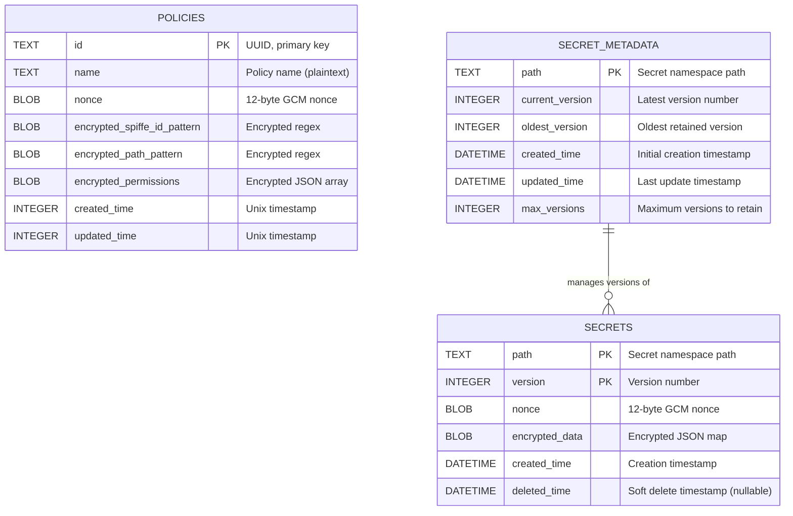
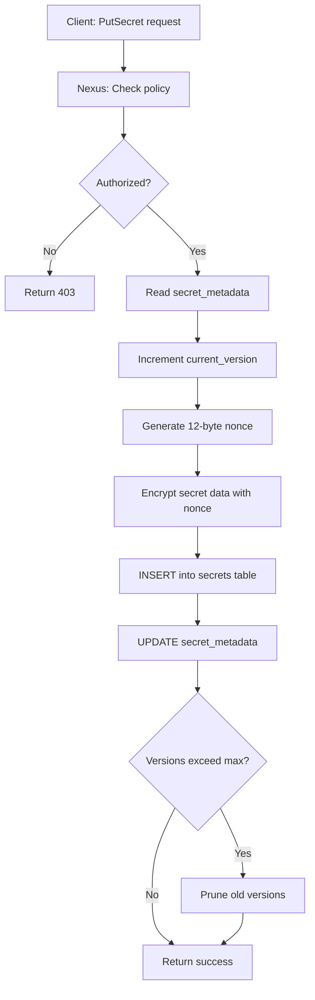
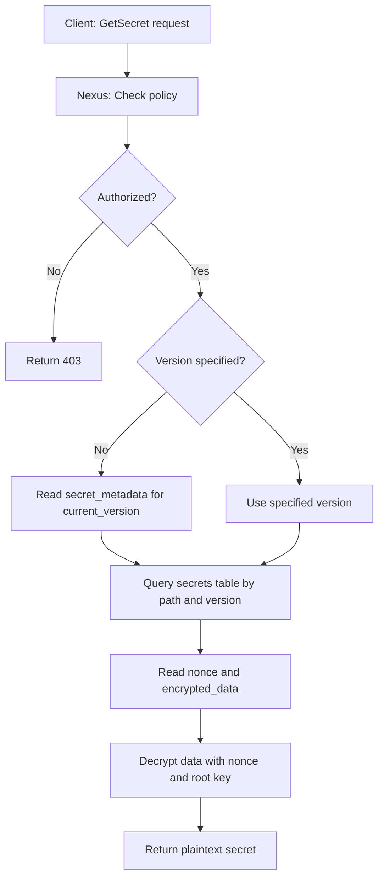
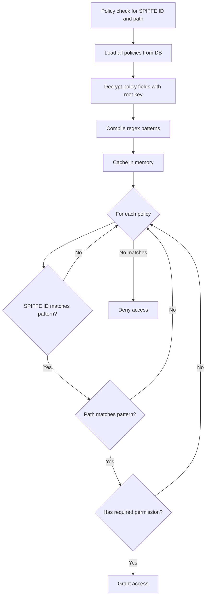

# SPIKE Database Schema

## Overview

SPIKE Nexus uses SQLite for persistent storage. All sensitive data (secrets
and policy details) are encrypted with AES-256-GCM using the root key.

**Location:** `~/.spike/data/spike.db`

---

## Entity-Relationship Diagram



---

## Table Definitions

### 1. policies

Stores access control policies.

```sql
CREATE TABLE IF NOT EXISTS policies (
    id TEXT PRIMARY KEY,
    name TEXT NOT NULL,
    nonce BLOB NOT NULL,
    encrypted_spiffe_id_pattern BLOB NOT NULL,
    encrypted_path_pattern BLOB NOT NULL,
    encrypted_permissions BLOB NOT NULL,
    created_time INTEGER NOT NULL,
    updated_time INTEGER NOT NULL
);
```

**Fields:**

| Field | Type | Description | Example |
|-------|------|-------------|---------|
| `id` | TEXT | UUID primary key | `550e8400-e29b-41d4-a716-446655440000` |
| `name` | TEXT | Policy name (plaintext) | `db-access` |
| `nonce` | BLOB | 12-byte AES-GCM nonce | Binary (12 bytes) |
| `encrypted_spiffe_id_pattern` | BLOB | Encrypted regex pattern | Binary (variable) |
| `encrypted_path_pattern` | BLOB | Encrypted regex pattern | Binary (variable) |
| `encrypted_permissions` | BLOB | Encrypted JSON array | Binary (variable) |
| `created_time` | INTEGER | Unix timestamp | `1705315200` |
| `updated_time` | INTEGER | Unix timestamp | `1705315200` |

**Encryption Details:**
- All three encrypted fields use the **same nonce** (atomic operation)
- Decrypted format:
  - `spiffe_id_pattern`: Regex string (e.g., `spiffe://example\.org/.*`)
  - `path_pattern`: Regex string (e.g., `secrets/db/.*`)
  - `permissions`: JSON array (e.g., `["read", "write"]`)

**Indexes:**
- Primary key: `id`
- No additional indexes (small number of policies)

---

### 2. secrets

Stores secret data with versioning.

```sql
CREATE TABLE IF NOT EXISTS secrets (
    path TEXT NOT NULL,
    version INTEGER NOT NULL,
    nonce BLOB NOT NULL,
    encrypted_data BLOB NOT NULL,
    created_time DATETIME NOT NULL,
    deleted_time DATETIME,
    PRIMARY KEY (path, version)
);

CREATE INDEX IF NOT EXISTS idx_secrets_path ON secrets(path);
CREATE INDEX IF NOT EXISTS idx_secrets_created_time ON secrets(created_time);
```

**Fields:**

| Field | Type | Description | Example |
|-------|------|-------------|---------|
| `path` | TEXT | Secret namespace path | `secrets/db/creds` |
| `version` | INTEGER | Version number (auto-increment) | `1`, `2`, `3` |
| `nonce` | BLOB | 12-byte AES-GCM nonce | Binary (12 bytes) |
| `encrypted_data` | BLOB | Encrypted JSON map | Binary (variable) |
| `created_time` | DATETIME | ISO 8601 timestamp | `2024-01-15T10:30:00Z` |
| `deleted_time` | DATETIME | Soft delete timestamp (nullable) | `NULL` or ISO 8601 |

**Encryption Details:**
- Each version has a **unique nonce** (regenerated on each update)
- Decrypted format:
  - JSON map: `{"username": "admin", "password": "secret123"}`

**Versioning:**
- Each update creates a new row with incremented version
- Old versions retained up to `max_versions` limit
- Soft delete: `deleted_time` set instead of row removal

**Indexes:**
- Primary key: Composite `(path, version)`
- `idx_secrets_path`: Fast lookup by path
- `idx_secrets_created_time`: Fast time-based queries

---

### 3. secret_metadata

Tracks versioning metadata for secrets.

```sql
CREATE TABLE IF NOT EXISTS secret_metadata (
    path TEXT PRIMARY KEY,
    current_version INTEGER NOT NULL,
    oldest_version INTEGER NOT NULL,
    created_time DATETIME NOT NULL,
    updated_time DATETIME NOT NULL,
    max_versions INTEGER NOT NULL
);
```

**Fields:**

| Field | Type | Description | Example |
|-------|------|-------------|---------|
| `path` | TEXT | Secret namespace path | `secrets/db/creds` |
| `current_version` | INTEGER | Latest version number | `5` |
| `oldest_version` | INTEGER | Oldest retained version | `3` |
| `created_time` | DATETIME | Initial creation timestamp | `2024-01-15T10:30:00Z` |
| `updated_time` | DATETIME | Last update timestamp | `2024-01-16T14:20:00Z` |
| `max_versions` | INTEGER | Maximum versions to retain | `10` |

**Relationship:**
- One metadata row per secret path
- Manages version lifecycle for corresponding `secrets` rows
- When `current_version - oldest_version >= max_versions`, prune old versions

**Version Pruning:**
```
If max_versions = 10 and current_version = 15:
  oldest_version = 6
  Versions 1-5 are deleted from secrets table
  Versions 6-15 are retained
```

**Indexes:**
- Primary key: `path`

---

## Data Flow Diagram

### Secret Write Flow



### Secret Read Flow



### Policy Evaluation Flow



---

## File Locations

**Schema DDL:**
- `app/nexus/internal/state/backend/sqlite/ddl/statement.go`

**Persistence Layer:**
- `app/nexus/internal/state/backend/sqlite/persist/secret.go` - Secret CRUD
- `app/nexus/internal/state/backend/sqlite/persist/policy.go` - Policy CRUD
- `app/nexus/internal/state/backend/sqlite/persist/crypto.go` - Encryption/
  decryption

**Database Initialization:**
- `app/nexus/internal/state/backend/sqlite/sqlite.go::Initialize()`

---

## Database Operations

### Create Tables

```go
func createTables(db *sql.DB) error {
    _, err := db.Exec(policiesTableStatement)
    if err != nil {
        return err
    }

    _, err = db.Exec(secretsTableStatement)
    if err != nil {
        return err
    }

    _, err = db.Exec(secretMetadataTableStatement)
    if err != nil {
        return err
    }

    return nil
}
```

### Insert Policy

```go
func StorePolicy(policy Policy, cipher cipher.AEAD) error {
    // Generate nonce
    nonce := make([]byte, 12)
    rand.Read(nonce)

    // Encrypt fields with same nonce
    encSPIFFE, _ := encrypt([]byte(policy.SPIFFEIDPattern), nonce, cipher)
    encPath, _ := encrypt([]byte(policy.PathPattern), nonce, cipher)
    encPerms, _ := encrypt(marshalJSON(policy.Permissions), nonce, cipher)

    // Insert into database
    _, err := db.Exec(`
        INSERT INTO policies
        (id, name, nonce, encrypted_spiffe_id_pattern,
         encrypted_path_pattern, encrypted_permissions,
         created_time, updated_time)
        VALUES (?, ?, ?, ?, ?, ?, ?, ?)
    `, policy.ID, policy.Name, nonce, encSPIFFE, encPath, encPerms,
       time.Now().Unix(), time.Now().Unix())

    return err
}
```

### Insert Secret

```go
func StoreSecret(path string, data map[string]string,
                 cipher cipher.AEAD) error {
    // Get current version
    metadata := getMetadata(path)
    version := metadata.CurrentVersion + 1

    // Generate unique nonce for this version
    nonce := make([]byte, 12)
    rand.Read(nonce)

    // Encrypt secret data
    jsonData := marshalJSON(data)
    encrypted, _ := encrypt(jsonData, nonce, cipher)

    // Insert secret
    _, err := db.Exec(`
        INSERT INTO secrets
        (path, version, nonce, encrypted_data, created_time)
        VALUES (?, ?, ?, ?, ?)
    `, path, version, nonce, encrypted, time.Now())

    // Update metadata
    updateMetadata(path, version)

    // Prune old versions
    pruneOldVersions(path, metadata.MaxVersions)

    return err
}
```

### Read Secret

```go
func GetSecret(path string, version int, cipher cipher.AEAD)
               (map[string]string, error) {
    var nonce, encrypted []byte

    // Query database
    err := db.QueryRow(`
        SELECT nonce, encrypted_data
        FROM secrets
        WHERE path = ? AND version = ? AND deleted_time IS NULL
    `, path, version).Scan(&nonce, &encrypted)

    if err != nil {
        return nil, err
    }

    // Decrypt
    plaintext, err := decrypt(encrypted, nonce, cipher)
    if err != nil {
        return nil, err
    }

    // Unmarshal JSON
    var data map[string]string
    json.Unmarshal(plaintext, &data)

    return data, nil
}
```

---

## Encryption at Rest

### What Is Encrypted?

**Policies:**
- ✅ SPIFFE ID pattern (regex)
- ✅ Path pattern (regex)
- ✅ Permissions (JSON array)
- ❌ Policy name (plaintext for lookups)

**Secrets:**
- ✅ Secret data (JSON map of key-value pairs)
- ❌ Path (plaintext for lookups)
- ❌ Version number (plaintext for versioning)

### What Is NOT Encrypted?

| Field | Reason |
|-------|--------|
| Policy name | Used for user-friendly lookups |
| Secret path | Used for authorization checks |
| Secret version | Used for version queries |
| Timestamps | Used for audit and cleanup |

### Encryption Algorithm

**AES-256-GCM** (Galois/Counter Mode)

**Properties:**
- Key size: 32 bytes (256 bits)
- Nonce size: 12 bytes (96 bits)
- Authentication: Built-in (AEAD)
- Performance: Hardware-accelerated on most CPUs

**Security:**
- Confidentiality: Data hidden
- Integrity: Tampering detected
- Authenticity: Verifies data origin

---

## Database File

**Location:** `~/.spike/data/spike.db`

**Permissions:** `0600` (owner read/write only)

**Size:** Varies (typically < 100 MB for most deployments)

**Backup Strategy:**
- Regular SQLite backups recommended
- Backup is useless without root key (data encrypted)
- For disaster recovery, use break-the-glass shards

**File Format:** SQLite 3

---

## Configuration

Environment variables:
- `SPIKE_BACKEND_STORE_TYPE`: `sqlite`, `lite`, or `memory`
  - `sqlite`: Persistent storage (default)
  - `lite`: Lightweight SQLite
  - `memory`: In-memory only (testing)
- `SPIKE_DATA_DIR`: Data directory path (default: `~/.spike/data`)

---

## Performance Considerations

### Indexes

**secrets table:**
- `idx_secrets_path`: Speeds up queries by path
- `idx_secrets_created_time`: Speeds up time-based cleanup

**Why no index on policies?**
- Small number of policies (typically < 100)
- Full table scan is fast enough
- Policies are cached in memory after load

### Query Patterns

**Fast:**
- Get secret by path and version (indexed)
- Get latest secret (metadata lookup + indexed query)
- Check policy (cached in memory)

**Slow (by design):**
- List all secrets (requires full table scan)
- Time-based secret queries (may scan many rows)

### Data Access Patterns

**Policies:**
- Loaded from database on every authorization check
- NOT cached in memory
- Decrypted and regex patterns compiled on every check
- Performance consideration: High-volume authorization checks may
  impact database performance

**Secrets:**
- NOT cached (sensitive data)
- Always queried from database
- Decrypted on-demand

---

## Data Retention

### Secret Versioning

**Default:** Retain 10 most recent versions

**Configurable:** `max_versions` in `secret_metadata`

**Pruning Logic:**
```
When current_version - oldest_version >= max_versions:
  Delete oldest version
  Increment oldest_version in metadata
```

**Example:**
```
max_versions = 3
Versions: 1, 2, 3, 4, 5

After pruning:
Versions: 3, 4, 5  (versions 1 and 2 deleted)
oldest_version = 3
current_version = 5
```

### Soft Delete

**Secrets:**
- Setting `deleted_time` marks secret as deleted (soft delete)
- Can be undeleted by clearing `deleted_time`
- Physical deletion only occurs automatically during version pruning when
  `MaxVersions` is exceeded
- No explicit "hard delete" API endpoint

**Policies:**
- Physical deletion only (row removed from table)
- No soft delete mechanism
- Immediately revokes access when deleted

---

## Summary

**Database Schema:**
- 3 tables: `policies`, `secrets`, `secret_metadata`
- Encryption: AES-256-GCM with root key
- Versioning: Track multiple secret versions
- Soft delete: Recoverable secret deletion
- Indexes: Optimized for common queries

**Security:**
- All sensitive data encrypted at rest
- Root key never stored on disk
- Database useless without root key
- Authenticated encryption prevents tampering

**Performance:**
- Policies cached in memory
- Secrets queried on-demand
- Indexes for fast lookups
- Efficient versioning with metadata table
