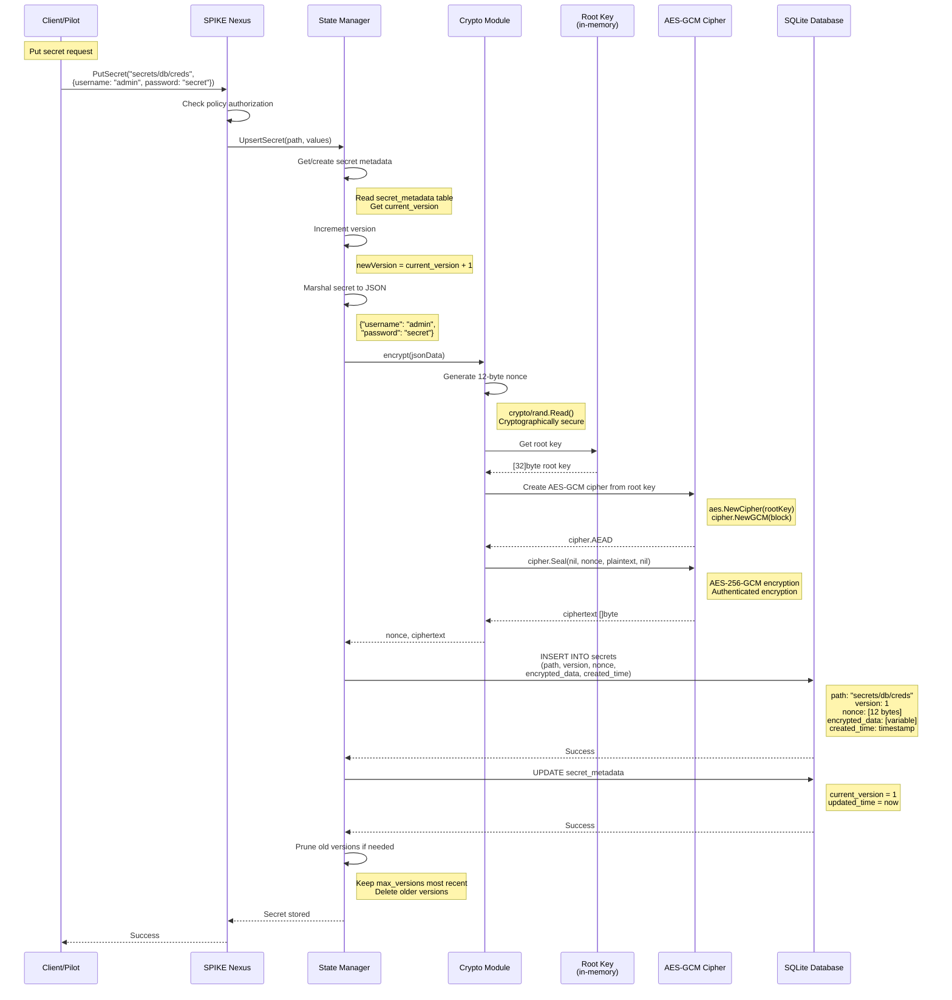
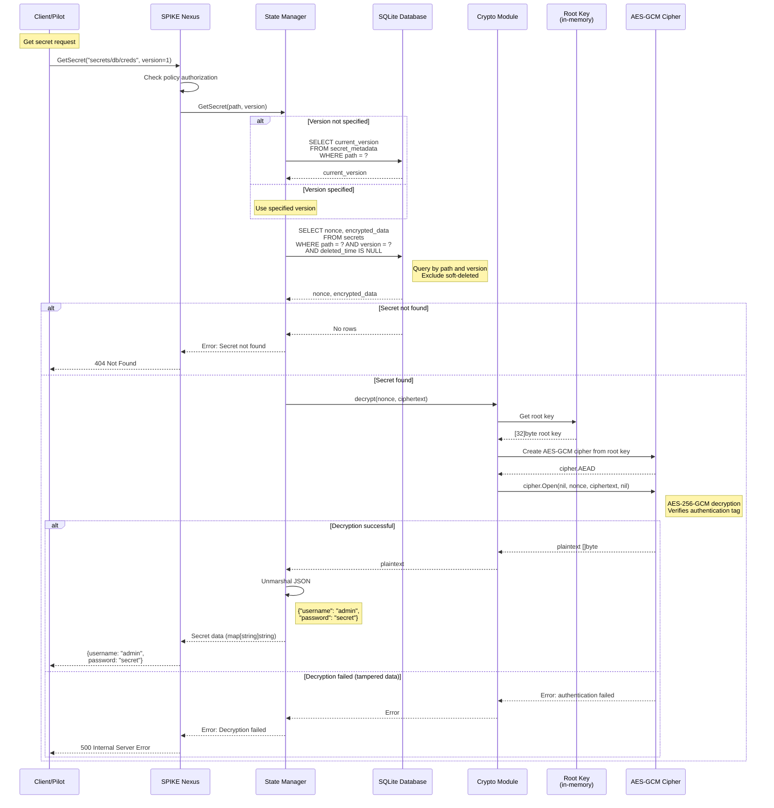
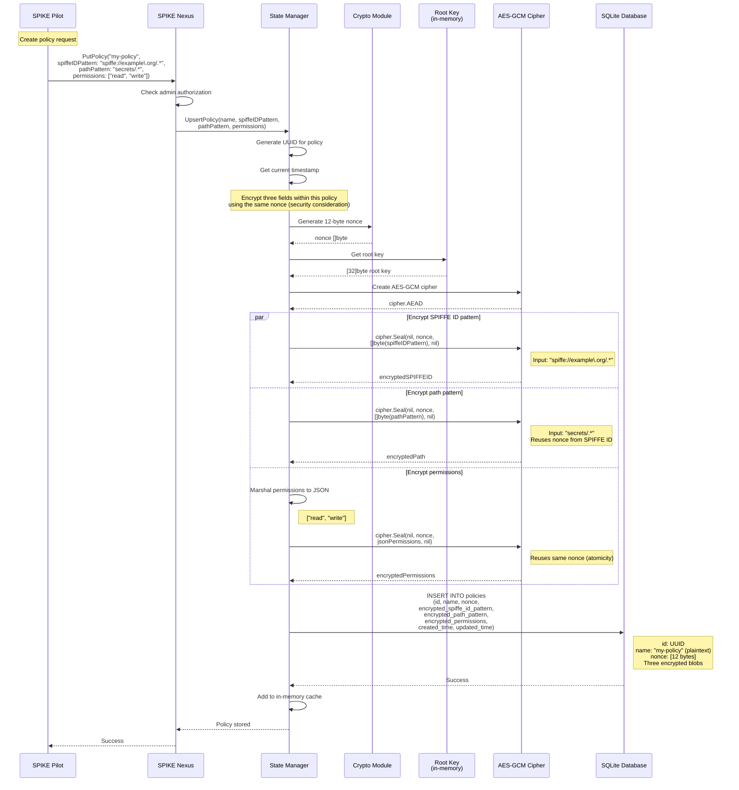
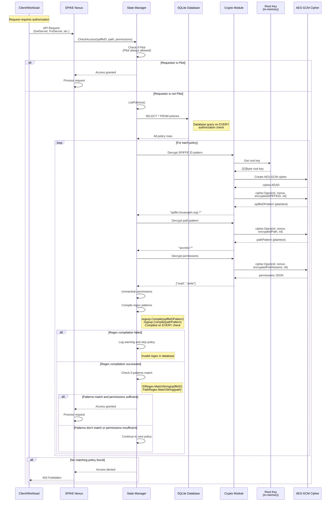
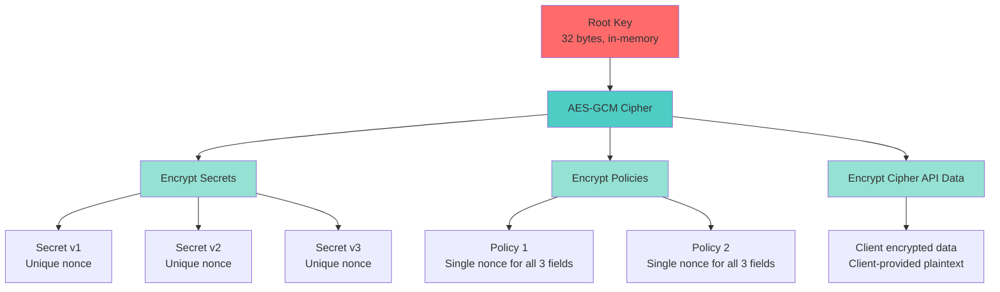

# Secrets and Policies Encryption Flows

## Overview

SPIKE uses AES-256-GCM for encrypting secrets and policies at rest. All
encryption operations use the root key, which is stored only in memory.

---

## 1. Secret Encryption Flow



---

## 2. Secret Decryption Flow



---

## 3. Policy Encryption Flow



**Note:** All three fields within a single policy share the **same nonce**.
Each policy has a unique nonce, but reusing the nonce for multiple fields
within a policy violates AES-GCM best practices (see Section 6 for
security implications).

---

## 4. Policy Authorization Check Flow



**Performance Characteristics:**
- **Database query on every authorization check** (no caching)
- **All policies decrypted on every check** (performance overhead)
- **Regex patterns compiled on every check** (no pre-compilation)
- **No in-memory policy cache exists** in current implementation

**Performance Implications:**
- High-volume systems may experience database load from frequent policy
  queries
- Decryption and regex compilation overhead on every authorization
- Consider implementing policy caching if authorization checks become
  a bottleneck

---

## 5. Encryption Key Hierarchy



**Key Points:**
- **Single root key** for all encryption
- **Root key never leaves memory**
- **Unique nonce per secret version** (prevents nonce reuse across secrets)
- **Single nonce per policy** (reused for 3 fields within each policy)
- **AES-GCM provides authentication** (tamper detection)

**Security Note:** Reusing the same nonce for multiple encryptions with
the same key (as done for policy fields) violates AES-GCM strict best
practices. However, the realistic risk is LOW-MEDIUM given: (1) only 3
fields per policy, (2) no cross-policy nonce reuse, (3) policy data is
structural metadata not high-value secrets, (4) attack requires database
access (already inside trust boundary). Should be fixed during schema
migrations for compliance, but not an immediate security emergency.

---

## 6. Nonce Management

### Secret Nonces

**Strategy:** Unique nonce for each secret version

```go
func encryptSecret(data []byte) ([]byte, []byte, error) {
    // Generate UNIQUE nonce for this version
    nonce := make([]byte, 12)
    _, err := rand.Read(nonce)
    if err != nil {
        return nil, nil, err
    }

    ciphertext := cipher.Seal(nil, nonce, data, nil)
    return nonce, ciphertext, nil
}
```

**Why unique nonces?**
- Each secret update generates new nonce
- Prevents nonce reuse with same key
- Critical for GCM security (reused nonce breaks security)

### Policy Nonces

**Strategy:** Single nonce for all fields in a policy

```go
func encryptPolicy(policy Policy) error {
    // Generate ONE nonce for all three fields
    nonce := make([]byte, 12)
    rand.Read(nonce)

    // Encrypt all fields with SAME nonce (SECURITY ISSUE)
    encSPIFFE := cipher.Seal(nil, nonce, []byte(policy.SPIFFEID), nil)
    encPath := cipher.Seal(nil, nonce, []byte(policy.Path), nil)
    encPerms := cipher.Seal(nil, nonce, marshalJSON(policy.Perms), nil)

    // Store single nonce with three ciphertexts
    storePolicy(nonce, encSPIFFE, encPath, encPerms)
}
```

**Why same nonce was used?**
- Implementation chose atomicity (all fields encrypted together)
- Single database transaction with one nonce column
- Simpler storage schema

**Is this cryptographically correct?**
- **NO** - This violates AES-GCM strict nonce uniqueness requirements
- Each encryption operation should ideally use a unique (key, nonce) pair
- Theoretical vulnerabilities from nonce reuse:
  - Allows attackers to XOR ciphertexts: C1⊕C2 = P1⊕P2
  - Weakens authentication guarantees
  - Enables keystream recovery if one plaintext is known

**Is this a practical security risk?**
- **LOW-MEDIUM risk** in this specific context:
  - Attack limited to 3 fields within single policy (not cumulative)
  - Requires database file access (already inside trust boundary)
  - Policy data is structural metadata, not high-value secrets
  - No cross-policy attack surface (each policy has unique nonce)
  - With only 3 short fields, XOR attack reveals minimal information
  - Defense-in-depth: file permissions, access control, encrypted storage
- Would fail cryptographic audit, should be fixed for compliance
- Acceptable for current deployments given limited practical impact

**Proper fix would be:**
- Use three separate nonces (one per field)
- Store all three nonces in database
- Atomicity can still be achieved via transaction
- Storage schema: add `nonce_path_pattern` and `nonce_permissions` columns

---

## 7. Cryptographic Details

### AES-256-GCM Parameters

| Parameter | Value | Description |
|-----------|-------|-------------|
| Algorithm | AES-GCM | Galois/Counter Mode |
| Key size | 32 bytes (256 bits) | From root key |
| Nonce size | 12 bytes (96 bits) | GCM standard |
| Tag size | 16 bytes (128 bits) | Authentication tag |
| Additional data | None | No AAD used |

### Cipher Creation

```go
func createCipher(rootKey [32]byte) (cipher.AEAD, error) {
    // Create AES block cipher
    block, err := aes.NewCipher(rootKey[:])
    if err != nil {
        return nil, err
    }

    // Create GCM mode
    gcm, err := cipher.NewGCM(block)
    if err != nil {
        return nil, err
    }

    return gcm, nil
}
```

### Encryption

```go
func encrypt(plaintext []byte, cipher cipher.AEAD) ([]byte, []byte, error) {
    // Generate nonce
    nonce := make([]byte, 12)
    _, err := rand.Read(nonce)
    if err != nil {
        return nil, nil, err
    }

    // Encrypt (also computes authentication tag)
    ciphertext := cipher.Seal(nil, nonce, plaintext, nil)

    return nonce, ciphertext, nil
}
```

**Output format:**
- `nonce`: 12 bytes (stored separately)
- `ciphertext`: len(plaintext) + 16 bytes (includes auth tag)

### Decryption

```go
func decrypt(nonce, ciphertext []byte, cipher cipher.AEAD) ([]byte, error) {
    // Decrypt and verify authentication tag
    plaintext, err := cipher.Open(nil, nonce, ciphertext, nil)
    if err != nil {
        // Decryption failed or authentication failed
        return nil, sdkErrors.ErrDecryptionFailed.Clone()
    }

    return plaintext, nil
}
```

**Failure modes:**
- Wrong key: Authentication tag mismatch
- Tampered data: Authentication tag mismatch
- Wrong nonce: Gibberish plaintext (still decrypts, but wrong data)

---

## 8. Security Properties

### Confidentiality

**Guarantee:** Plaintext cannot be recovered without root key

**Attack resistance:**
- Brute force: 2^256 key space (computationally infeasible)
- Known plaintext: No advantage (GCM mode secure)
- Chosen plaintext: No advantage

### Integrity

**Guarantee:** Tampering is detected

**Mechanism:** GCM authentication tag

**Attack resistance:**
- Modification: Tag verification fails (error on decryption)
- Truncation: Tag verification fails
- Bit flipping: Tag verification fails

### Authenticity

**Guarantee:** Data originated from holder of root key

**Mechanism:** Only root key can produce valid ciphertext+tag pair

**Use case:** Verify data was encrypted by SPIKE Nexus, not external
attacker

### Nonce Uniqueness

**Requirement:** Nonce must be unique for each encryption with same key

**SPIKE's approach:**
- Secrets: Generate random nonce per version (astronomically unlikely
  collision)
- Policies: Generate random nonce per policy (unique per policy)
- Cipher API: Client provides plaintext, server generates unique nonce

**Collision probability:**
With 12-byte (96-bit) random nonces:
- After 2^32 encryptions: ~0.000005% chance of collision
- SPIKE generates new nonce for each secret version
- Even with millions of secrets, collision risk is negligible

---

## 9. Key Files

**Encryption/Decryption:**
- `app/nexus/internal/state/backend/sqlite/persist/crypto.go`

**Secret Persistence:**
- `app/nexus/internal/state/backend/sqlite/persist/secret.go`

**Policy Persistence:**
- `app/nexus/internal/state/backend/sqlite/persist/policy.go`

**Root Key Management:**
- `app/nexus/internal/state/base/data.go::SetRootKey()`
- `app/nexus/internal/state/base/global.go` - Root key global variable

**Cipher Constants:**
- `internal/crypto/gcm.go::GCMNonceSize` - 12 bytes
- `internal/crypto/aes.go::AES256KeySize` - 32 bytes

---

## 10. Error Handling

### Encryption Errors

```go
ErrEncryptionFailed = &SDKError{
    Code:    "ENCRYPTION_FAILED",
    Message: "Failed to encrypt data",
}
```

**Causes:**
- Random number generation failed
- Cipher creation failed (invalid root key)

**Action:** `log.FatalErr()` - Cannot proceed without encryption

### Decryption Errors

```go
ErrDecryptionFailed = &SDKError{
    Code:    "DECRYPTION_FAILED",
    Message: "Failed to decrypt data",
}
```

**Causes:**
- Wrong root key
- Corrupted ciphertext
- Tampered data (authentication failed)

**Action:**
- Return error to client (500 Internal Server Error)
- Log error for investigation
- Possible root key mismatch or database corruption

---

## Summary

**Encryption Strategy:**
- **Algorithm:** AES-256-GCM (authenticated encryption)
- **Key:** Single root key (32 bytes, in-memory only)
- **Nonces:** Unique per secret version, shared per policy
- **Storage:** Nonce and ciphertext stored separately in database

**Security:**
- **Confidentiality:** 256-bit key (computationally infeasible to break)
- **Integrity:** Authentication tag (tampering detected)
- **Authenticity:** Only root key holder can create valid ciphertext

**Performance:**
- **Secrets:** Decrypted on-demand (not cached)
- **Policies:** Decrypted once, cached in memory
- **Hardware acceleration:** AES-NI on modern CPUs
