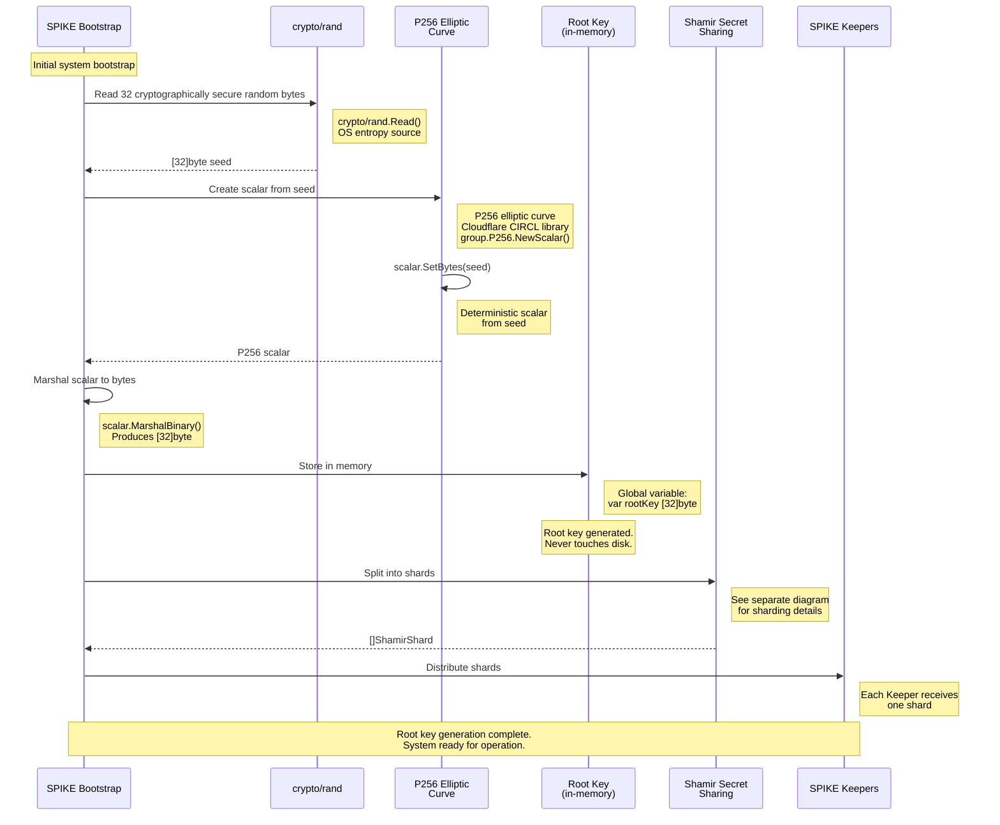
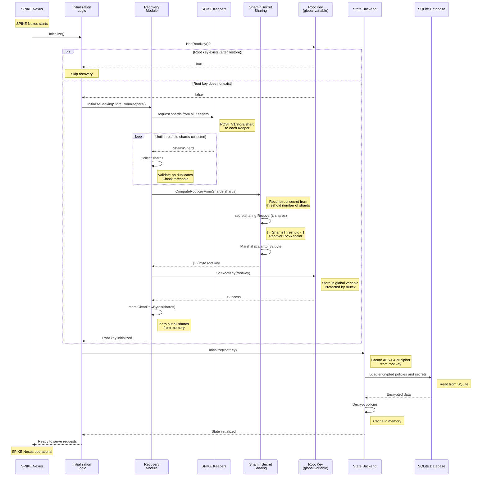
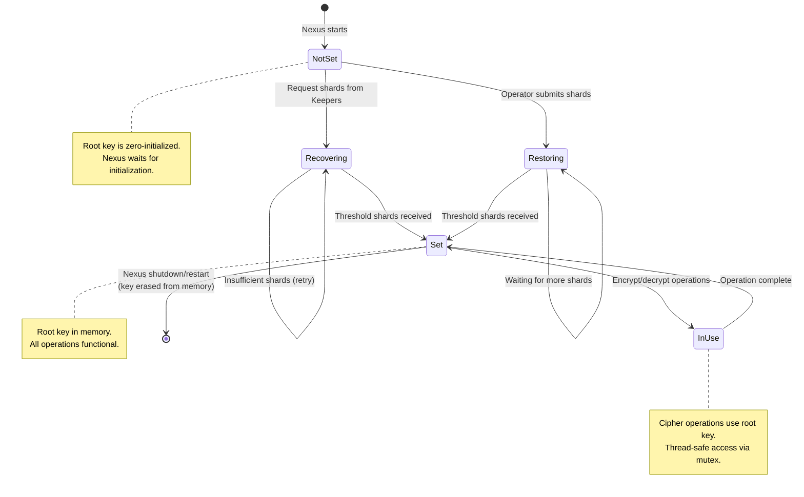
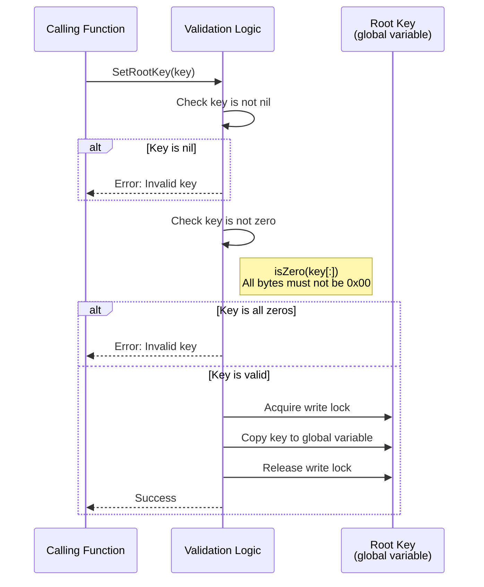
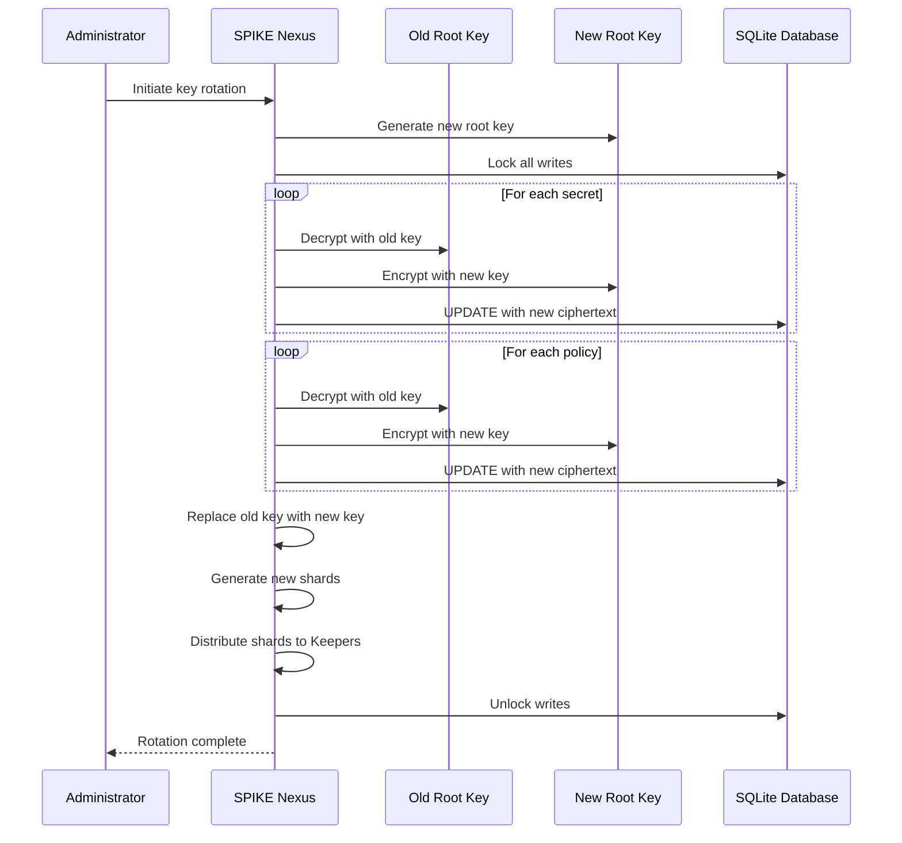

# Root Key Computation and Storage

## Overview

The root key is the foundation of SPIKE's security. It is used to encrypt all
secrets and policies. The root key is **never persisted to disk** and exists
only in memory.

---

## 1. Root Key Generation (Bootstrap)



**Key Files:**
- `app/bootstrap/internal/state/state.go::RootShares()`

**Cryptographic Details:**

```go
func generateRootKey() ([32]byte, error) {
    // Generate 32-byte cryptographically secure seed
    seed := make([]byte, crypto.AES256KeySize)
    _, err := rand.Read(seed)
    if err != nil {
        return [32]byte{}, err
    }

    // Create P256 scalar
    scalar := group.P256.NewScalar()
    err = scalar.SetBytes(seed)
    if err != nil {
        return [32]byte{}, err
    }

    // Marshal to fixed-size array
    bytes, err := scalar.MarshalBinary()
    if err != nil {
        return [32]byte{}, err
    }

    var rootKey [32]byte
    copy(rootKey[:], bytes)

    return rootKey, nil
}
```

**Why P256 scalar?**
- Provides mathematical structure for Shamir Secret Sharing
- Operates in finite field (required for secret sharing)
- Cryptographically secure (NIST P-256 curve)
- Deterministic operations from seed

---

## 2. Root Key Storage (In-Memory)

```mermaid
graph TD
    A[SPIKE Nexus Process Memory] --> B[Global Variables]
    B --> C[rootKey: [32]byte]
    B --> D[rootKeyMu: sync.RWMutex]

    C --> E[Cipher Creation]
    C --> F[Secret Encryption]
    C --> G[Policy Encryption]
    C --> H[Shard Generation]

    D --> I[Thread-Safe Access]

    style C fill:#ff6b6b,color:#fff
    style D fill:#4ecdc4
    style E fill:#95e1d3
    style F fill:#95e1d3
    style G fill:#95e1d3
    style H fill:#95e1d3

    J[Disk/Swap] -.X Not Persisted .-X C

    style J fill:#888,stroke:#f00,stroke-width:3px
```

**Global Variable Definition:**

```go
// File: app/nexus/internal/state/base/global.go

var (
    // Root key stored in memory only
    rootKey [crypto.AES256KeySize]byte  // [32]byte

    // Mutex for thread-safe access
    rootKeyMu sync.RWMutex
)
```

**Access Functions:**

```go
// SetRootKey stores the root key in memory
func SetRootKey(key [crypto.AES256KeySize]byte) error {
    // Validate key is not zero
    if isZero(key[:]) {
        return sdkErrors.ErrInvalidRootKey.Clone()
    }

    rootKeyMu.Lock()
    defer rootKeyMu.Unlock()

    // Copy key into global variable
    copy(rootKey[:], key[:])

    return nil
}

// GetRootKey retrieves the root key from memory
func GetRootKey() [crypto.AES256KeySize]byte {
    rootKeyMu.RLock()
    defer rootKeyMu.RUnlock()

    var key [crypto.AES256KeySize]byte
    copy(key[:], rootKey[:])

    return key
}

// HasRootKey checks if root key is set
func HasRootKey() bool {
    rootKeyMu.RLock()
    defer rootKeyMu.RUnlock()

    return !isZero(rootKey[:])
}
```

**Thread Safety:**
- `sync.RWMutex` allows multiple concurrent readers
- Single writer blocks all readers and other writers
- Critical for multi-threaded Nexus operations

**Memory Protection:**
- SPIKE uses memory locking (`mlockall`) to prevent memory from being
  swapped to disk
  - Implemented via `github.com/spiffe/spike-sdk-go/security/mem.Lock()`
  - Called during initialization in `out.Preamble()` for all components
  - Locks all current and future memory allocations
- Requires proper `ulimit` configuration:
  - Linux: Set `memlock` limits in `/etc/security/limits.conf`
  - Docker: Configure `default-ulimits.memlock` in `daemon.json`
  - Kubernetes: Set `LimitMEMLOCK=infinity` in systemd unit
- If memory locking fails (insufficient privileges), a warning is logged
  - Controlled by `SPIKE_SHOW_MEMORY_WARNING` environment variable
  - System continues to operate (degrades gracefully)
- Not possible to prevent memory dumps completely (ptrace, core dumps)
- SPIKE assumes process memory is trusted
- Additional OS-level protections recommended:
  - ASLR (Address Space Layout Randomization)
  - DEP (Data Execution Prevention)
  - Disable swap (`vm.swappiness=0`)
  - Disable core dumps (`LimitCORE=0`)

---

## 3. Root Key Initialization Flow



**Key Files:**
- `app/nexus/cmd/main.go` - Entry point
- `app/nexus/internal/initialization/recovery/recovery.go::InitializeBackingStoreFromKeepers()`
- `app/nexus/internal/state/base/data.go::SetRootKey()`

---

## 4. Root Key Lifecycle



**States:**

1. **NotSet**: Root key not in memory (zero-initialized)
   - Nexus cannot encrypt/decrypt
   - Waits for initialization

2. **Recovering**: Nexus requests shards from Keepers
   - Retry with exponential backoff
   - Continues until threshold met

3. **Restoring**: Operator manually submits shards
   - Break-the-glass recovery procedure
   - Stateful accumulation of shards

4. **Set**: Root key in memory
   - All cryptographic operations functional
   - Normal operation mode

5. **InUse**: Active encryption/decryption operation
   - Thread-safe access via mutex
   - Returns to Set after operation

**Transitions:**
- **NotSet → Recovering**: Automatic (startup)
- **NotSet → Restoring**: Manual (operator action)
- **Recovering → Set**: Automatic (threshold met)
- **Restoring → Set**: Manual (threshold met)
- **Set → InUse**: Automatic (on crypto operation)
- **InUse → Set**: Automatic (operation complete)
- **Set → Exit**: Only on shutdown/restart (process termination)

---

## 5. Root Key Validation



**Validation Logic:**

```go
func SetRootKey(key [crypto.AES256KeySize]byte) error {
    // Check if key is zero (invalid)
    if isZero(key[:]) {
        return sdkErrors.ErrInvalidRootKey.Clone().
            WithMessage("Root key cannot be zero")
    }

    // Thread-safe write
    rootKeyMu.Lock()
    defer rootKeyMu.Unlock()

    copy(rootKey[:], key[:])

    return nil
}

func isZero(data []byte) bool {
    for _, b := range data {
        if b != 0 {
            return false
        }
    }
    return true
}
```

**Why validate?**
- Prevents setting invalid root key
- Avoids cryptographic operations with zero key
- Fail-fast on configuration errors

---

## 6. Root Key Usage

### Cipher Creation

```go
func GetCipher() (cipher.AEAD, error) {
    key := GetRootKey()

    // Validate key is set
    if isZero(key[:]) {
        return nil, sdkErrors.ErrRootKeyNotSet.Clone()
    }

    // Create AES block cipher
    block, err := aes.NewCipher(key[:])
    if err != nil {
        return nil, err
    }

    // Create GCM mode
    gcm, err := cipher.NewGCM(block)
    if err != nil {
        return nil, err
    }

    return gcm, nil
}
```

### Secret Encryption

```go
func encryptSecret(data []byte) ([]byte, []byte, error) {
    cipher, err := GetCipher()
    if err != nil {
        return nil, nil, err
    }

    nonce := make([]byte, 12)
    rand.Read(nonce)

    ciphertext := cipher.Seal(nil, nonce, data, nil)

    return nonce, ciphertext, nil
}
```

### Shard Generation

```go
func computeShares() ([]ShamirShard, error) {
    key := GetRootKey()

    // Create deterministic reader from key
    reader := deterministicReader(key)

    // Create P256 scalar
    secret := group.P256.NewScalar()
    secret.SetBytes(key[:])

    // Generate shards
    threshold := uint(ShamirThreshold - 1)
    shares := uint(ShamirShares)

    ss := shamir.New(reader, threshold, secret)
    shards := ss.Share(shares)

    return convertShards(shards), nil
}
```

---

## 7. Security Considerations

### Why Memory-Only?

**Advantages:**
1. **No disk exposure**: Cannot be read from filesystem
2. **Ephemeral**: Erased on process termination
3. **No backup leakage**: Backups don't contain key
4. **Reduced attack surface**: Fewer persistence vectors

**Trade-offs:**
1. **Requires recovery**: Must reconstruct on restart
2. **Keeper dependency**: Needs Keepers online for recovery
3. **Memory dump risk**: Process memory can be dumped (requires root/admin)

### Memory Protection

**Current:**
- OS-level ASLR (Address Space Layout Randomization)
- OS-level DEP (Data Execution Prevention)
- Process isolation

**Future Enhancements:**
- `mlock()` to prevent swapping to disk
- Memory encryption (Intel SGX, AMD SEV)
- Secure enclaves (TPM, HSM integration)

### Threat Model

**Protected Against:**
- Disk forensics (key not on disk)
- Database theft (encrypted data useless without key)
- Backup leakage (backups don't contain key)
- Configuration file exposure (key not in config)

**NOT Protected Against:**
- Memory dump by root/admin user
- Process memory inspection (ptrace, gdb)
- Kernel exploits (access to process memory)
- Physical memory dump (cold boot attack)

**Mitigation:**
- Run Nexus with least privilege
- Use memory-protected environments (SGX, SEV)
- Monitor for suspicious process access
- Use Keeper-based recovery for redundancy

---

## 8. Root Key Rotation

**Current Status:** Root key rotation is **NOT supported**.

**Why Not?**
- Requires re-encrypting all secrets and policies
- Complex migration process
- Risk of data loss during rotation
- Keeper shards must be regenerated and redistributed

**Future Consideration:**



**Challenges:**
- Atomic operation (all-or-nothing)
- Downtime during rotation
- Keeper shard updates
- Rollback strategy if failure
- Audit trail for rotation

---

## 9. Configuration

**No Configuration Required:**
- Root key is NOT configurable
- Always 32 bytes (256 bits)
- Always generated cryptographically secure
- Always stored in memory only

**Related Configuration:**
- `SPIKE_SHAMIR_THRESHOLD`: Number of shards needed for recovery
- `SPIKE_SHAMIR_SHARES`: Total number of shards to generate
- `SPIKE_KEEPERS`: Keeper URLs for recovery

---

## 10. Operational Visibility

### Logging

**Logged Events:**
- Root key initialization success/failure
- Shard collection progress during recovery
- Shard distribution to Keepers
- Cipher creation errors

**NOT Logged (Security):**
- Root key value (NEVER logged)
- Decrypted secret data
- Decrypted policy patterns

### Monitoring

**Key Metrics:**
- Root key set: `true` or `false`
- Time to initialize root key (on startup)
- Failed cipher operations (may indicate missing key)
- Keeper shard distribution status

**Alerts:**
- Root key not initialized after extended period
- Repeated cipher operation failures
- Keeper shard distribution failures

---

## Summary

**Root Key Management:**
- **Generation**: Cryptographically secure random seed + P256 scalar
- **Storage**: Memory only (global variable, mutex-protected)
- **Initialization**: From Keepers (automatic) or operator (manual restore)
- **Usage**: All encryption/decryption operations
- **Persistence**: NEVER written to disk
- **Recovery**: Shamir Secret Sharing via Keepers or operator shards

**Security Properties:**
- **Entropy**: 256 bits of cryptographically secure randomness
- **Isolation**: Process memory only (not on disk)
- **Thread-safety**: Mutex-protected concurrent access
- **Validation**: Non-zero check before use
- **Erasure**: Cleared from memory on process exit

**Operational:**
- **Automatic recovery**: From Keepers on startup
- **Manual recovery**: Break-the-glass restore procedure
- **High availability**: Distributed shards across Keepers
- **No rotation**: Current limitation (future enhancement)
