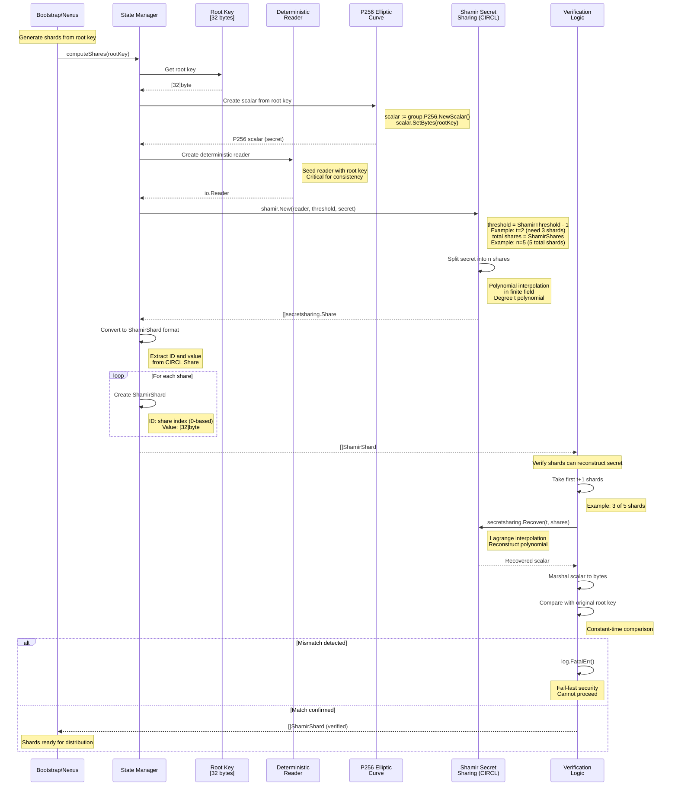
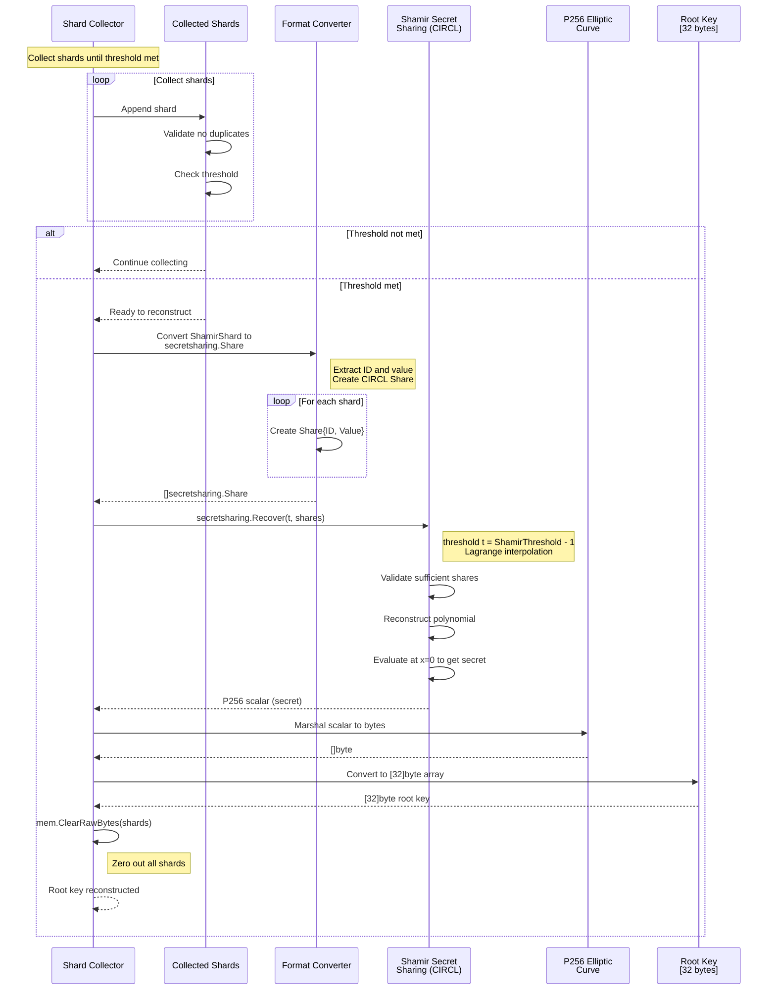
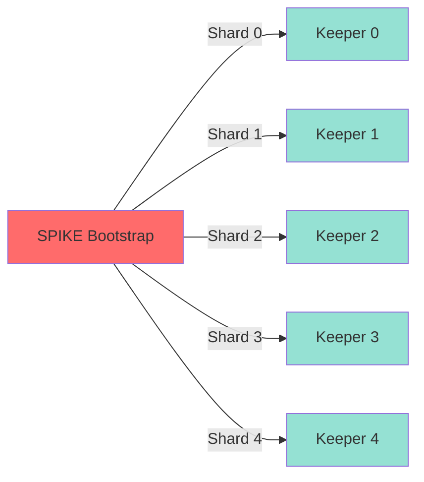
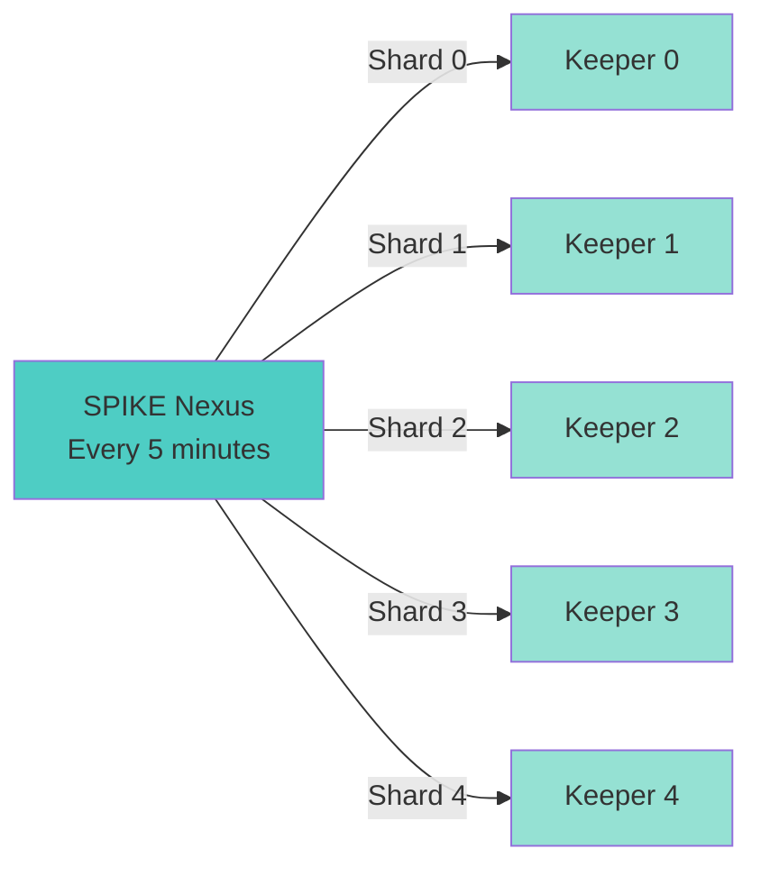
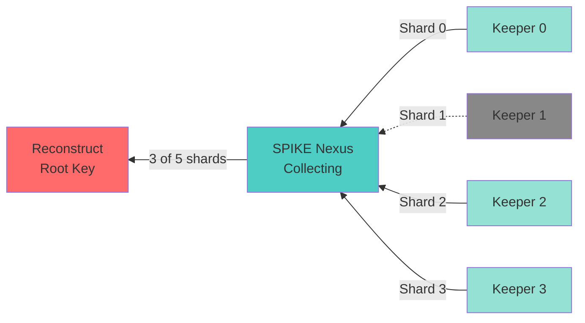
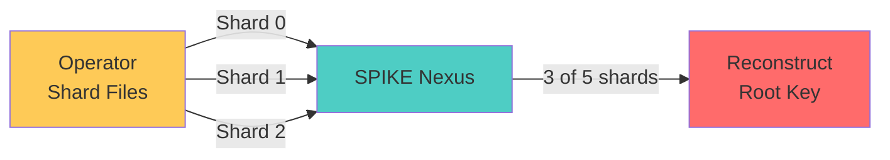
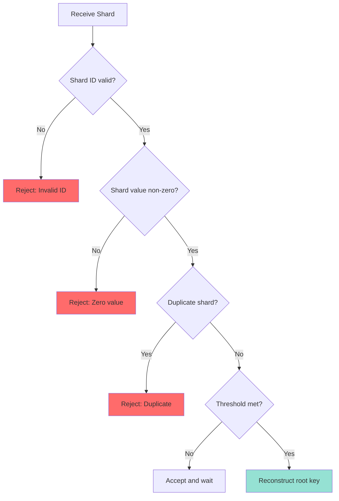

# Root Key Sharding with Shamir Secret Sharing

## Overview

SPIKE uses Shamir Secret Sharing to split the root key into multiple shards.
A threshold number of shards (t+1) can reconstruct the original key. This
provides redundancy and enables break-the-glass recovery.

---

## 1. Shard Generation Process



**Key Files:**
- `app/bootstrap/internal/state/state.go::RootShares()`
- `app/nexus/internal/initialization/recovery/shamir.go::computeShares()`

---

## 2. Shamir Secret Sharing Mathematics

### Threshold Scheme

**Parameters:**
- `t`: Threshold (minimum shards - 1)
- `n`: Total shards
- Need `t+1` shards to reconstruct

**Example Configuration:**
```
ShamirThreshold = 3
ShamirShares = 5

t = 3 - 1 = 2
n = 5

Need any 3 of 5 shards to reconstruct root key
```

### Polynomial Construction

```
Secret s is split using a random polynomial of degree t:

f(x) = a₀ + a₁x + a₂x² + ... + aₜx^t

Where:
- a₀ = s (the secret)
- a₁, a₂, ..., aₜ are random coefficients
- Operations in finite field (P256 curve)

Shards are points on this polynomial:
Shard₁ = f(1)
Shard₂ = f(2)
...
Shardₙ = f(n)

Any t+1 shards can reconstruct the polynomial and recover s = a₀
```

### Lagrange Interpolation (Reconstruction)

```
Given t+1 points (xᵢ, yᵢ), reconstruct polynomial:

f(x) = Σ yᵢ * Lᵢ(x)

Where Lᵢ(x) is the Lagrange basis polynomial:

Lᵢ(x) = Π (x - xⱼ) / (xᵢ - xⱼ)  for j ≠ i

Evaluate at x=0 to recover secret: s = f(0)
```

---

## 3. Deterministic Shard Generation

```mermaid
graph TD
    A[Root Key: [32 bytes]] --> B[Deterministic Reader]
    B --> C[Seeded Random Number Generator]
    C --> D[Generate Random Coefficients]
    D --> E[Construct Polynomial]
    E --> F[Evaluate at n Points]
    F --> G[Shard 1: f(1)]
    F --> H[Shard 2: f(2)]
    F --> I[Shard 3: f(3)]
    F --> J[Shard 4: f(4)]
    F --> K[Shard 5: f(5)]

    style A fill:#ff6b6b
    style B fill:#4ecdc4
    style G fill:#95e1d3
    style H fill:#95e1d3
    style I fill:#95e1d3
    style J fill:#95e1d3
    style K fill:#95e1d3
```

**Why Deterministic?**

```go
// Create deterministic reader from root key
func deterministicReader(rootKey [32]byte) io.Reader {
    hash := sha256.Sum256(rootKey[:])
    return rand.New(rand.NewSource(int64(binary.BigEndian.Uint64(hash[:]))))
}
```

**Benefits:**
1. **Consistency**: Same root key always produces same shards
2. **Crash recovery**: Can regenerate identical shards after restart
3. **Keeper synchronization**: Keepers receive same shard index consistently
4. **Verification**: Can verify distributed shards match expected values

**Critical for:**
- SPIKE Nexus restarts (regenerate and redistribute same shards)
- Keeper failures (send same shard to replacement Keeper)
- Audit and verification

---

## 4. Shard Structure

```go
type ShamirShard struct {
    ID    uint64                      // Shard identifier (0-based index)
    Value *[crypto.AES256KeySize]byte // 32-byte shard value
}
```

**Example Shards:**

```
Root Key: [0x12, 0x34, 0x56, ..., 0xAB]  (32 bytes)

Shard 0:
  ID: 0
  Value: [0xA1, 0xB2, 0xC3, ..., 0xD4]

Shard 1:
  ID: 1
  Value: [0xE5, 0xF6, 0x07, ..., 0x18]

Shard 2:
  ID: 2
  Value: [0x29, 0x3A, 0x4B, ..., 0x5C]

... (n total shards)
```

**Properties:**
- Fixed size: 32 bytes per shard (same as root key)
- Unique ID per shard
- No shard reveals information about root key alone
- Need threshold to reconstruct

---

## 5. Shard Reconstruction Process



**Key Files:**
- `app/nexus/internal/initialization/recovery/root_key.go::ComputeRootKeyFromShards()`

**Reconstruction Code:**

```go
func ComputeRootKeyFromShards(shards []ShamirShard) ([32]byte, error) {
    // Convert to CIRCL format
    shares := make([]secretsharing.Share, len(shards))
    for i, shard := range shards {
        shares[i] = secretsharing.Share{
            ID:    shard.ID,
            Value: group.P256.NewScalar().SetBytes(shard.Value[:]),
        }
    }

    // Reconstruct secret
    threshold := uint(ShamirThreshold - 1)
    secret, err := secretsharing.Recover(threshold, shares)
    if err != nil {
        return [32]byte{}, err
    }

    // Marshal to bytes
    bytes, err := secret.MarshalBinary()
    if err != nil {
        return [32]byte{}, err
    }

    // Convert to fixed-size array
    var rootKey [32]byte
    copy(rootKey[:], bytes)

    return rootKey, nil
}
```

---

## 6. Shard Distribution Scenarios

### Scenario A: Bootstrap (Initial Distribution)



**One-time distribution during initial setup.**

### Scenario B: Periodic Update (Nexus → Keepers)



**Continuous redistribution for redundancy.**

### Scenario C: Recovery (Keepers → Nexus)



**Nexus collects threshold shards from available Keepers.**

**Note:** Keeper 1 is offline (dashed line). 3 of 4 online Keepers provide
shards (meets threshold).

### Scenario D: Break-the-Glass (Operator → Nexus)



**Manual recovery using operator-held shards.**

---

## 7. Shard Validation



**Validation Checks:**

```go
func validateShard(shard ShamirShard, existing []ShamirShard) error {
    // Check value not zero
    if isZero(shard.Value[:]) {
        return errors.New("shard value cannot be zero")
    }

    // Check for duplicates
    for _, s := range existing {
        if s.ID == shard.ID {
            return errors.New("duplicate shard ID")
        }
    }

    return nil
}
```

---

## 8. Security Analysis

### Information Leakage

**Q: Can an attacker with `t` shards learn anything about the root key?**

**A: No.** Shamir Secret Sharing is information-theoretically secure. With
fewer than `t+1` shards, the attacker gains **zero information** about the
secret.

**Mathematical Proof:**
```
Given t shards, there exist 2^256 possible secrets that are
consistent with those shards. All are equally likely.
```

### Shard Compromise Scenarios

| Shards Compromised | Security Impact |
|--------------------|-----------------|
| 0-2 (< threshold) | Zero information leaked |
| 3 (= threshold) | Root key can be reconstructed |
| 4-5 (> threshold) | Root key can be reconstructed |

**Mitigation:**
- Distribute shards across isolated Keepers
- Use mTLS with SPIFFE ID validation
- Monitor shard access (audit logs)
- Rotate root key if threshold breached (future feature)

### Shard Storage Security

**Keeper Storage:**
- In-memory only (not persisted)
- Lost on Keeper restart (recovered from Nexus)
- Protected by process isolation

**Operator Storage (Break-the-Glass):**
- Saved to `~/.spike/recover` directory
- File permissions: 0600 (owner read/write only)
- Operator responsibility to secure

---

## 9. Configuration

```bash
# Shamir Secret Sharing configuration
export SPIKE_SHAMIR_THRESHOLD=3   # Need 3 shards to reconstruct
export SPIKE_SHAMIR_SHARES=5      # Generate 5 total shards
```

**Recommendations:**

| Deployment | Threshold | Shares | Rationale |
|------------|-----------|--------|-----------|
| Dev/Test | 2 | 3 | Minimal redundancy |
| Small Prod | 3 | 5 | Standard config |
| Large Prod | 5 | 7 | High redundancy |
| Critical | 7 | 10 | Maximum security |

**Trade-offs:**
- **Higher threshold**: More secure (harder to compromise)
- **Higher shares**: More redundancy (tolerate more Keeper failures)
- **Lower threshold**: Easier recovery (fewer shards needed)
- **Lower shares**: Less overhead (fewer Keepers needed)

---

## 10. Operational Procedures

### Generate Recovery Shards

```bash
spike recover
# Output: Shard files saved to ~/.spike/recover/
```

**Files Created:**
```
~/.spike/recover/shard-1
~/.spike/recover/shard-2
~/.spike/recover/shard-3
...
```

### Restore from Recovery Shards

```bash
# Submit shards one at a time
spike restore ~/.spike/recover/shard-1
spike restore ~/.spike/recover/shard-2
spike restore ~/.spike/recover/shard-3

# After threshold met:
# Output: Root key restored successfully
```

### Verify Shard Consistency

```bash
# Compare shards from different sources
# (Not implemented, future feature)
spike verify-shards \
  --keeper-shard keeper1:/v1/store/shard \
  --recovery-shard ~/.spike/recover/shard-1
```

---

## Summary

**Shamir Secret Sharing:**
- **Algorithm**: Polynomial-based threshold scheme
- **Library**: Cloudflare CIRCL (cryptographic library)
- **Threshold**: Configurable (default: 3 of 5)
- **Shard Size**: 32 bytes (same as root key)
- **Deterministic**: Same key produces same shards
- **Security**: Information-theoretically secure

**Key Properties:**
- Need `t+1` shards to reconstruct (threshold)
- Fewer than `t+1` shards reveal **zero information**
- Shards are points on degree-t polynomial
- Reconstruction uses Lagrange interpolation
- Operates in finite field (P256 elliptic curve)

**Use Cases:**
1. **Bootstrap**: Initial shard distribution to Keepers
2. **Periodic updates**: Nexus redistributes shards every 5 minutes
3. **Recovery**: Nexus collects shards from Keepers on startup
4. **Break-the-glass**: Operator manually restores from saved shards
