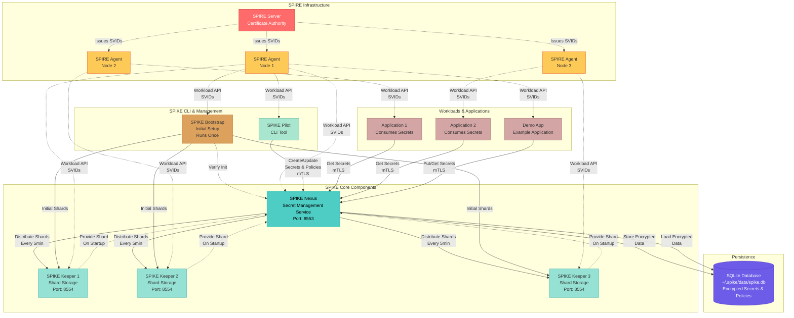

# SPIKE System Overview

## Architecture Diagram



---

## Component Descriptions

### SPIRE Infrastructure

**SPIRE Server:**
- Certificate Authority for workload identity
- Issues X.509 SVIDs to workloads
- Manages trust domain
- Typically runs as HA cluster

**SPIRE Agents:**
- Node attestation
- Workload attestation
- SVID rotation
- Workload API (Unix domain socket)
- One agent per node/VM

**SPIFFE IDs:**
```
spiffe://<trust-domain>/spike/nexus
spiffe://<trust-domain>/spike/keeper/<id>
spiffe://<trust-domain>/spike/pilot/role/<role>
spiffe://<trust-domain>/spike/bootstrap
spiffe://<trust-domain>/workload/<name>
```

---

### SPIKE Core Components

#### SPIKE Nexus (Secret Management Service)

**Responsibilities:**
- Store and manage secrets
- Enforce access policies
- Encrypt/decrypt data with root key
- Distribute shards to Keepers
- Serve mTLS API

**Key Features:**
- SQLite backend (encrypted at rest)
- AES-256-GCM encryption
- Policy-based authorization
- Secret versioning
- Cipher API (encrypt/decrypt for clients)

**Ports:**
- 8553 (mTLS API)

**Storage:**
- `~/.spike/data/spike.db` (encrypted database)

**In-Memory:**
- Root key (32 bytes, never persisted)

---

#### SPIKE Keepers (Shard Storage)

**Responsibilities:**
- Store one shard of root key
- Provide shard to Nexus on startup
- Receive periodic shard updates from Nexus

**Key Features:**
- In-memory shard storage (not persisted)
- mTLS with SPIFFE ID validation
- Distributed across nodes/zones
- Stateless (shards recovered from Nexus)

**Ports:**
- 8554 (mTLS API)

**Configuration:**
- Number of Keepers = `SPIKE_SHAMIR_SHARES`
- Threshold = `SPIKE_SHAMIR_THRESHOLD`
- Typical: 5 Keepers, need 3 for recovery

---

#### SPIKE Pilot (CLI Tool)

**Responsibilities:**
- Secret management (put, get, delete, list)
- Policy management (create, delete, list)
- Operator commands (recover, restore)
- User-friendly interface

**Key Features:**
- mTLS authentication
- Role-based operations
- Interactive and scripted modes
- JSON output for automation

**SPIFFE IDs:**
- `spike/pilot/role/superuser` - Full admin
- `spike/pilot/role/admin` - Policy admin
- `spike/pilot/role/operator` - Secret operations
- `spike/pilot/role/recover` - Recovery shards
- `spike/pilot/role/restore` - Restore operations

---

#### SPIKE Bootstrap (Initial Setup)

**Responsibilities:**
- One-time system initialization
- Generate root key
- Create and distribute shards to Keepers
- Verify Nexus initialization

**Key Features:**
- Runs once at deployment
- Idempotent (checks if already bootstrapped)
- Kubernetes: Uses ConfigMap flag
- Bare-metal: Uses environment variable

**Lifecycle:**
- Start → Check if bootstrapped → Generate root key → Distribute shards →
  Verify → Mark complete → Exit

---

### Workloads & Applications

**Application Workloads:**
- Consume secrets from SPIKE Nexus
- Use SPIKE SDK for API access
- Authenticate with SPIFFE SVIDs
- Subject to policy-based authorization

**Example Use Cases:**
- Database credentials
- API keys
- TLS certificates
- Configuration secrets

**Demo App:**
- Example application showing SPIKE integration
- Demonstrates secret put/get operations
- Reference implementation for developers

---

### Data Flows

#### 1. Secret Write Flow

```
Operator → SPIKE Pilot → mTLS → SPIKE Nexus
  ↓
Check Policy (SPIFFE ID + Path)
  ↓
Encrypt Secret with Root Key (AES-GCM)
  ↓
Store in SQLite Database (encrypted)
```

#### 2. Secret Read Flow

```
Application → mTLS → SPIKE Nexus
  ↓
Check Policy (SPIFFE ID + Path)
  ↓
Query SQLite Database (encrypted data)
  ↓
Decrypt Secret with Root Key
  ↓
Return Plaintext to Application
```

#### 3. Shard Distribution Flow

```
SPIKE Nexus (Every 5 minutes)
  ↓
Generate Shards from Root Key
  ↓
For Each Keeper:
  mTLS → POST /v1/store/contribute
  ↓
Keeper stores shard in memory
```

#### 4. Recovery Flow

```
SPIKE Nexus Starts
  ↓
Root Key Not in Memory
  ↓
For Each Keeper:
  mTLS → POST /v1/store/shard
  ↓
Collect Shards
  ↓
Threshold Met?
  ↓
Reconstruct Root Key (Shamir Secret Sharing)
  ↓
Initialize State (decrypt policies/secrets)
  ↓
Start Serving Requests
```

---

## Security Architecture

### Authentication (mTLS with SPIFFE)

```
Client connects to SPIKE Nexus
  ↓
TLS Handshake
  ↓
Mutual certificate verification
  ↓
Extract SPIFFE ID from client certificate
  ↓
Validate SPIFFE ID format
  ↓
Use SPIFFE ID for authorization
```

**Trust Model:**
- SPIRE Server is root of trust
- All components trust SPIRE-issued SVIDs
- Workload identity based on SPIFFE IDs
- No shared secrets or passwords

---

### Authorization (Policy-Based)

```
Client requests secret at path "secrets/db/creds"
  ↓
Extract client SPIFFE ID: "spiffe://example.org/app/api"
  ↓
Load all policies from cache
  ↓
For each policy:
  - Does SPIFFE ID match regex pattern?
  - Does path match regex pattern?
  - Does policy grant required permission (read)?
  ↓
If ANY policy matches → Grant access
If NO policies match → Deny access (403)
```

**Policy Model:**
- Positive grants only (no deny rules)
- First match wins
- Regex-based pattern matching
- Permission hierarchy (super > admin > write > read)

---

### Encryption (Defense in Depth)

**At Rest:**
- All secrets encrypted with AES-256-GCM
- All policy details encrypted
- Root key never persisted (memory only)
- Database useless without root key

**In Transit:**
- mTLS for all communication
- SPIFFE SVIDs for authentication
- TLS 1.3 with strong ciphers
- Certificate rotation via SPIRE

**In Memory:**
- Root key in protected memory
- Mutex-protected concurrent access
- Sensitive data zeroed after use
- Shards cleared after reconstruction

---

## High Availability Architecture

### Keeper Redundancy

```
5 Keepers, need 3 for recovery

Scenario: 2 Keepers fail
  ↓
3 Keepers still online
  ↓
Nexus can recover root key ✓
  ↓
System remains operational
```

**Deployment Recommendations:**
- Spread Keepers across availability zones
- Different nodes/VMs for each Keeper
- Monitor Keeper health
- Alert if available < threshold

---

### Nexus High Availability

**Single Nexus:**
- Simple deployment
- Single point of failure
- Suitable for dev/small prod

**Active-Passive Nexus:**
- Primary + standby instances
- Standby recovers from Keepers on failover
- Shared SQLite database (NFS/replicated storage)

**Active-Active Nexus:**
- Multiple instances
- Load balancer in front
- Shared database (not recommended with SQLite)
- Consider PostgreSQL backend (future)

---

## Deployment Architectures

### 1. Kubernetes Deployment

```
┌─────────────────────────────────────────┐
│         Kubernetes Cluster              │
│                                         │
│  ┌───────────────┐  ┌────────────────┐ │
│  │  SPIKE Nexus  │  │  SPIKE Keeper  │ │
│  │  StatefulSet  │  │  StatefulSet   │ │
│  │  (1 replica)  │  │  (5 replicas)  │ │
│  │  + PVC        │  │  (no PVC)      │ │
│  └───────┬───────┘  └────────┬───────┘ │
│          │                    │         │
│  ┌───────▼────────────────────▼──────┐ │
│  │     SPIRE Agent (DaemonSet)       │ │
│  │     (on each node)                │ │
│  └───────────────────────────────────┘ │
│                                         │
│  ┌───────────────────────────────────┐ │
│  │   SPIRE Server (StatefulSet)      │ │
│  │   (3 replicas, HA)                │ │
│  └───────────────────────────────────┘ │
│                                         │
│  ┌───────────────────────────────────┐ │
│  │   Application Pods                │ │
│  │   (consume secrets)               │ │
│  └───────────────────────────────────┘ │
└─────────────────────────────────────────┘
```

**Deployment Details:**

| Component | Type | Storage | Reason |
|-----------|------|---------|--------|
| SPIKE Nexus | StatefulSet | PersistentVolume | Needs SQLite database (`~/.spike/data/spike.db`) for secrets/policies |
| SPIKE Keeper | StatefulSet | None (in-memory) | Stores shard in-memory only, but needs stable network identity |
| SPIRE Server | StatefulSet | PersistentVolume | Needs database for registration entries |
| SPIRE Agent | DaemonSet | None | Runs on every node to provide SPIFFE identities |

**Why StatefulSet for SPIKE Keeper?**
- Keepers store shards **in-memory only** (no persistent storage needed)
- StatefulSet provides stable network identity for Nexus to discover Keepers
- Each Keeper gets predictable DNS name (e.g., `spike-keeper-0`, `spike-keeper-1`)
- Enables Nexus to contact specific Keepers for shard distribution/recovery
- NOT a DaemonSet because we need a fixed number of Keepers (e.g., 5), not one per node

**Bootstrap Process:**
1. Deploy SPIRE (Server + Agents)
2. Register SPIKE components in SPIRE
3. Deploy SPIKE Keepers (StatefulSet with 5 replicas)
4. Run SPIKE Bootstrap job
5. Deploy SPIKE Nexus (StatefulSet with PVC)
6. Deploy applications

---

### 2. Bare-Metal / VM Deployment

```
┌──────────────┐  ┌──────────────┐  ┌──────────────┐
│   Node 1     │  │   Node 2     │  │   Node 3     │
│              │  │              │  │              │
│ SPIRE Agent  │  │ SPIRE Agent  │  │ SPIRE Agent  │
│ SPIKE Keeper │  │ SPIKE Keeper │  │ SPIKE Keeper │
│ Application  │  │ SPIKE Nexus  │  │ Application  │
└──────────────┘  └──────────────┘  └──────────────┘
                          │
                          │
                  ┌───────▼────────┐
                  │ SPIRE Server   │
                  │ (separate node)│
                  └────────────────┘
```

**Installation:**
1. Install SPIRE on each node (systemd service)
2. Install SPIKE components (systemd services)
3. Run SPIKE Bootstrap once
4. Start SPIKE Nexus and Keepers
5. Configure applications to use SPIKE

---

## Monitoring and Observability

### Key Metrics

**SPIKE Nexus:**
- Requests per second (read, write, cipher)
- Policy checks per second
- Cipher operations per second
- Database query latency
- Root key initialization status
- Active connections

**SPIKE Keepers:**
- Shard contribution requests
- Shard retrieval requests
- Last shard update timestamp
- Keeper health status

**SPIRE:**
- SVID issuance rate
- SVID rotation events
- Agent-server connection status
- Workload attestation success/failure

---

### Logging

**Log Levels:**
- FATAL: Unrecoverable errors (process exits)
- ERROR: Operation failures
- WARN: Recoverable issues
- INFO: Normal operations
- DEBUG: Detailed debugging (disabled in prod)

**Important Events:**
- Secret access (read, write, delete)
- Policy creation/deletion
- Authorization failures (policy violations)
- Root key initialization
- Shard distribution
- mTLS connection failures

---

## Configuration Summary

### Environment Variables

**SPIKE Nexus:**
```bash
SPIKE_NEXUS_TLS_PORT=8553
SPIKE_KEEPERS=https://keeper1:8554,https://keeper2:8554,...
SPIKE_SHAMIR_THRESHOLD=3
SPIKE_SHAMIR_SHARES=5
SPIKE_BACKEND_STORE_TYPE=sqlite
SPIKE_DATA_DIR=~/.spike/data
```

**SPIKE Keeper:**
```bash
SPIKE_KEEPER_TLS_PORT=8554
```

**SPIKE Bootstrap:**
```bash
SPIKE_KEEPERS=https://keeper1:8554,https://keeper2:8554,...
SPIKE_NEXUS_URL=https://nexus:8553
SPIKE_SHAMIR_THRESHOLD=3
SPIKE_SHAMIR_SHARES=5
```

**SPIRE:**
```bash
SPIFFE_ENDPOINT_SOCKET=unix:///run/spire/sockets/agent.sock
```

---

## Summary

**SPIKE Architecture:**
- **SPIRE**: Workload identity foundation (mTLS, SVIDs)
- **Nexus**: Central secret management service
- **Keepers**: Distributed shard storage for redundancy
- **Pilot**: User-friendly CLI for operations
- **Bootstrap**: One-time initialization
- **Applications**: Consume secrets via SDK

**Security Properties:**
- Zero-trust architecture (SPIFFE-based authentication)
- Policy-based authorization (regex patterns)
- Encryption at rest (AES-256-GCM)
- Encryption in transit (mTLS)
- No single point of compromise (Shamir Secret Sharing)
- Defense in depth (multiple security layers)

**Operational Benefits:**
- High availability (distributed Keepers)
- Disaster recovery (break-the-glass shards)
- Scalability (stateless Keepers, single Nexus)
- Observability (structured logging, metrics)
- Automation-friendly (CLI with JSON output)
