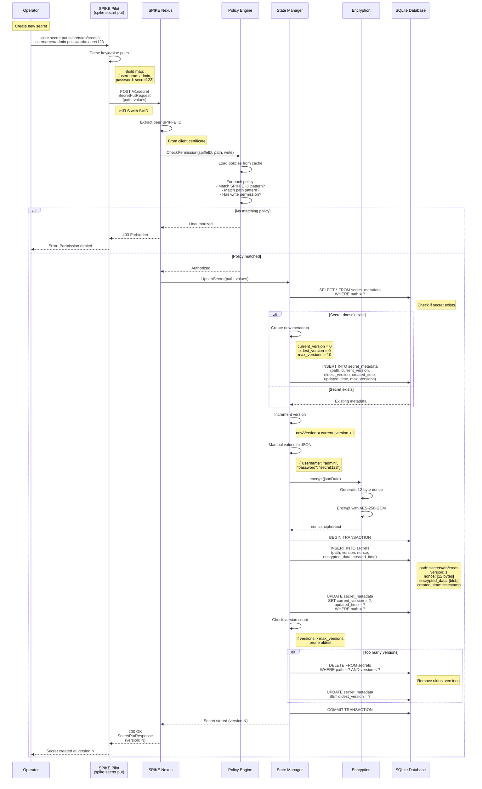
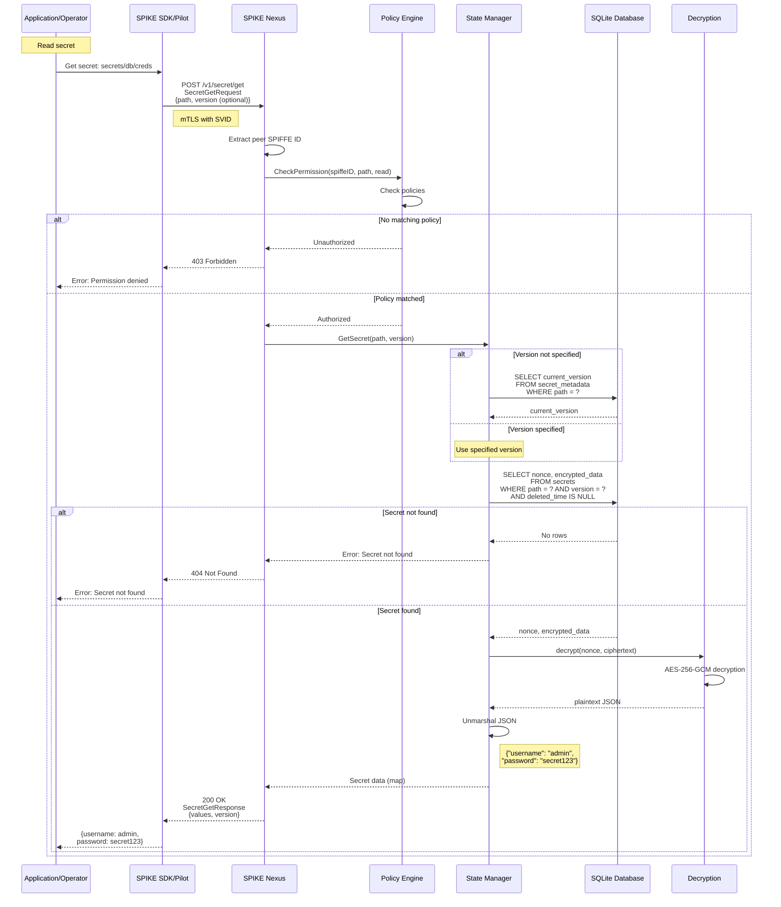
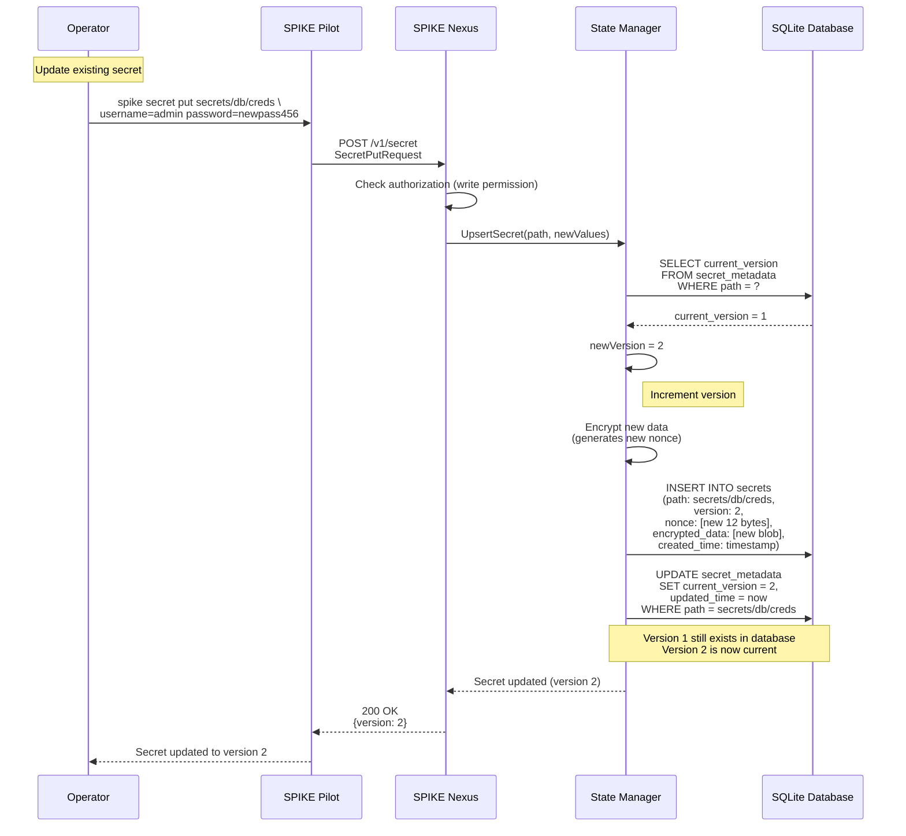
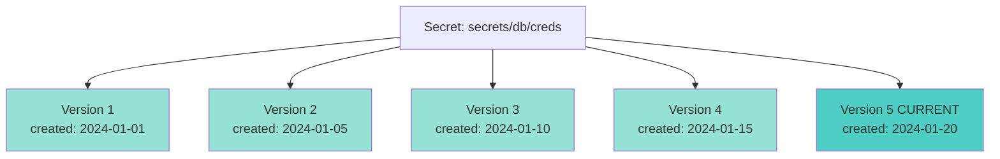
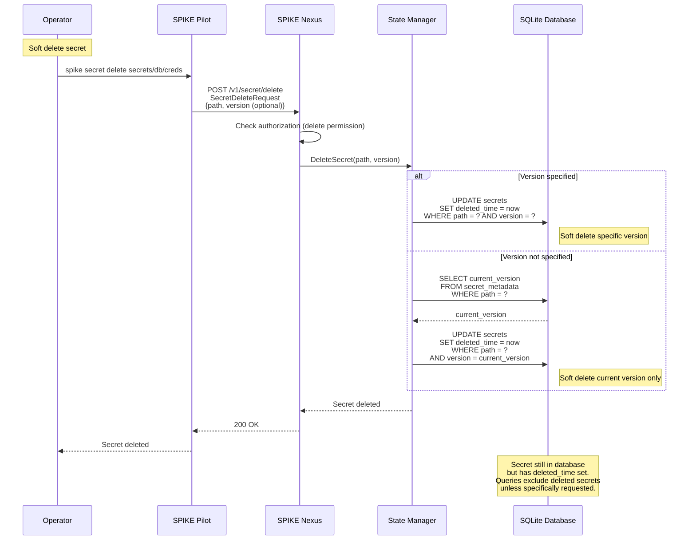
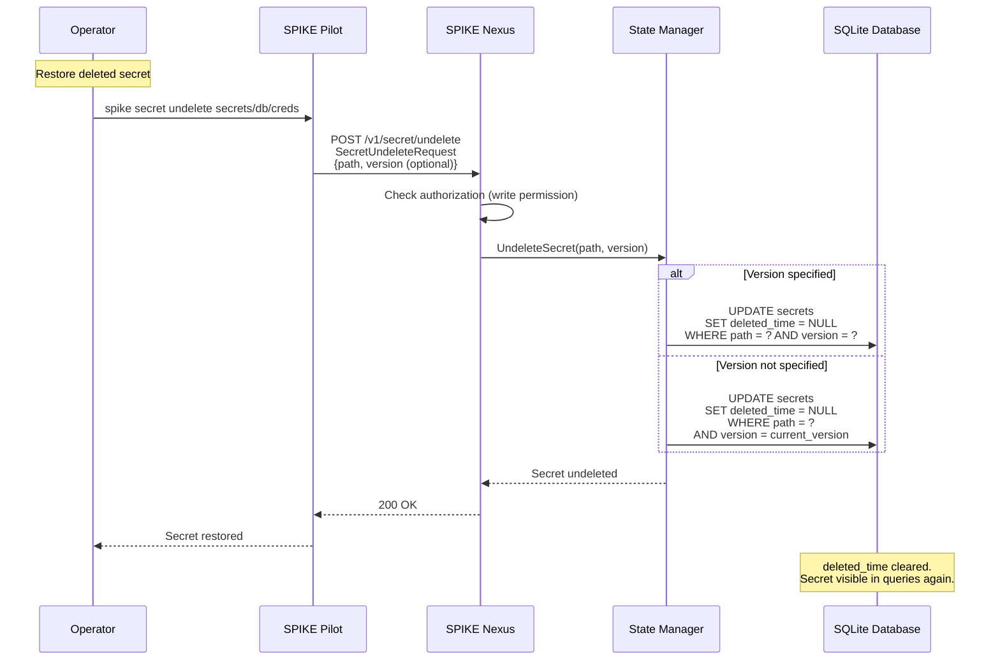
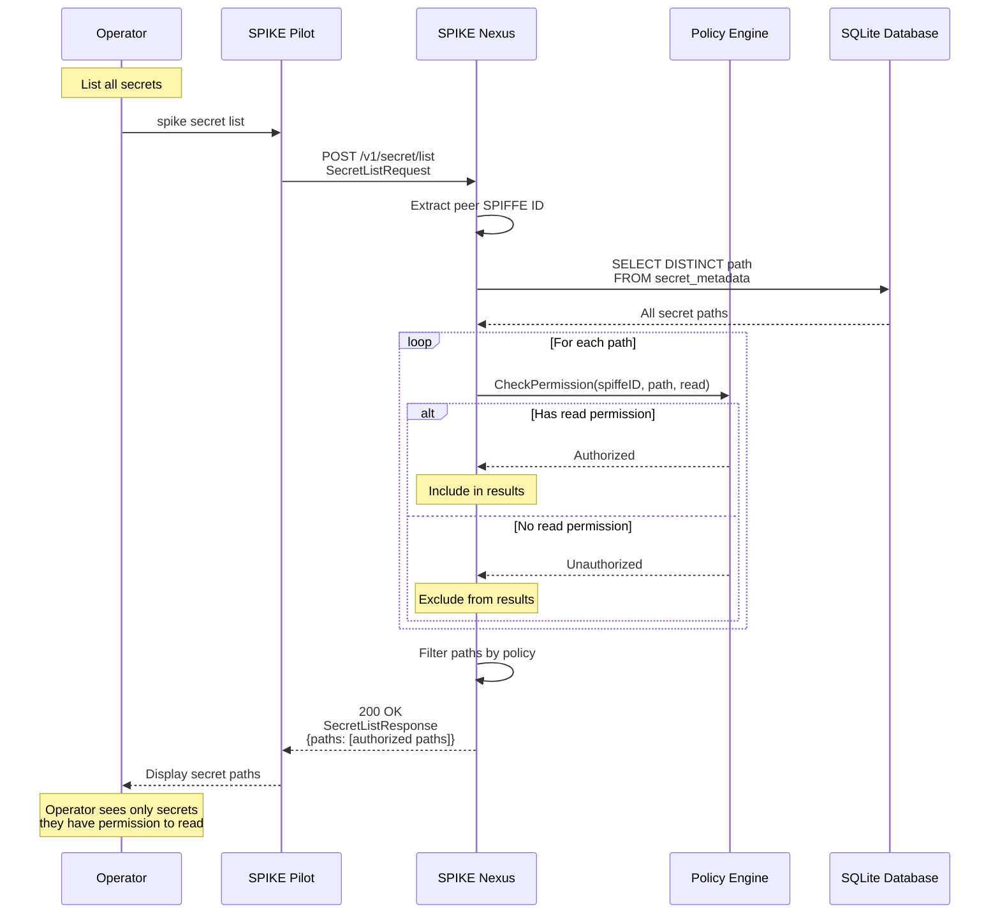
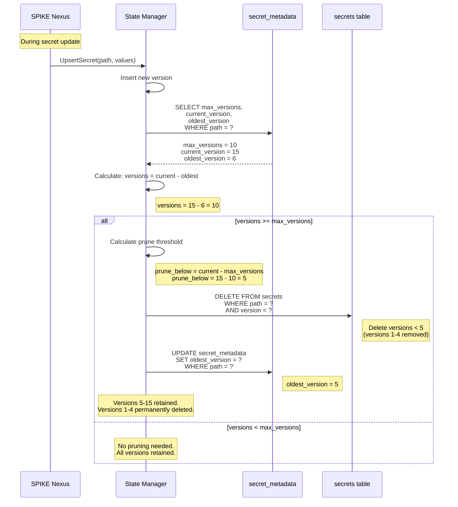
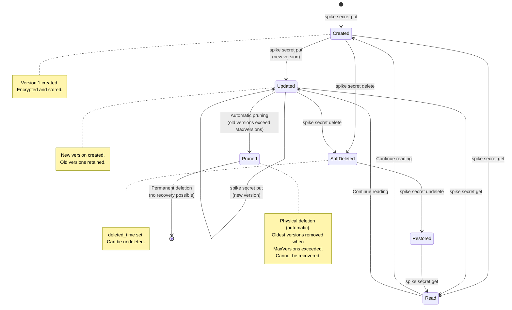

# Secret Lifecycle Management

## Overview

Secrets in SPIKE have a complete lifecycle from creation through versioning,
updates, soft deletion, and permanent removal. This document covers all
operations from CLI to database.

---

## 1. Secret Creation (Put)



**Key Files:**
- `app/spike/internal/cmd/secret/put.go` - CLI command
- `app/nexus/internal/route/secret/put.go` - HTTP handler
- `app/nexus/internal/state/base/secret.go::UpsertSecret()`
- `app/nexus/internal/state/backend/sqlite/persist/secret.go::StoreSecret()`

---

## 2. Secret Read (Get)



**Key Files:**
- `app/spike/internal/cmd/secret/get.go` - CLI command
- `app/nexus/internal/route/secret/get.go` - HTTP handler
- `app/nexus/internal/state/base/secret.go::GetSecret()`
- `app/nexus/internal/state/backend/sqlite/persist/secret.go::ReadSecret()`

---

## 3. Secret Update (New Version)



**Note:** Old versions are retained up to `max_versions` limit.

---

## 4. Secret Versioning



**Version Management:**
- Each update creates new version
- Current version tracked in metadata
- Old versions retained up to `max_versions`
- Can read any non-deleted version
- Oldest versions pruned automatically

**Example:**
```bash
# Get current version (5)
spike secret get secrets/db/creds

# Get specific version
spike secret get secrets/db/creds --version 3

# List versions
spike secret versions secrets/db/creds
# Output:
#   Version 5 (current) - 2024-01-20
#   Version 4 - 2024-01-15
#   Version 3 - 2024-01-10
#   Version 2 - 2024-01-05
#   Version 1 - 2024-01-01
```

---

## 5. Secret Soft Delete



**Key Files:**
- `app/spike/internal/cmd/secret/delete.go` - CLI command
- `app/nexus/internal/route/secret/delete.go` - HTTP handler

**Soft Delete Benefits:**
- Can be undeleted
- Audit trail preserved
- No data loss
- Fast operation (no encryption/decryption)

---

## 6. Secret Undelete



**Note:** Undelete only works for soft-deleted secrets (marked with
`deleted_time`). Once a version is physically removed from the database
through automatic pruning (when `MaxVersions` is exceeded and new versions
are added), it cannot be recovered. There is no explicit "hard delete" API
endpoint—physical deletion only occurs automatically during version pruning.

---

## 7. Secret List



**Key Files:**
- `app/spike/internal/cmd/secret/list.go` - CLI command
- `app/nexus/internal/route/secret/list.go` - HTTP handler

**Security Note:** List returns only paths, not secret data. Only paths the
user has permission to read are included.

---

## 8. Secret Version Pruning



**Pruning Rules:**
- Automatic during secret updates
- Keeps most recent `max_versions` versions
- Oldest versions physically deleted from database
- Cannot be recovered after pruning
- This is the only way versions are permanently removed (no manual hard
  delete API)

**Configuration:**
```bash
# Set max versions for new secrets (default: 10)
spike secret put path key=value --max-versions 20

# Update max versions for existing secret
spike secret metadata path --max-versions 5
```

---

## 9. Complete Secret Lifecycle State Machine



---

## 10. Secret Lifecycle Operations Summary

| Operation | Command | Effect | Reversible |
|-----------|---------|--------|------------|
| **Create** | `spike secret put path key=val` | Create version 1 | N/A |
| **Read** | `spike secret get path` | Get current version | N/A (read-only) |
| **Read Version** | `spike secret get path --version N` | Get specific version | N/A (read-only) |
| **Update** | `spike secret put path key=newval` | Create new version | Yes (old version retained) |
| **List** | `spike secret list` | List paths (filtered by policy) | N/A (read-only) |
| **Versions** | `spike secret versions path` | List all versions | N/A (read-only) |
| **Soft Delete** | `spike secret delete path` | Set deleted_time | Yes (undelete) |
| **Undelete** | `spike secret undelete path` | Clear deleted_time | N/A (restores) |
| **Prune** | Automatic (on update) | Physically removes old versions | No |

---

## 11. Key Files Reference

**CLI Commands:**
- `app/spike/internal/cmd/secret/put.go` - Create/update secret
- `app/spike/internal/cmd/secret/get.go` - Read secret
- `app/spike/internal/cmd/secret/delete.go` - Delete secret
- `app/spike/internal/cmd/secret/undelete.go` - Restore secret
- `app/spike/internal/cmd/secret/list.go` - List secrets
- `app/spike/internal/cmd/secret/versions.go` - List versions

**HTTP Handlers:**
- `app/nexus/internal/route/secret/put.go` - Secret put endpoint
- `app/nexus/internal/route/secret/get.go` - Secret get endpoint
- `app/nexus/internal/route/secret/delete.go` - Secret delete endpoint
- `app/nexus/internal/route/secret/undelete.go` - Secret undelete endpoint
- `app/nexus/internal/route/secret/list.go` - Secret list endpoint

**State Management:**
- `app/nexus/internal/state/base/secret.go` - Secret operations
- `app/nexus/internal/state/backend/sqlite/persist/secret.go` - Database persistence

---

## Summary

**Secret Lifecycle Stages:**
1. **Creation**: First version created
2. **Reading**: Access current or specific version
3. **Updating**: Create new version, retain old
4. **Versioning**: Track multiple versions per secret
5. **Soft Deletion**: Mark as deleted (reversible)
6. **Undelete**: Restore soft-deleted secret
7. **Pruning**: Automatic removal of old versions
8. **Hard Deletion**: Permanent removal (irreversible)

**Key Features:**
- **Versioning**: Full history of secret changes
- **Soft Delete**: Reversible deletion with undelete
- **Auto-Pruning**: Keep most recent versions, remove old
- **Policy-Based Access**: Authorization at every step
- **Encryption**: All versions encrypted with unique nonce
- **Audit Trail**: Timestamps for all operations
