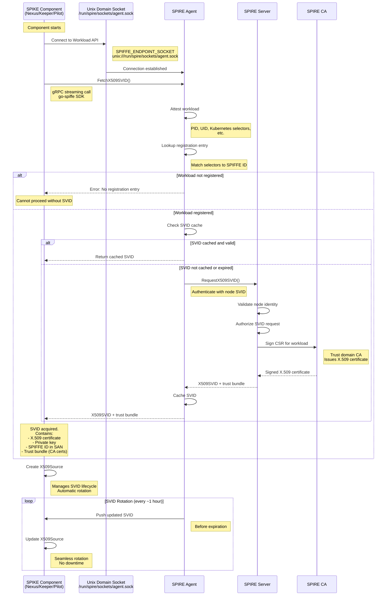
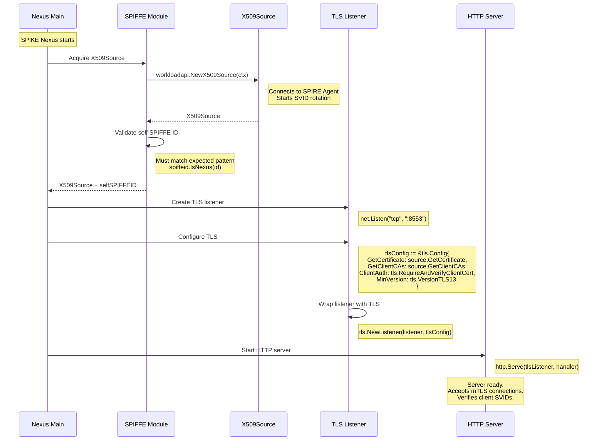
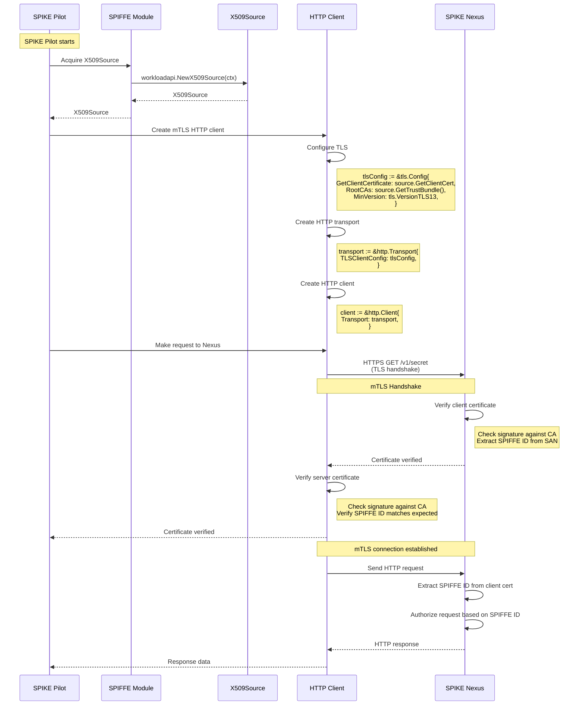
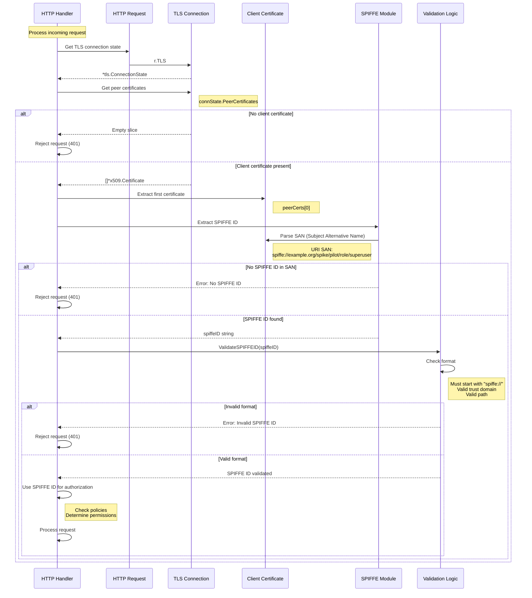
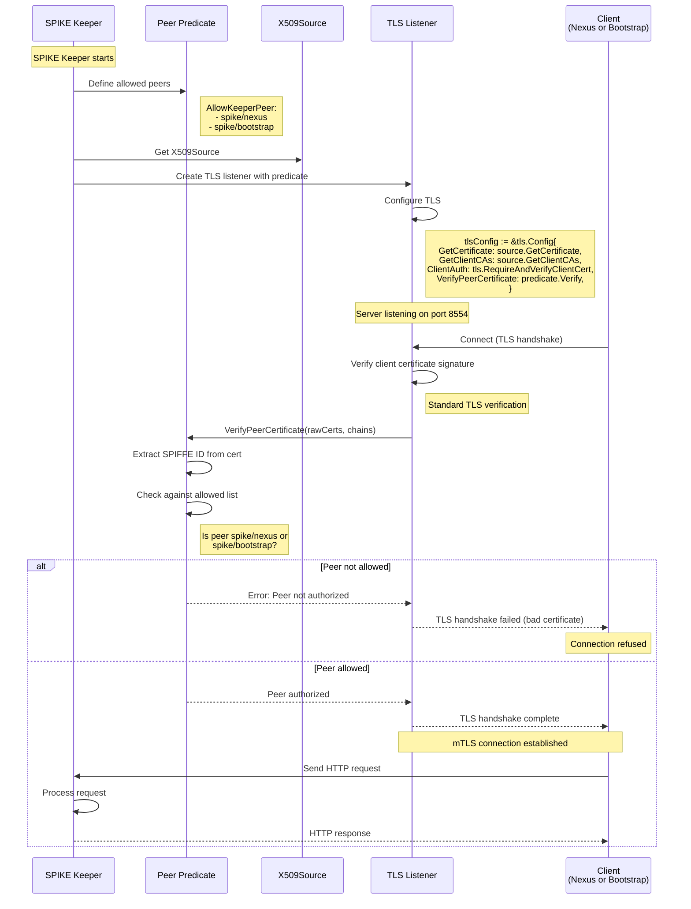
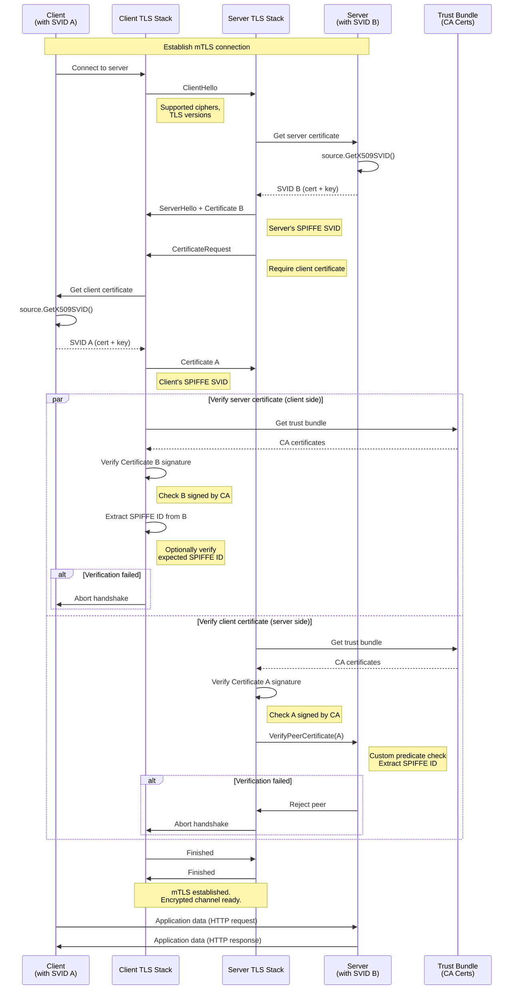
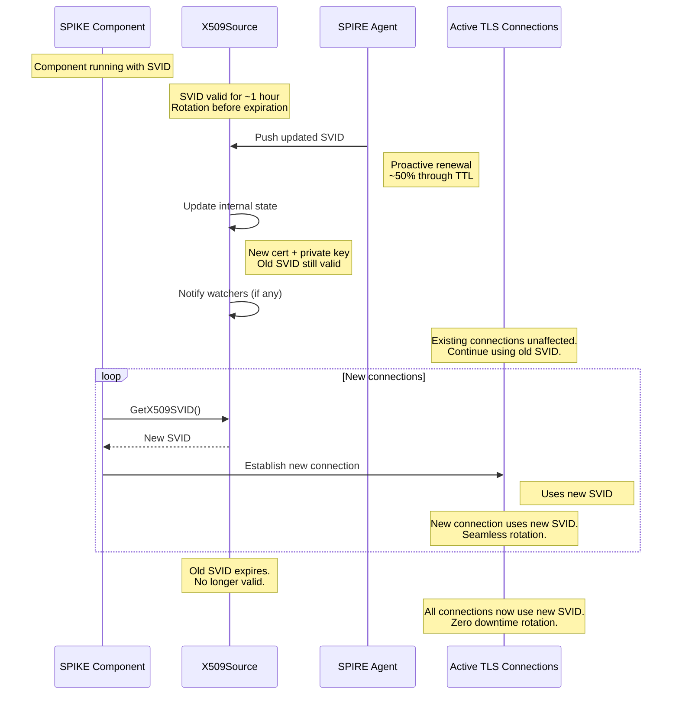

# mTLS Establishment Using SPIFFE SVID

## Overview

SPIKE uses SPIFFE (Secure Production Identity Framework For Everyone) for
workload identity. All communication between components uses mutual TLS (mTLS)
with X.509 SVIDs (SPIFFE Verifiable Identity Documents) as certificates.

---

## 1. SVID Acquisition from SPIRE



**Key Files:**
- `internal/net/spiffe.go::Source()` - Acquire X509Source
- SPIRE Go SDK: `github.com/spiffe/go-spiffe/v2/workloadapi`

**SPIFFE ID Format:**
```
spiffe://<trust-domain>/<workload-path>

Examples:
spiffe://example.org/spike/nexus
spiffe://example.org/spike/keeper/0
spiffe://example.org/spike/pilot/role/superuser
spiffe://example.org/workload/api
```

---

## 2. mTLS Server Setup (SPIKE Nexus Example)



**Key Configuration:**

```go
tlsConfig := &tls.Config{
    // Server certificate (Nexus SVID)
    GetCertificate: func(hello *tls.ClientHelloInfo) (*tls.Certificate, error) {
        return source.GetX509SVID()
    },

    // CA bundle for verifying client certificates
    GetClientCAs: func() (*x509.CertPool, error) {
        return source.GetX509BundleForTrustDomain(trustDomain)
    },

    // Require client certificate
    ClientAuth: tls.RequireAndVerifyClientCert,

    // TLS 1.3 only
    MinVersion: tls.VersionTLS13,
}
```

**Key Files:**
- `app/nexus/internal/net/serve.go::Serve()`
- `internal/net/tls.go` - TLS configuration

---

## 3. mTLS Client Setup (SPIKE Pilot Example)



**Key Configuration:**

```go
tlsConfig := &tls.Config{
    // Client certificate (Pilot SVID)
    GetClientCertificate: func(info *tls.CertificateRequestInfo) (*tls.Certificate, error) {
        return source.GetX509SVID()
    },

    // CA bundle for verifying server certificate
    RootCAs: source.GetX509BundleForTrustDomain(trustDomain),

    // TLS 1.3 only
    MinVersion: tls.VersionTLS13,

    // Optionally verify server SPIFFE ID
    VerifyPeerCertificate: func(rawCerts [][]byte, verifiedChains [][]*x509.Certificate) error {
        // Custom verification logic
        return verifyServerSPIFFEID(verifiedChains)
    },
}
```

**Key Files:**
- `app/spike/internal/net/client.go` - mTLS client creation
- `internal/net/client.go::CreateMTLSClient()`

---

## 4. SPIFFE ID Extraction and Validation



**Key Functions:**

```go
func extractSPIFFEID(r *http.Request) (string, error) {
    if r.TLS == nil {
        return "", errors.New("no TLS connection")
    }

    if len(r.TLS.PeerCertificates) == 0 {
        return "", errors.New("no client certificate")
    }

    cert := r.TLS.PeerCertificates[0]

    // Extract SPIFFE ID from SAN
    for _, uri := range cert.URIs {
        if strings.HasPrefix(uri.String(), "spiffe://") {
            return uri.String(), nil
        }
    }

    return "", errors.New("no SPIFFE ID in certificate")
}

func validateSPIFFEID(spiffeID string) error {
    if !strings.HasPrefix(spiffeID, "spiffe://") {
        return errors.New("invalid SPIFFE ID format")
    }

    // Additional validation
    // - Trust domain matches expected
    // - Path is well-formed

    return nil
}
```

**Key Files:**
- `internal/auth/spiffe.go::IDFromRequest()`
- `internal/validation/spiffeid.go::ValidateSPIFFEID()`

---

## 5. mTLS with Peer Validation (Predicate)

Some SPIKE components restrict which peers they accept connections from.



**Predicate Example:**

```go
var AllowKeeperPeer = func(id spiffeid.ID) error {
    idStr := id.String()

    // Allow SPIKE Nexus
    if spiffeid.IsNexus(idStr) {
        return nil
    }

    // Allow SPIKE Bootstrap
    if spiffeid.IsBootstrap(idStr) {
        return nil
    }

    // Reject all others
    return fmt.Errorf("peer %s not authorized", idStr)
}
```

**Key Files:**
- `internal/auth/predicate/predicate.go` - Peer predicates
- `app/keeper/internal/net/serve.go::ServeWithPredicate()`

---

## 6. Complete mTLS Handshake Flow



**Security Properties:**
- **Mutual authentication**: Both client and server prove identity
- **Confidentiality**: All data encrypted (TLS 1.3 AES-GCM)
- **Integrity**: Tampering detected (TLS MAC)
- **Forward secrecy**: Ephemeral keys (ECDHE)
- **Certificate validation**: Both sides verify signatures
- **Identity binding**: SPIFFE IDs bound to certificates

---

## 7. SVID Rotation



**Rotation Characteristics:**
- **Automatic**: No manual intervention
- **Proactive**: Renewed before expiration
- **Seamless**: Zero downtime
- **Concurrent**: Old and new SVIDs valid during rotation
- **Transparent**: Application code unaffected

---

## 8. Trust Domain and Federation

**Single Trust Domain (Common):**
```
Trust Domain: example.org
CA: SPIRE Server CA

All components trust same CA.
All SPIFFE IDs: spiffe://example.org/...
```

**Federated Trust Domains (Advanced):**
```
Trust Domain A: company-a.com
Trust Domain B: company-b.com

Components in A can communicate with B if:
- Trust bundles federated
- Both sides accept peer's trust domain
- Policies allow cross-domain access
```

**SPIKE Federation Support:**
- Currently: Single trust domain
- Future: Cross-trust-domain policies
- Use case: Multi-organization secrets sharing

---

## 9. Key Files Reference

**SPIFFE Integration:**
- `internal/net/spiffe.go::Source()` - Acquire X509Source
- `internal/auth/spiffe.go::IDFromRequest()` - Extract SPIFFE ID from request
- `internal/validation/spiffeid.go::ValidateSPIFFEID()` - Validate SPIFFE ID format

**mTLS Server:**
- `app/nexus/internal/net/serve.go::Serve()` - Start Nexus mTLS server
- `app/keeper/internal/net/serve.go::ServeWithPredicate()` - Start Keeper with predicate

**mTLS Client:**
- `internal/net/client.go::CreateMTLSClient()` - Create basic mTLS client
- `internal/net/client.go::CreateMTLSClientWithPredicate()` - Create client with server validation

**Predicates:**
- `internal/auth/predicate/predicate.go` - Peer validation predicates

**SPIFFE ID Checks:**
- `internal/auth/spiffeid/checks.go` - IsNexus, IsKeeper, IsSuperuser, etc.

---

## 10. Configuration

**Environment Variables:**

```bash
# SPIFFE Workload API socket
export SPIFFE_ENDPOINT_SOCKET=unix:///run/spire/sockets/agent.sock

# Trust domain (usually inferred from SVID)
export SPIKE_TRUST_DOMAIN=example.org

# Server ports
export SPIKE_NEXUS_TLS_PORT=8553
export SPIKE_KEEPER_TLS_PORT=8554
```

**SPIRE Configuration (example):**

```hcl
# SPIRE Agent configuration
agent {
    data_dir = "/opt/spire/data/agent"
    server_address = "spire-server"
    server_port = 8081
    trust_domain = "example.org"
}

# Workload API configuration
plugins {
    WorkloadAttestor "unix" {
        plugin_data {}
    }

    WorkloadAttestor "k8s" {
        plugin_data {
            kubelet_read_only_port = "10255"
        }
    }
}
```

**Registration Entry (example):**

```bash
# Register SPIKE Nexus
spire-server entry create \
  -spiffeID spiffe://example.org/spike/nexus \
  -parentID spiffe://example.org/spire/agent/k8s_psat/node1 \
  -selector k8s:ns:spike \
  -selector k8s:pod-label:app:spike-nexus

# Register SPIKE Keeper
spire-server entry create \
  -spiffeID spiffe://example.org/spike/keeper/0 \
  -parentID spiffe://example.org/spire/agent/k8s_psat/node2 \
  -selector k8s:ns:spike \
  -selector k8s:pod-label:app:spike-keeper \
  -selector k8s:pod-label:keeper-id:0
```

---

## Summary

**mTLS with SPIFFE:**
- **SVID**: X.509 certificate with SPIFFE ID in SAN
- **Workload API**: Automatic SVID acquisition from SPIRE Agent
- **Rotation**: Automatic certificate renewal (zero downtime)
- **Mutual Authentication**: Both client and server verify identity
- **Trust Model**: All workloads trust SPIRE CA
- **Zero Configuration**: No manual certificate management

**Key Properties:**
- **Identity-based**: Authorization based on SPIFFE ID (not IP, hostname)
- **Dynamic**: SVIDs issued at runtime (no pre-provisioned certs)
- **Short-lived**: SVIDs expire quickly (default: 1 hour)
- **Automatic Rotation**: Seamless renewal before expiration
- **Scalable**: Works for thousands of workloads

**Security Benefits:**
- **No shared secrets**: Each workload has unique SVID
- **No password management**: Certificate-based authentication
- **Defense in depth**: Multiple layers (TLS + SPIFFE ID validation)
- **Principle of least privilege**: Fine-grained policies per SPIFFE ID
- **Auditability**: All connections tied to workload identity
