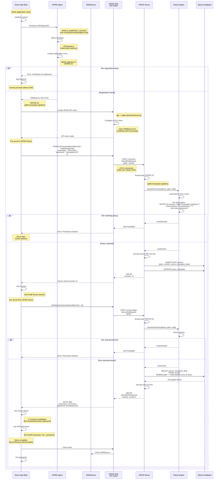

# Demo Application Flow

## Overview

The SPIKE demo application (`app/demo/cmd/main.go`) demonstrates how to
integrate SPIKE SDK into an application for secret management. It shows the
complete workflow from SVID acquisition to secret operations.

---

## Demo Application Sequence Diagram



---

## Demo Application Code Structure

```go
// File: app/demo/cmd/main.go

package main

import (
    "context"
    "log"

    "github.com/spiffe/spike-sdk-go/api"
    "github.com/spiffe/spike-sdk-go/net/spiffe"
)

func main() {
    ctx := context.Background()

    // Step 1: Acquire SPIFFE SVID
    source, spiffeID, err := spiffe.Source(ctx, spiffe.EndpointSocket())
    if err != nil {
        log.Fatalf("Failed to acquire SVID: %v", err)
    }
    defer source.Close()

    log.Printf("Demo app running with SPIFFE ID: %s", spiffeID)

    // Step 2: Create SPIKE API client
    client := api.NewClient(source)

    // Step 3: Put secret
    err = client.PutSecret("tenants/demo/db/creds", map[string]string{
        "username": "demouser",
        "password": "demopass123",
    })
    if err != nil {
        log.Fatalf("Failed to put secret: %v", err)
    }

    log.Println("Secret stored successfully")

    // Step 4: Get secret
    secret, err := client.GetSecret("tenants/demo/db/creds", nil)
    if err != nil {
        log.Fatalf("Failed to get secret: %v", err)
    }

    username := secret["username"]
    password := secret["password"]

    log.Printf("Retrieved credentials - Username: %s", username)

    // Step 5: Use secret (example: connect to database)
    // db.Connect(username, password)

    log.Println("Demo complete")
}
```

---

## Prerequisites

### 1. SPIRE Registration

The demo app must be registered in SPIRE with a SPIFFE ID:

```bash
spire-server entry create \
  -spiffeID spiffe://example.org/demo \
  -parentID spiffe://example.org/spire/agent/k8s_psat/node1 \
  -selector k8s:ns:default \
  -selector k8s:pod-label:app:spike-demo
```

### 2. SPIKE Policy

A policy must grant the demo app access to its secrets:

```bash
spike policy create demo-policy \
  --spiffe-id-pattern "spiffe://example\.org/demo" \
  --path-pattern "tenants/demo/.*" \
  --permissions read,write
```

**Policy Details:**
- **Name**: `demo-policy`
- **SPIFFE ID Pattern**: `spiffe://example\.org/demo` (regex)
- **Path Pattern**: `tenants/demo/.*` (regex, matches all paths under
  `tenants/demo/`)
- **Permissions**: `read`, `write`

### 3. SPIKE Nexus Running

The demo app requires SPIKE Nexus to be running and accessible:

```bash
# Check Nexus health
curl https://spike-nexus:8553/v1/health \
  --cert $CLIENT_CERT \
  --key $CLIENT_KEY \
  --cacert $CA_BUNDLE
```

---

## Demo Application Operations

### Put Secret

**Operation**: Store credentials in SPIKE Nexus

**Path**: `tenants/demo/db/creds`

**Values**:
- `username`: `demouser`
- `password`: `demopass123`

**Authorization**: Policy check
- SPIFFE ID: `spiffe://example.org/demo`
- Path: `tenants/demo/db/creds`
- Permission: `write`

**Encryption**: AES-256-GCM with root key

**Storage**: SQLite database (encrypted)

**Outcome**: Secret stored at version 1

---

### Get Secret

**Operation**: Retrieve credentials from SPIKE Nexus

**Path**: `tenants/demo/db/creds`

**Version**: Current (not specified)

**Authorization**: Policy check
- SPIFFE ID: `spiffe://example.org/demo`
- Path: `tenants/demo/db/creds`
- Permission: `read`

**Decryption**: AES-256-GCM with root key

**Outcome**: Retrieved plaintext values

**Usage**: Connect to database with credentials

---

## Demo Application Deployment

### Kubernetes Deployment

```yaml
apiVersion: apps/v1
kind: Deployment
metadata:
  name: spike-demo
  namespace: default
spec:
  replicas: 1
  selector:
    matchLabels:
      app: spike-demo
  template:
    metadata:
      labels:
        app: spike-demo
    spec:
      containers:
      - name: demo
        image: spike-demo:latest
        env:
        - name: SPIFFE_ENDPOINT_SOCKET
          value: "unix:///run/spire/sockets/agent.sock"
        - name: SPIKE_NEXUS_URL
          value: "https://spike-nexus:8553"
        volumeMounts:
        - name: spire-agent-socket
          mountPath: /run/spire/sockets
          readOnly: true
      volumes:
      - name: spire-agent-socket
        hostPath:
          path: /run/spire/sockets
          type: Directory
```

**Key Points:**
- Mount SPIRE Agent socket
- Set `SPIFFE_ENDPOINT_SOCKET` environment variable
- Set `SPIKE_NEXUS_URL` to Nexus service

---

### Bare-Metal Deployment

```bash
# 1. Ensure SPIRE Agent is running
systemctl status spire-agent

# 2. Register demo app in SPIRE
spire-server entry create \
  -spiffeID spiffe://example.org/demo \
  -parentID spiffe://example.org/spire/agent/unix/hostname \
  -selector unix:uid:1001

# 3. Set environment variables
export SPIFFE_ENDPOINT_SOCKET=unix:///tmp/spire-agent/public/api.sock
export SPIKE_NEXUS_URL=https://localhost:8553

# 4. Run demo app
./spike-demo
```

---

## Expected Output

```
2024/01/20 10:30:00 Demo app running with SPIFFE ID: spiffe://example.org/demo
2024/01/20 10:30:01 Secret stored successfully
2024/01/20 10:30:01 Retrieved credentials - Username: demouser
2024/01/20 10:30:01 Demo complete
```

---

## Error Scenarios

### 1. Workload Not Registered in SPIRE

**Error:**
```
Failed to acquire SVID: no registration entry found
```

**Solution:** Register demo app in SPIRE with correct selectors.

---

### 2. No Policy Granting Access

**Error (on Put):**
```
Failed to put secret: 403 Forbidden - Permission denied
```

**Error (on Get):**
```
Failed to get secret: 403 Forbidden - Permission denied
```

**Solution:** Create policy granting demo app read/write access to
`tenants/demo/.*` path.

---

### 3. SPIKE Nexus Unreachable

**Error:**
```
Failed to put secret: connection refused
```

**Solution:**
- Check SPIKE Nexus is running
- Verify network connectivity
- Check `SPIKE_NEXUS_URL` environment variable

---

### 4. SPIRE Agent Not Running

**Error:**
```
Failed to acquire SVID: connection refused
```

**Solution:**
- Start SPIRE Agent
- Verify `SPIFFE_ENDPOINT_SOCKET` path
- Check socket permissions

---

## Demo Application Use Cases

### 1. Application Onboarding Demo

Show developers how to integrate SPIKE into their applications.

**Steps:**
1. Register application in SPIRE
2. Create policy for application
3. Integrate SPIKE SDK
4. Test secret operations

---

### 2. Secret Rotation Demo

Demonstrate secret updates and versioning.

```go
// Initial secret
client.PutSecret("path", map[string]string{"password": "old"})

// Rotate secret
client.PutSecret("path", map[string]string{"password": "new"})

// Old version still accessible
oldSecret, _ := client.GetSecret("path", &api.GetSecretOptions{Version: 1})
newSecret, _ := client.GetSecret("path", nil)  // Current version
```

---

### 3. Policy Enforcement Demo

Show authorization in action.

**Scenario:**
- Demo app has policy for `tenants/demo/*`
- Attempt to access `tenants/other/*`
- Request rejected (403 Forbidden)

**Demonstrates:**
- Zero-trust model
- Path-based isolation
- Policy enforcement

---

### 4. mTLS Authentication Demo

Show workload identity with SPIFFE.

**Scenario:**
- Demo app connects with SPIFFE ID
- Nexus verifies client certificate
- No passwords or API keys needed

**Demonstrates:**
- Certificate-based authentication
- Automatic SVID rotation
- No shared secrets

---

## Integration Patterns

### Pattern 1: Initialization Secret Fetch

Application fetches secrets at startup.

```go
func main() {
    // Get SPIKE client
    client := getSpikeClient()

    // Fetch all required secrets
    dbCreds := client.GetSecret("tenants/demo/db/creds")
    apiKey := client.GetSecret("tenants/demo/api/key")

    // Initialize services
    db := connectDB(dbCreds)
    api := initAPI(apiKey)

    // Run application
    serve(db, api)
}
```

---

### Pattern 2: On-Demand Secret Fetch

Application fetches secrets when needed.

```go
func handleRequest(req Request) {
    client := getSpikeClient()

    // Fetch secret for this specific request
    secret := client.GetSecret("tenants/demo/api/key")

    // Use secret
    response := callExternalAPI(secret["key"])

    return response
}
```

---

### Pattern 3: Cached Secrets with Refresh

Application caches secrets and refreshes periodically.

```go
type SecretCache struct {
    client *spike.Client
    cache  map[string]map[string]string
    mu     sync.RWMutex
}

func (c *SecretCache) Get(path string) map[string]string {
    c.mu.RLock()
    defer c.mu.RUnlock()
    return c.cache[path]
}

func (c *SecretCache) Refresh() {
    secrets := c.client.GetSecret("tenants/demo/db/creds")

    c.mu.Lock()
    defer c.mu.Unlock()
    c.cache["tenants/demo/db/creds"] = secrets
}

// Refresh every 5 minutes
go func() {
    ticker := time.NewTicker(5 * time.Minute)
    for range ticker.C {
        cache.Refresh()
    }
}()
```

---

## Summary

**Demo Application:**
- **Purpose**: Demonstrate SPIKE SDK integration
- **Operations**: Put secret, get secret
- **Authentication**: SPIFFE SVID from SPIRE Agent
- **Authorization**: Policy-based (SPIFFE ID + path)
- **Transport**: mTLS with automatic certificate rotation

**Key Learnings:**
1. How to acquire SPIFFE SVID
2. How to create SPIKE API client
3. How to store and retrieve secrets
4. How policies control access
5. How mTLS provides secure communication

**Developer Takeaway:**
Integrating SPIKE requires minimal code. The SDK handles all complexity:
- SVID acquisition
- mTLS setup
- API communication
- Error handling

Applications focus on business logic, not secret management infrastructure.
