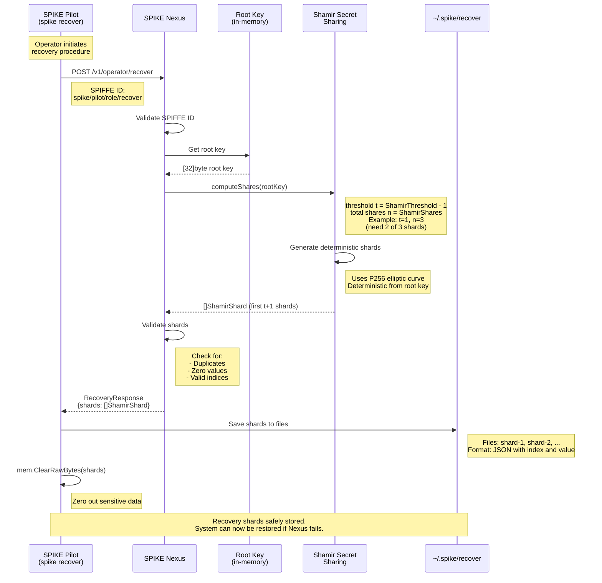

## SPIKE Nexus Recovery Flow (`spike recover`)

Generate recovery shards from the running SPIKE Nexus instance.

**Security Notes:**
* Only operators who can assign the SPIFFE ID 
  `spiffe://$trustRoot/spike/pilot/role/recover` to **SPIKE Pilot** can start
  the recovery procedure.
* Shards are deterministic (*the same root key produces the same shards*)
* Shards are zeroed from the memory after save
* Threshold scheme: need `ShamirThreshold` shards to reconstruct

