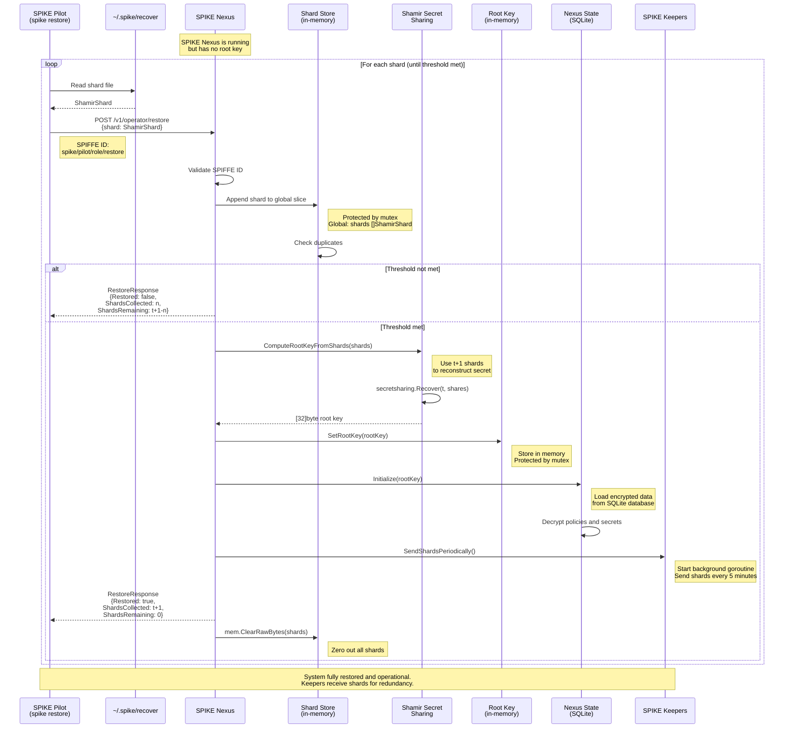

## SPIKE Nexus Root Key Restoration (`spike restore`)

Restore the root key in SPIKE Nexus from recovery shards.

**Flow Details:**
- Shards submitted one at a time (stateful accumulation)
- Global `shards` variable protected by mutex
- When the threshold is reached, immediate restoration
- Shards sent to all keepers immediately after restore
- All shards zeroed from memory after reconstruction

**Configuration:**
- `SPIKE_NEXUS_SHAMIR_THRESHOLD`: Number of shards needed (default: 2)
- `SPIKE_NEXUS_SHAMIR_SHARES`: Total shards generated (default: 3)

