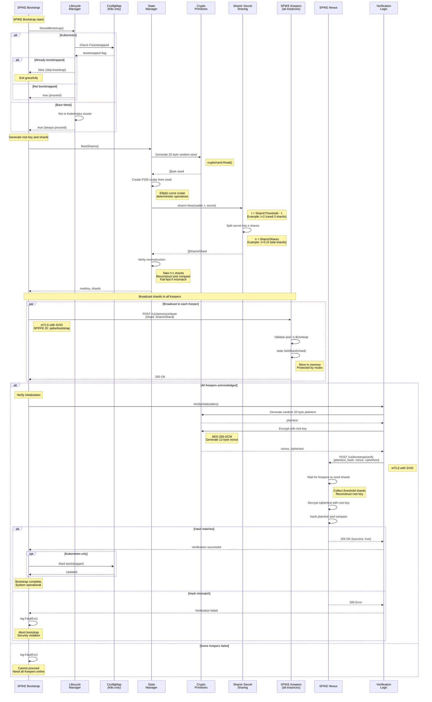

## SPIKE Bootstrapping Flow

**SPIKE Bootstrap** is responsible for initial system setup. It generates the 
root key, creates Shamir shards, and distributes them to **SPIKE Keeper**s.

**Kubernetes vs. Bare-Metal Differences:**

| Aspect             | Kubernetes             | Bare-Metal              |
|--------------------|------------------------|-------------------------|
| Bootstrap check    | ConfigMap flag         | Always proceeds         |
| Marker persistence | ConfigMap in namespace | None (runs each time)   |
| Keeper discovery   | K8s Service DNS        | Static URLs from config |
| Deployment         | DaemonSet/Deployment   | Systemd service         |

**Configuration:**
* `SPIKE_SHAMIR_THRESHOLD`: Number of shards needed (default: 2)
* `SPIKE_SHAMIR_SHARES`: Total shards to generate (default: 4)
* `SPIKE_KEEPERS`: Comma-separated Keeper URLs
* `SPIKE_NEXUS_URL`: SPIKE Nexus endpoint
* `SPIKE_BOOTSTRAP_FORCE`: Force bootstrap even if already completed (K8s only)

**Security Notes:**
* Root key NEVER persisted to disk
* Shards distributed immediately after generation
* Verification ensures correct key distribution
* Fail-fast on any security violation
* All sensitive data zeroed after use

**Root Key Generation Details:**

**1. Generate a 32-byte cryptographically secure random seed**
* Uses crypto/rand.Read()
* Entropy from OS

**2. Create P256 elliptic curve scalar**
* Deterministic operations from seed
* Scalar is the root key

**3. Create Shamir shares**
* Deterministic reader seeded with the root key
* Ensures consistent shards after restart
* threshold t = ShamirThreshold - 1
* total shares n = ShamirShares

**4. Verify shares**
* Take any t+1 shares
* Reconstruct secret
* Compare with original
* Fail-fast if mismatch

