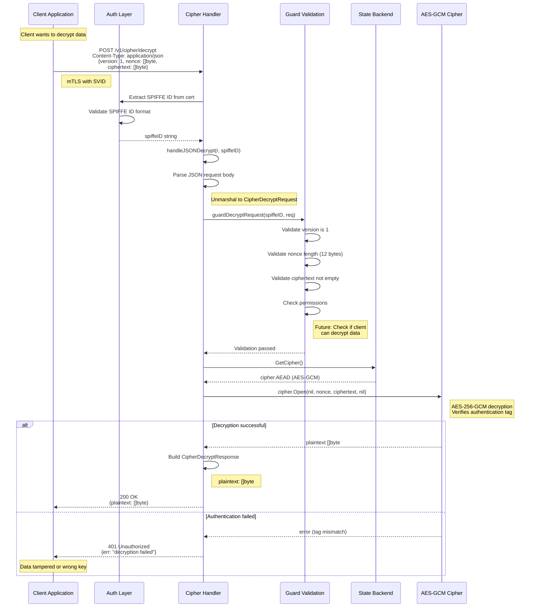

```mermaid
sequenceDiagram
    participant Client as Client Application
    participant Auth as Auth Layer
    participant Handler as Cipher Handler
    participant Guard as Guard Validation
    participant Backend as State Backend
    participant Crypto as AES-GCM Cipher

    Note over Client: Client wants to decrypt data

    Client->>Handler: POST /v1/cipher/decrypt<br/>Content-Type: application/json<br/>{version: 1, nonce: []byte,<br/>ciphertext: []byte}
    Note right of Client: mTLS with SVID

    Handler->>Auth: Extract SPIFFE ID from cert
    Auth->>Auth: Validate SPIFFE ID format
    Auth-->>Handler: spiffeID string

    Handler->>Handler: handleJSONDecrypt(r, spiffeID)

    Handler->>Handler: Parse JSON request body
    Note right of Handler: Unmarshal to CipherDecryptRequest

    Handler->>Guard: guardDecryptRequest(spiffeID, req)

    Guard->>Guard: Validate version is 1
    Guard->>Guard: Validate nonce length (12 bytes)
    Guard->>Guard: Validate ciphertext not empty
    Guard->>Guard: Check permissions
    Note right of Guard: Future: Check if client<br/>can decrypt data

    Guard-->>Handler: Validation passed

    Handler->>Backend: GetCipher()
    Backend-->>Handler: cipher.AEAD (AES-GCM)

    Handler->>Crypto: cipher.Open(nil, nonce, ciphertext, nil)
    Note right of Crypto: AES-256-GCM decryption<br/>Verifies authentication tag

    alt Decryption successful
        Crypto-->>Handler: plaintext []byte

        Handler->>Handler: Build CipherDecryptResponse
        Note right of Handler: plaintext: []byte

        Handler-->>Client: 200 OK<br/>{plaintext: []byte}
    else Authentication failed
        Crypto-->>Handler: error (tag mismatch)

        Handler-->>Client: 401 Unauthorized<br/>{err: "decryption failed"}

        Note over Client: Data tampered or wrong key
    end
```
