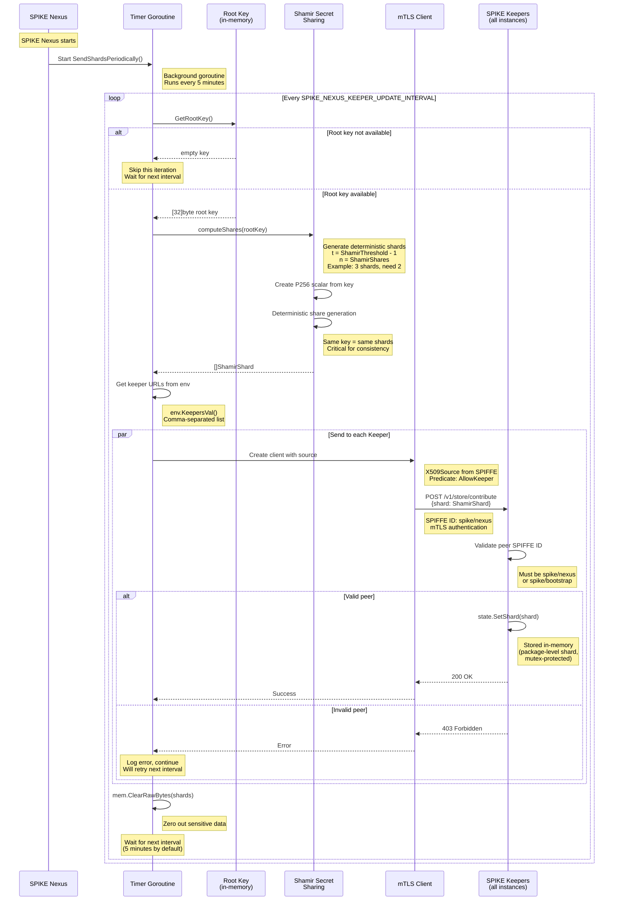

## Periodic Shard Distribution (Nexus → Keeper)

SPIKE Nexus periodically sends shards to all Keepers to ensure redundancy.

```mermaid
sequenceDiagram
participant Nexus as SPIKE Nexus
participant Timer as Timer Goroutine
participant RootKey as Root Key<br/>(in-memory)
participant Shamir as Shamir Secret<br/>Sharing
participant MTLSClient as mTLS Client
participant Keepers as SPIKE Keepers<br/>(all instances)

    Note over Nexus: SPIKE Nexus starts

    Nexus->>Timer: Start SendShardsPeriodically()
    Note right of Timer: Background goroutine<br/>Runs every 5 minutes

    loop Every SPIKE_NEXUS_KEEPER_UPDATE_INTERVAL
        Timer->>RootKey: GetRootKey()

        alt Root key not available
            RootKey-->>Timer: empty key
            Note over Timer: Skip this iteration<br/>Wait for next interval
        else Root key available
            RootKey-->>Timer: [32]byte root key

            Timer->>Shamir: computeShares(rootKey)
            Note right of Shamir: Generate deterministic shards<br/>t = ShamirThreshold - 1<br/>n = ShamirShares<br/>Example: 3 shards, need 2

            Shamir->>Shamir: Create P256 scalar from key
            Shamir->>Shamir: Deterministic share generation
            Note right of Shamir: Same key = same shards<br/>Critical for consistency

            Shamir-->>Timer: []ShamirShard

            Timer->>Timer: Get keeper URLs from env
            Note right of Timer: env.KeepersVal()<br/>Comma-separated list

            par Send to each Keeper
                Timer->>MTLSClient: Create client with source
                Note right of MTLSClient: X509Source from SPIFFE<br/>Predicate: AllowKeeper

                MTLSClient->>Keepers: POST /v1/store/contribute<br/>{shard: ShamirShard}
                Note right of MTLSClient: SPIFFE ID: spike/nexus<br/>mTLS authentication

                Keepers->>Keepers: Validate peer SPIFFE ID
                Note right of Keepers: Must be spike/nexus<br/>or spike/bootstrap

                alt Valid peer
                    Keepers->>Keepers: state.SetShard(shard)
                    Note right of Keepers: Stored in-memory<br/>(package-level shard,<br/>mutex-protected)

                    Keepers-->>MTLSClient: 200 OK

                    MTLSClient-->>Timer: Success
                else Invalid peer
                    Keepers-->>MTLSClient: 403 Forbidden

                    MTLSClient-->>Timer: Error
                    Note over Timer: Log error, continue<br/>Will retry next interval
                end
            end

            Timer->>Timer: mem.ClearRawBytes(shards)
            Note right of Timer: Zero out sensitive data

            Note over Timer: Wait for next interval<br/>(5 minutes by default)
        end
    end
```