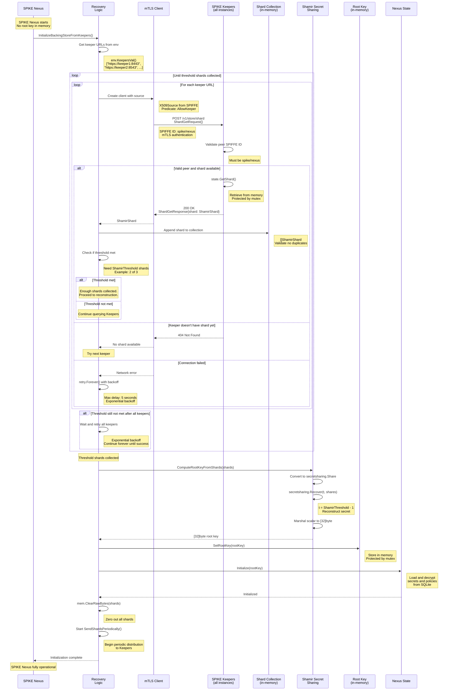

##  Shard Retrieval During Recovery (Nexus ← Keeper)

When SPIKE Nexus starts without a root key, it retrieves shards from Keepers.

```mermaid
sequenceDiagram
    participant Nexus as SPIKE Nexus
    participant Recovery as Recovery<br/>Logic
    participant MTLSClient as mTLS Client
    participant Keepers as SPIKE Keepers<br/>(all instances)
    participant ShardStore as Shard Collection<br/>(in-memory)
    participant Shamir as Shamir Secret<br/>Sharing
    participant RootKey as Root Key<br/>(in-memory)
    participant State as Nexus State

    Note over Nexus: SPIKE Nexus starts<br/>No root key in memory

    Nexus->>Recovery: InitializeBackingStoreFromKeepers()

    Recovery->>Recovery: Get keeper URLs from env
    Note right of Recovery: env.KeepersVal()<br/>["https://keeper1:8443",<br/>"https://keeper2:8543", ...]

    loop Until threshold shards collected
        loop For each keeper URL
            Recovery->>MTLSClient: Create client with source
            Note right of MTLSClient: X509Source from SPIFFE<br/>Predicate: AllowKeeper

            MTLSClient->>Keepers: POST /v1/store/shard<br/>ShardGetRequest{}
            Note right of MTLSClient: SPIFFE ID: spike/nexus<br/>mTLS authentication

            Keepers->>Keepers: Validate peer SPIFFE ID
            Note right of Keepers: Must be spike/nexus

            alt Valid peer and shard available
                Keepers->>Keepers: state.GetShard()
                Note right of Keepers: Retrieve from memory<br/>Protected by mutex

                Keepers-->>MTLSClient: 200 OK<br/>ShardGetResponse{shard: ShamirShard}

                MTLSClient-->>Recovery: ShamirShard

                Recovery->>ShardStore: Append shard to collection
                Note right of ShardStore: []ShamirShard<br/>Validate no duplicates

                Recovery->>Recovery: Check if threshold met
                Note right of Recovery: Need ShamirThreshold shards<br/>Example: 2 of 3

                alt Threshold met
                    Note over Recovery: Enough shards collected.<br/>Proceed to reconstruction.
                else Threshold not met
                    Note over Recovery: Continue querying Keepers
                end
            else Keeper doesn't have shard yet
                Keepers-->>MTLSClient: 404 Not Found

                MTLSClient-->>Recovery: No shard available
                Note over Recovery: Try next keeper
            else Connection failed
                MTLSClient-->>Recovery: Network error

                Recovery->>Recovery: retry.Forever() with backoff
                Note right of Recovery: Max delay: 5 seconds<br/>Exponential backoff
            end
        end

        alt Threshold still not met after all keepers
            Recovery->>Recovery: Wait and retry all keepers
            Note right of Recovery: Exponential backoff<br/>Continue forever until success
        end
    end

    Note over Recovery: Threshold shards collected

    Recovery->>Shamir: ComputeRootKeyFromShards(shards)

    Shamir->>Shamir: Convert to secretsharing.Share
    Shamir->>Shamir: secretsharing.Recover(t, shares)
    Note right of Shamir: t = ShamirThreshold - 1<br/>Reconstruct secret

    Shamir->>Shamir: Marshal scalar to [32]byte
    Shamir-->>Recovery: [32]byte root key

    Recovery->>RootKey: SetRootKey(rootKey)
    Note right of RootKey: Store in memory<br/>Protected by mutex

    Recovery->>State: Initialize(rootKey)
    Note right of State: Load and decrypt<br/>secrets and policies<br/>from SQLite

    State-->>Recovery: Initialized

    Recovery->>Recovery: mem.ClearRawBytes(shards)
    Note right of Recovery: Zero out all shards

    Recovery->>Recovery: Start SendShardsPeriodically()
    Note right of Recovery: Begin periodic distribution<br/>to Keepers

    Recovery-->>Nexus: Initialization complete

    Note over Nexus: SPIKE Nexus fully operational
```
