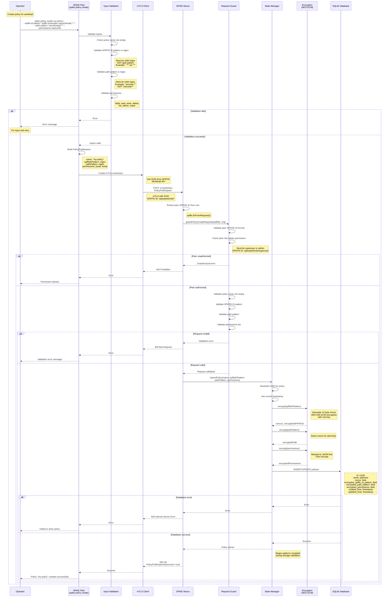

## Policy Creation Flow

Policies in SPIKE define access control rules using SPIFFE IDs and path
patterns. Policies are created through SPIKE Pilot CLI and stored encrypted
in SPIKE Nexus.

```mermaid
sequenceDiagram
    participant User as Operator
    participant Pilot as SPIKE Pilot<br/>(spike policy create)
    participant Validation as Input Validation
    participant MTLSClient as mTLS Client
    participant Nexus as SPIKE Nexus
    participant Guard as Request Guard
    participant State as State Manager
    participant Crypto as Encryption<br/>(AES-GCM)
    participant DB as SQLite Database

    Note over User: Create policy for workload

    User->>Pilot: spike policy create my-policy \<br/>--spiffe-id-pattern "spiffe://example\.org/workload/.*" \<br/>--path-pattern "secrets/app/.*" \<br/>--permissions read,write

    Pilot->>Validation: Validate inputs

    Validation->>Validation: Check policy name not empty
    Validation->>Validation: Validate SPIFFE ID pattern is regex
    Note right of Validation: Must be valid regex<br/>NOT glob pattern<br/>Example: ".*" not "*"

    Validation->>Validation: Validate path pattern is regex
    Note right of Validation: Must be valid regex<br/>Example: "secrets/.*"<br/>NOT "/secrets/*"

    Validation->>Validation: Validate permissions
    Note right of Validation: Valid: read, write, delete,<br/>list, admin, super

    alt Validation fails
        Validation-->>Pilot: Error
        Pilot-->>User: Error message
        Note over User: Fix input and retry
    else Validation succeeds
        Validation-->>Pilot: Inputs valid

        Pilot->>Pilot: Build PolicyPutRequest
        Note right of Pilot: name: "my-policy"<br/>spiffeIDPattern: regex<br/>pathPattern: regex<br/>permissions: [read, write]

        Pilot->>MTLSClient: Create mTLS connection
        Note right of MTLSClient: Get SVID from SPIFFE<br/>Workload API

        MTLSClient->>Nexus: POST /v1/acl/policy<br/>PolicyPutRequest
        Note right of MTLSClient: mTLS with SVID<br/>SPIFFE ID: spike/pilot/role/*

        Nexus->>Nexus: Extract peer SPIFFE ID from cert
        Note right of Nexus: spiffe.IDFromRequest(r)

        Nexus->>Guard: guardPolicyCreateRequest(spiffeID, req)

        Guard->>Guard: Validate peer SPIFFE ID format
        Guard->>Guard: Check peer has admin permission
        Note right of Guard: Must be superuser or admin<br/>SPIFFE ID: spike/pilot/role/superuser

        alt Peer unauthorized
            Guard-->>Nexus: Unauthorized error
            Nexus-->>MTLSClient: 403 Forbidden
            MTLSClient-->>Pilot: Error
            Pilot-->>User: Permission denied
        else Peer authorized
            Guard->>Guard: Validate policy name not empty
            Guard->>Guard: Validate SPIFFE ID pattern
            Guard->>Guard: Validate path pattern
            Guard->>Guard: Validate permissions list

            alt Request invalid
                Guard-->>Nexus: Validation error
                Nexus-->>MTLSClient: 400 Bad Request
                MTLSClient-->>Pilot: Error
                Pilot-->>User: Validation error message
            else Request valid
                Guard-->>Nexus: Request validated

                Nexus->>State: UpsertPolicy(name, spiffeIDPattern,<br/>pathPattern, permissions)

                State->>State: Generate UUID for policy
                State->>State: Get current timestamp

                State->>Crypto: encrypt(spiffeIDPattern)
                Note right of Crypto: Generate 12-byte nonce<br/>AES-256-GCM encryption<br/>with root key

                Crypto-->>State: nonce1, encryptedSPIFFEID

                State->>Crypto: encrypt(pathPattern)
                Note right of Crypto: Same nonce for atomicity

                Crypto-->>State: encryptedPath

                State->>Crypto: encrypt(permissions)
                Note right of Crypto: Marshal to JSON first<br/>Then encrypt

                Crypto-->>State: encryptedPermissions

                State->>DB: INSERT/UPDATE policies
                Note right of DB: id: UUID<br/>name: plaintext<br/>nonce: blob<br/>encrypted_spiffe_id_pattern: blob<br/>encrypted_path_pattern: blob<br/>encrypted_permissions: blob<br/>created_time: timestamp<br/>updated_time: timestamp

                alt Database error
                    DB-->>State: Error
                    State-->>Nexus: Error
                    Nexus-->>MTLSClient: 500 Internal Server Error
                    MTLSClient-->>Pilot: Error
                    Pilot-->>User: Failed to store policy
                else Database success
                    DB-->>State: Success

                    State-->>Nexus: Policy stored
                    Note right of State: Regex patterns compiled<br/>during storage validation

                    Nexus-->>MTLSClient: 200 OK<br/>PolicyPutResponse{success: true}

                    MTLSClient-->>Pilot: Success

                    Pilot-->>User: Policy "my-policy" created successfully
                end
            end
        end
    end
```
