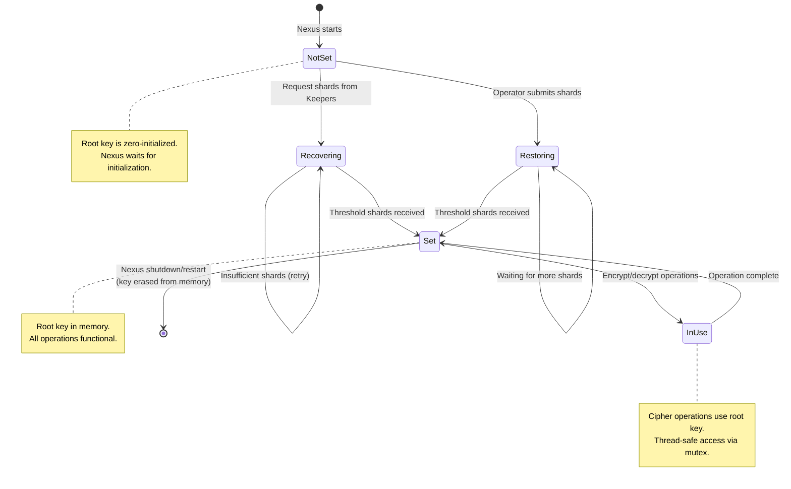

**States:**

1. **NotSet**: Root key not in memory (zero-initialized)
    * Nexus cannot encrypt/decrypt
    * Waits for initialization

2. **Recovering**: Nexus requests shards from Keepers
    * Retry with exponential backoff
    * Continues until the threshold is met

3. **Restoring**: Operator manually submits shards
    * Break-the-glass recovery procedure
    * Stateful accumulation of shards

4. **Set**: Root key in memory
    * All cryptographic operations are functional
    * Normal operation mode

5. **InUse**: Active encryption/decryption operation
    * Thread-safe access via mutex
    * Returns to Set after operation

**Transitions:**
- **NotSet → Recovering**: Automatic (startup)
* **NotSet → Restoring**: Manual (operator action)
* **Recovering → Set**: Automatic (the threshold is met)
* **Restoring → Set**: Manual (the threshold is met)
* **Set → InUse**: Automatic (on crypto operation)
* **InUse → Set**: Automatic (operation complete)
* **Set → Exit**: Only on shutdown/restart (process termination)

