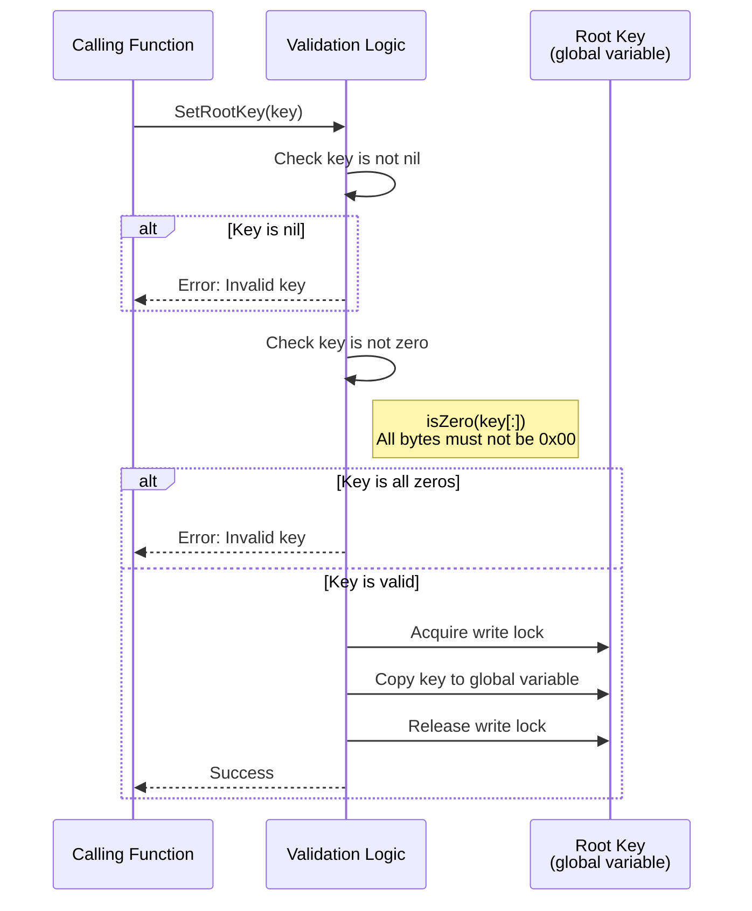

```mermaid
sequenceDiagram
    participant Caller as Calling Function
    participant Validate as Validation Logic
    participant RootKey as Root Key<br/>(global variable)

    Caller->>Validate: SetRootKey(key)

    Validate->>Validate: Check key is not nil
    alt Key is nil
        Validate-->>Caller: Error: Invalid key
    end

    Validate->>Validate: Check key is not zero
    Note right of Validate: isZero(key[:])<br/>All bytes must not be 0x00

    alt Key is all zeros
        Validate-->>Caller: Error: Invalid key
    else Key is valid
        Validate->>RootKey: Acquire write lock
        Validate->>RootKey: Copy key to global variable
        Validate->>RootKey: Release write lock

        Validate-->>Caller: Success
    end
```

**Why validate?**
- Prevents setting an invalid root key
- Avoids cryptographic operations with zero keys
- Fail-fast on configuration errors