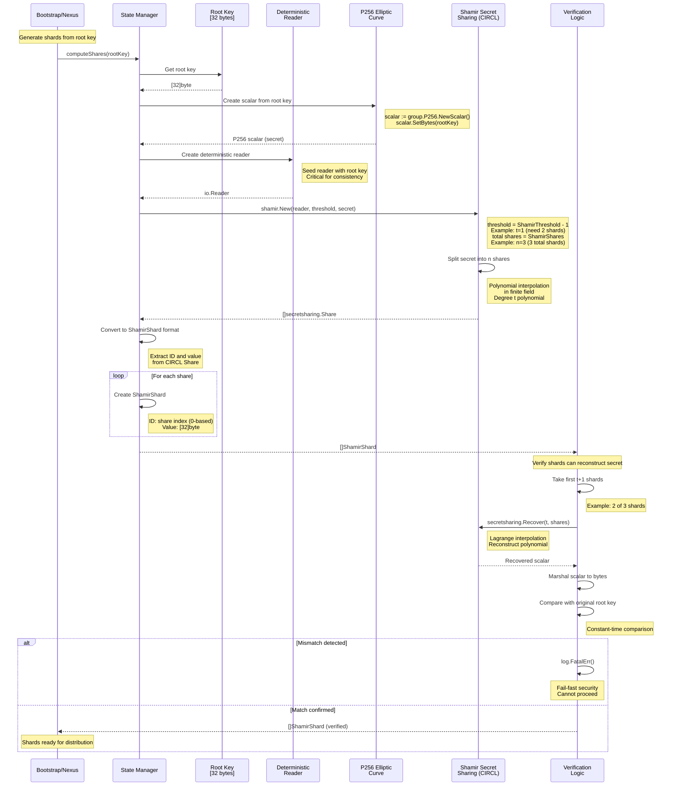

## Root Key Sharding with Shamir Secret Sharing

SPIKE uses Shamir Secret Sharing to split the root key into multiple shards.
A threshold number of shards (t+1) can reconstruct the original key. This
provides redundancy and enables break-the-glass recovery.



## Deterministic Shard Generation

```mermaid
graph TD
    A[Root Key: [32 bytes]] --> B[Deterministic Reader]
    B --> C[Seeded Random Number Generator]
    C --> D[Generate Random Coefficients]
    D --> E[Construct Polynomial]
    E --> F[Evaluate at n Points]
    F --> G[Shard 1: f(1)]
    F --> H[Shard 2: f(2)]
    F --> I[Shard 3: f(3)]
    F --> J[Shard 4: f(4)]
    F --> K[Shard 5: f(5)]

    style A fill:#ff6b6b
    style B fill:#4ecdc4
    style G fill:#95e1d3
    style H fill:#95e1d3
    style I fill:#95e1d3
    style J fill:#95e1d3
    style K fill:#95e1d3
```

**Why Deterministic?**


**Benefits**:
1. **Consistency**: The same root key always produces the same shards
2. **Crash recovery**: Can regenerate identical shards after restart
3. **Keeper synchronization**: Keepers receive the same shard index consistently
4. **Verification**: Can verify distributed shards match expected values

**Critical for**:
* SPIKE Nexus restarts (regenerate and redistribute the same shards)
* Keeper failures (send the same shard to a replacement Keeper)
* Audit and verification
  **Example Shards:**

## Example Shards

```
Root Key: [0x12, 0x34, 0x56, ..., 0xAB]  (32 bytes)

Shard 0:
  ID: 0
  Value: [0xA1, 0xB2, 0xC3, ..., 0xD4]

Shard 1:
  ID: 1
  Value: [0xE5, 0xF6, 0x07, ..., 0x18]

Shard 2:
  ID: 2
  Value: [0x29, 0x3A, 0x4B, ..., 0x5C]

... (n total shards)
```
