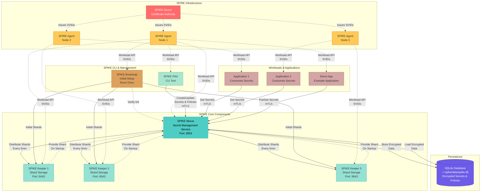

## Architecture Diagram

```mermaid
graph TB
    subgraph "SPIRE Infrastructure"
        SPIRE_SERVER[SPIRE Server<br/>Certificate Authority]
        SPIRE_AGENT1[SPIRE Agent<br/>Node 1]
        SPIRE_AGENT2[SPIRE Agent<br/>Node 2]
        SPIRE_AGENT3[SPIRE Agent<br/>Node 3]

        SPIRE_SERVER -.->|Issues SVIDs| SPIRE_AGENT1
        SPIRE_SERVER -.->|Issues SVIDs| SPIRE_AGENT2
        SPIRE_SERVER -.->|Issues SVIDs| SPIRE_AGENT3
    end

    subgraph "SPIKE Core Components"
        NEXUS[SPIKE Nexus<br/>Secret Management Service<br/>Port: 8553]
        KEEPER1[SPIKE Keeper 1<br/>Shard Storage<br/>Port: 8443]
        KEEPER2[SPIKE Keeper 2<br/>Shard Storage<br/>Port: 8543]
        KEEPER3[SPIKE Keeper 3<br/>Shard Storage<br/>Port: 8643]

        NEXUS -->|Distribute Shards<br/>Every 5min| KEEPER1
        NEXUS -->|Distribute Shards<br/>Every 5min| KEEPER2
        NEXUS -->|Distribute Shards<br/>Every 5min| KEEPER3

        KEEPER1 -.->|Provide Shard<br/>On Startup| NEXUS
        KEEPER2 -.->|Provide Shard<br/>On Startup| NEXUS
        KEEPER3 -.->|Provide Shard<br/>On Startup| NEXUS
    end

    subgraph "SPIKE CLI & Management"
        PILOT[SPIKE Pilot<br/>CLI Tool]
        BOOTSTRAP[SPIKE Bootstrap<br/>Initial Setup<br/>Runs Once]

        BOOTSTRAP -->|Initial Shards| KEEPER1
        BOOTSTRAP -->|Initial Shards| KEEPER2
        BOOTSTRAP -->|Initial Shards| KEEPER3
        BOOTSTRAP -.->|Verify Init| NEXUS
    end

    subgraph "Workloads & Applications"
        APP1[Application 1<br/>Consumes Secrets]
        APP2[Application 2<br/>Consumes Secrets]
        DEMO[Demo App<br/>Example Application]
    end

    subgraph "Persistence"
        DB[(SQLite Database<br/>~/.spike/data/spike.db<br/>Encrypted Secrets & Policies)]
    end

    %% SPIRE to SPIKE component connections
    SPIRE_AGENT1 -.->|Workload API<br/>SVIDs| NEXUS
    SPIRE_AGENT1 -.->|Workload API<br/>SVIDs| KEEPER1
    SPIRE_AGENT2 -.->|Workload API<br/>SVIDs| KEEPER2
    SPIRE_AGENT3 -.->|Workload API<br/>SVIDs| KEEPER3
    SPIRE_AGENT1 -.->|Workload API<br/>SVIDs| PILOT
    SPIRE_AGENT1 -.->|Workload API<br/>SVIDs| BOOTSTRAP
    SPIRE_AGENT2 -.->|Workload API<br/>SVIDs| APP1
    SPIRE_AGENT3 -.->|Workload API<br/>SVIDs| APP2
    SPIRE_AGENT1 -.->|Workload API<br/>SVIDs| DEMO

    %% SPIKE Pilot interactions
    PILOT -->|Create/Update<br/>Secrets & Policies<br/>mTLS| NEXUS

    %% Application interactions
    APP1 -->|Get Secrets<br/>mTLS| NEXUS
    APP2 -->|Get Secrets<br/>mTLS| NEXUS
    DEMO -->|Put/Get Secrets<br/>mTLS| NEXUS

    %% SPIKE Nexus to Database
    NEXUS -->|Store Encrypted<br/>Data| DB
    NEXUS -->|Load Encrypted<br/>Data| DB

    %% Styling
    style SPIRE_SERVER fill:#ff6b6b,stroke:#c92a2a,color:#fff
    style SPIRE_AGENT1 fill:#feca57,stroke:#ee5a24
    style SPIRE_AGENT2 fill:#feca57,stroke:#ee5a24
    style SPIRE_AGENT3 fill:#feca57,stroke:#ee5a24

    style NEXUS fill:#4ecdc4,stroke:#0fb9b1,color:#000
    style KEEPER1 fill:#95e1d3,stroke:#38ada9
    style KEEPER2 fill:#95e1d3,stroke:#38ada9
    style KEEPER3 fill:#95e1d3,stroke:#38ada9

    style PILOT fill:#a8e6cf,stroke:#56ab91
    style BOOTSTRAP fill:#dda15e,stroke:#bc6c25

    style APP1 fill:#d4a5a5,stroke:#9a6969
    style APP2 fill:#d4a5a5,stroke:#9a6969
    style DEMO fill:#d4a5a5,stroke:#9a6969

    style DB fill:#6c5ce7,stroke:#5f3dc4,color:#fff
```