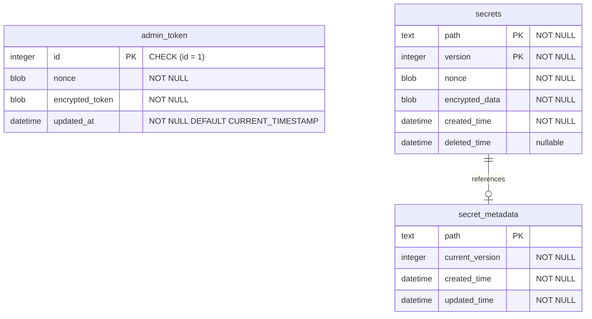

## SPIKE Nexus Backing Store

Here is the Entity-Relationship Diagram (ERD) for the SPIKE Nexus backing
store:

```mermaid
erDiagram
    admin_token {
        integer id PK "CHECK (id = 1)"
        blob nonce "NOT NULL"
        blob encrypted_token "NOT NULL"
        datetime updated_at "NOT NULL DEFAULT CURRENT_TIMESTAMP"
    }
    
    secrets {
        text path PK "NOT NULL"
        integer version PK "NOT NULL"
        blob nonce "NOT NULL"
        blob encrypted_data "NOT NULL"
        datetime created_time "NOT NULL"
        datetime deleted_time "nullable"
    }
    
    secret_metadata {
        text path PK
        integer current_version "NOT NULL"
        datetime created_time "NOT NULL"
        datetime updated_time "NOT NULL"
    }

    secrets ||--o| secret_metadata : "references"
```