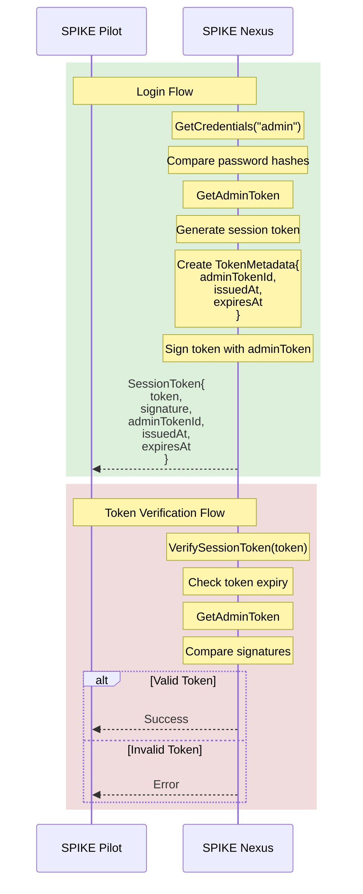

## Admin Token Verification

```mermaid
sequenceDiagram
    participant P as SPIKE Pilot
    participant N as SPIKE Nexus

    %% Login Flow
    rect rgb(220, 240, 220)
        Note over P,N: Login Flow
        Note over N: GetCredentials("admin")
        Note over N: Compare password hashes        
        Note over N: GetAdminToken
        Note over N: Generate session token
        Note over N: Create TokenMetadata{<br/>adminTokenId,<br/>issuedAt,<br/>expiresAt<br/>}
        Note over N: Sign token with adminToken
        N-->>P: SessionToken{<br/>token,<br/>signature,<br/>adminTokenId,<br/>issuedAt,<br/>expiresAt<br/>}
    end

    %% Token Verification Flow
    rect rgb(240, 220, 220)
        Note over P,N: Token Verification Flow
        Note over N: VerifySessionToken(token)
        Note over N: Check token expiry
        
        Note over N: GetAdminToken
        Note over N: Compare signatures
        
        alt Valid Token
            N-->>P: Success
        else Invalid Token
            N-->>P: Error
        end
    end
```
