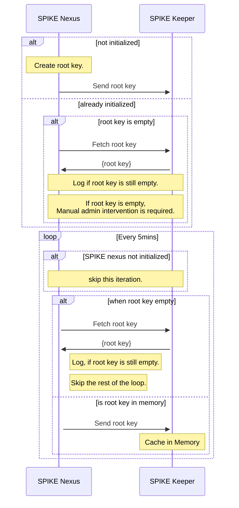

## SPIKE Nexus Root Key Provisioning

```mermaid
sequenceDiagram
    participant N as SPIKE Nexus
    participant K as SPIKE Keeper
    alt not initialized
        Note over N: Create root key.

        N->>+K: Send root key 
    else already initialized
        alt root key is empty
            N->>+K: Fetch root key 
            K->>+N: {root key}
            Note over N,K: Log if root key is still empty.
            Note over N,K: If root key is empty,<br>Manual admin intervention is required.
        end
    end

    loop Every 5mins
        alt SPIKE nexus not initialized
            Note over N,K: skip this iteration.
        end

        alt when root key empty
            N->>+K: Fetch root key 
            K->>+N: {root key}

            Note right of N: Log, if root key is still empty.
            Note right of N: Skip the rest of the loop.
        else is root key in memory
            N->>+K: Send root key

            Note over K: Cache in Memory
        end
    end
```