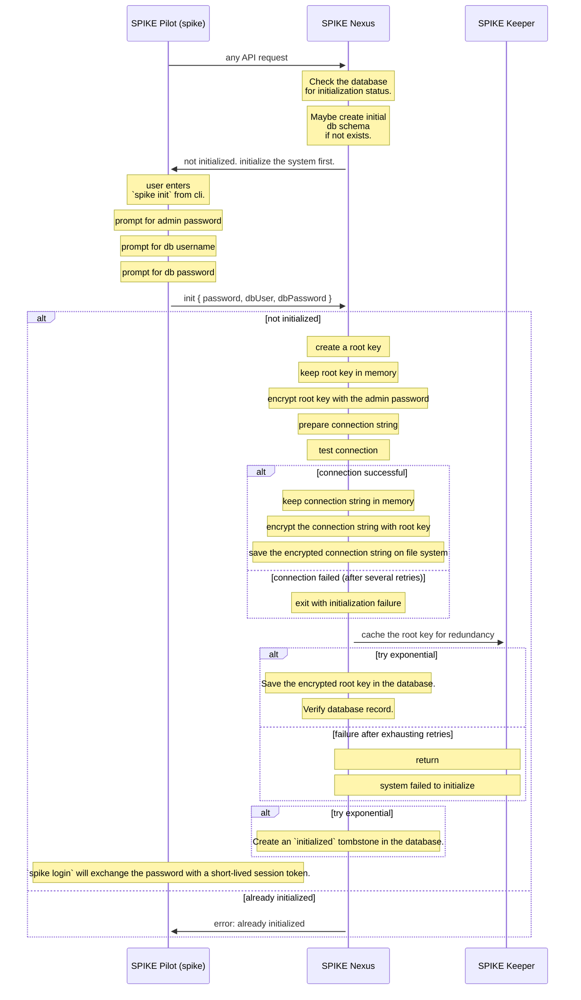

## SPIKE Initialization

```mermaid
sequenceDiagram
    participant P as SPIKE Pilot (spike)
    participant N as SPIKE Nexus
    participant K as SPIKE Keeper

    P->>+N: any API request

    Note over N: Check the database<br>for initialization status.
    Note over N: Maybe create initial<br>db schema<br>if not exists.

    N->>+P: not initialized. initialize the system first.

    Note over P: user enters<br>`spike init` from cli.

    Note over P: prompt for admin password
    Note over P: prompt for db username
    Note over P: prompt for db password

    P->>+N: init { password, dbUser, dbPassword }

    alt not initialized
        Note over N: create a root key
        Note over N: keep root key in memory
        
        Note over N: encrypt root key with the admin password
        Note over N: prepare connection string 
       
        Note over N: test connection
        
        alt connection successful
            Note over N: keep connection string in memory
            Note over N: encrypt the connection string with root key
            Note over N: save the encrypted connection string on file system
        else connection failed (after several retries)
            Note over N: exit with initialization failure
        end
        
        N->>+K: cache the root key for redundancy

        alt try exponential
            Note over N: Save the encrypted root key in the database.
            Note over N: Verify database record.
        else failure after exhausting retries
            Note over N,K: return
            Note over N,K: system failed to initialize
        end
       
        alt try exponential 
            Note over N: Create an `initialized` tombstone in the database.
        end

        Note over P: `spike login` will exchange the password with a short-lived session token.
    else already initialized
        N->>+P: error: already initialized
    end
```