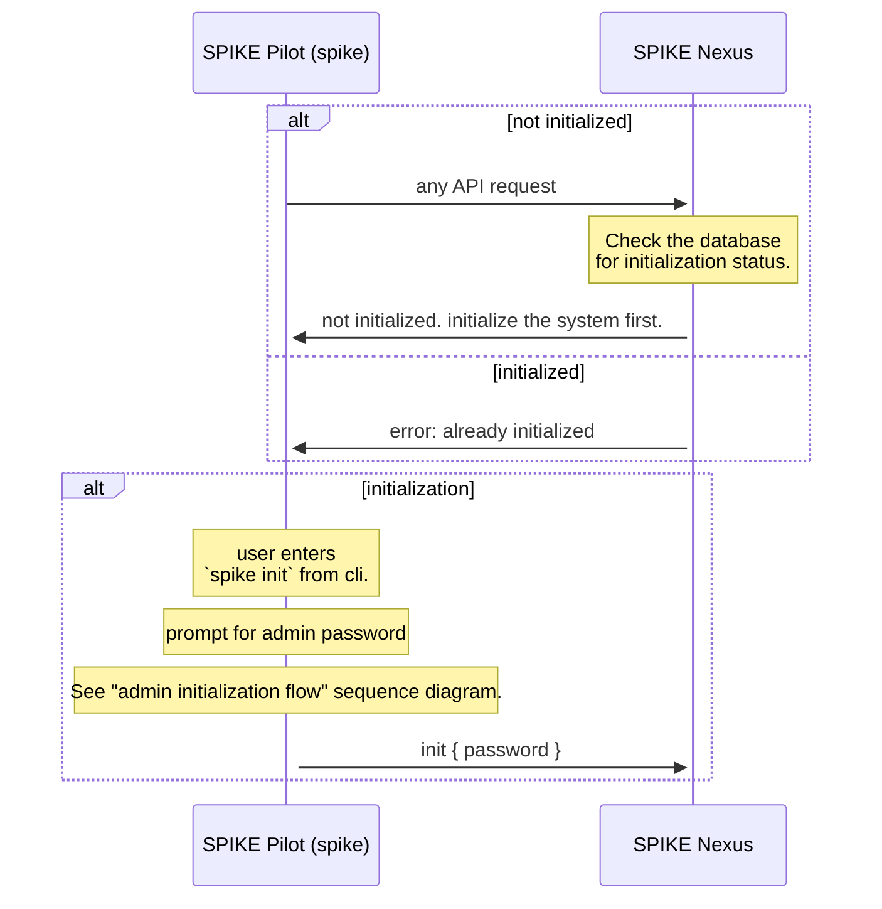

## SPIKE Initialization

```mermaid
sequenceDiagram
    participant P as SPIKE Pilot (spike)
    participant N as SPIKE Nexus

    alt not initialized

    P->>+N: any API request

        Note over N: Check the database<br>for initialization status.

        N->>+P: not initialized. initialize the system first.

    else initialized
        N->>+P: error: already initialized
    end

    alt initialization
        Note over P: user enters<br>`spike init` from cli.
        Note over P: prompt for admin password
        Note over P: See "admin initialization flow" sequence diagram.
        P->>+N: init { password }
    end
```