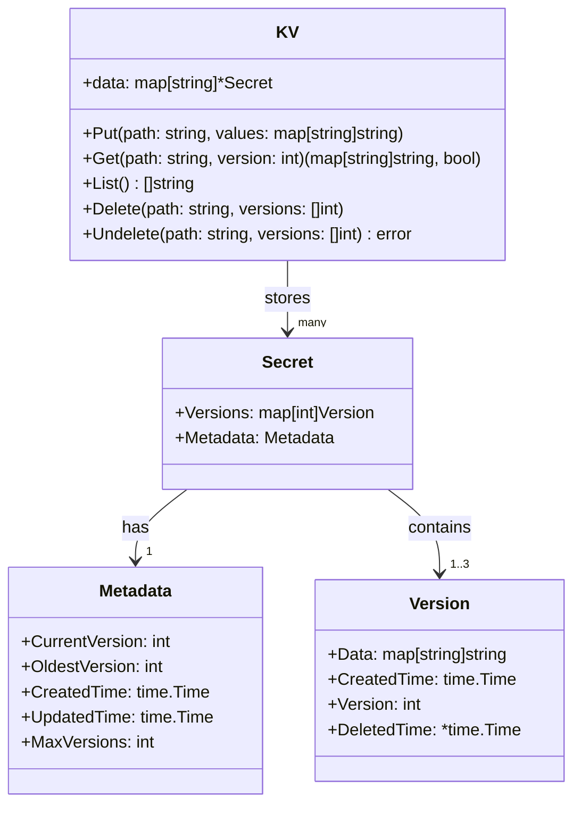

## Key-Value Store

```mermaid 
classDiagram
    class KV {
        +data: map[string]*Secret
        +Put(path: string, values: map[string]string)
        +Get(path: string, version: int) (map[string]string, bool)
        +List() []string
        +Delete(path: string, versions: []int)
        +Undelete(path: string, versions: []int) error
    }
    
    class Secret {
        +Versions: map[int]Version
        +Metadata: Metadata
    }
    
    class Version {
        +Data: map[string]string
        +CreatedTime: time.Time
        +Version: int
        +DeletedTime: *time.Time
    }
    
    class Metadata {
        +CurrentVersion: int
        +OldestVersion: int
        +CreatedTime: time.Time
        +UpdatedTime: time.Time
        +MaxVersions: int
    }
    
    KV --> "many" Secret: stores
    Secret --> "1" Metadata: has
    Secret --> "1..3" Version: contains
```
