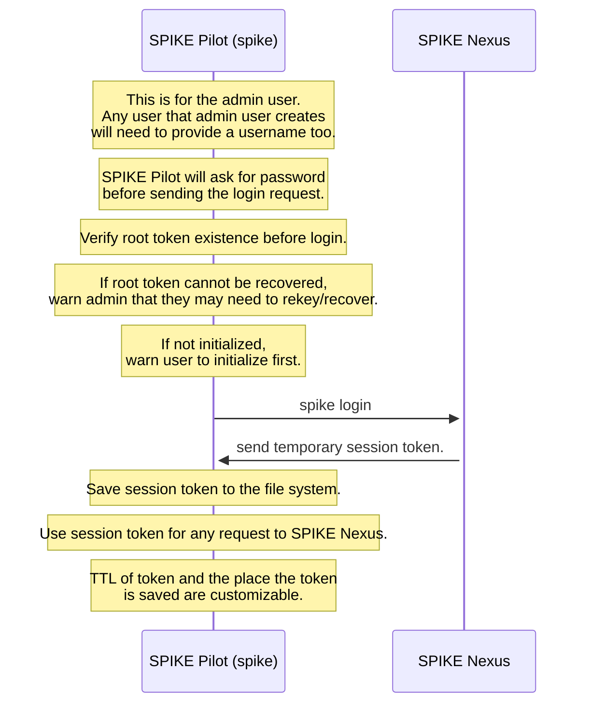

## SPIKE Login

```mermaid
sequenceDiagram
    participant P as SPIKE Pilot (spike)
    participant N as SPIKE Nexus
    
    Note over P: This is for the admin user.<br>Any user that admin user creates<br>will need to provide a username too.
    Note over P: SPIKE Pilot will ask for password<br>before sending the login request.
    Note over P: Verify root token existence before login.
    Note over P: If root token cannot be recovered,<br>warn admin that they may need to rekey/recover.
    Note over P: If not initialized,<br>warn user to initialize first.

    P->>+N: spike login 
    N->>+P: send temporary session token.

    Note over P: Save session token to the file system.
    Note over P: Use session token for any request to SPIKE Nexus.
    Note over P: TTL of token and the place the token<br>is saved are customizable.
```
