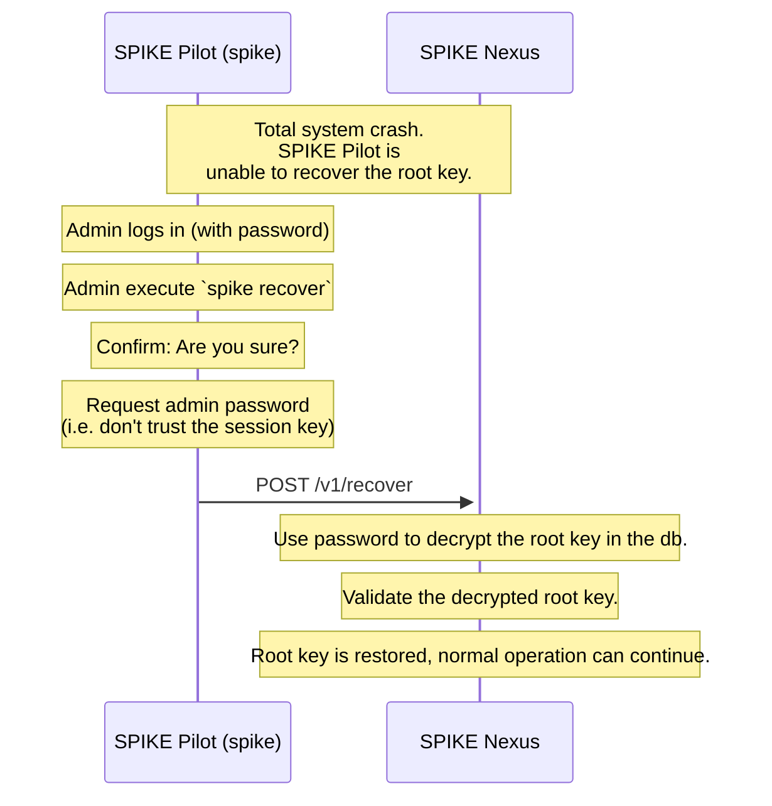

## SPIKE Manual System Re-Initialization

```mermaid 
sequenceDiagram
    participant P as SPIKE Pilot (spike)
    participant N as SPIKE Nexus

    Note over P,N: Total system crash.<br>SPIKE Pilot is<br>unable to recover the root key.

    Note over P: Admin logs in (with password)
    Note over P: Admin execute `spike recover`
    Note over P: Confirm: Are you sure?
    Note over P: Request admin password<br>(i.e. don't trust the session key)

    P->>+N: POST /v1/recover

    Note over N: Use password to decrypt the root key in the db.
    
    Note over N: Validate the decrypted root key.

    Note over N: Root key is restored, normal operation can continue.
```