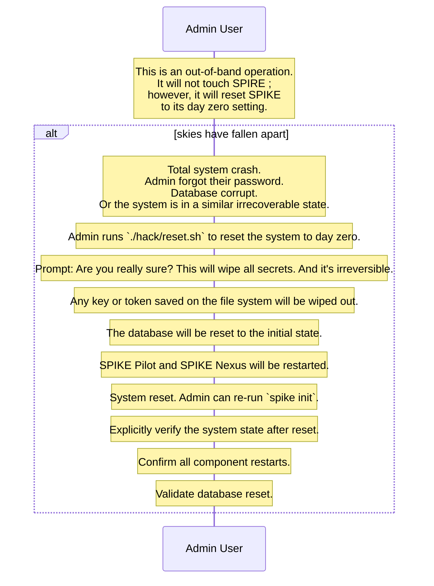

## SPIKE Forced Root Key Reset

This will make all the stored secrets obsolete, so it should be done
as a last resort. This may be required in cases where the database has been
corrupted, or the admin user has lost access to their password manager
(we hope that they don't memorize passwords, and they have more trusted ways
of keeping random long-lived passwords elsewhere, like system keyring, or a
password manager).

