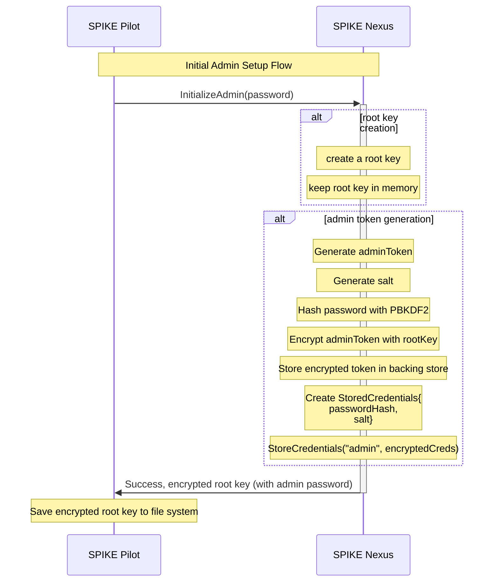

## Admin User Initialization Flow

```mermaid
sequenceDiagram
    participant P as SPIKE Pilot
    participant N as SPIKE Nexus
    
    %% Initialization Flow
    Note over P,N: Initial Admin Setup Flow
    P->>+N: InitializeAdmin(password)
   
    alt root key creation 
        Note over N: create a root key
        Note over N: keep root key in memory
    end
    
    alt admin token generation
        Note over N: Generate adminToken
        Note over N: Generate salt
        Note over N: Hash password with PBKDF2
        Note over N: Encrypt adminToken with rootKey        
        Note over N: Store encrypted token in backing store
        Note over N: Create StoredCredentials{<br/>passwordHash,<br/>salt}        
        Note over N: StoreCredentials("admin", encryptedCreds)
    end
    N->>-P: Success, encrypted root key (with admin password)
    
    Note over P: Save encrypted root key to file system
```