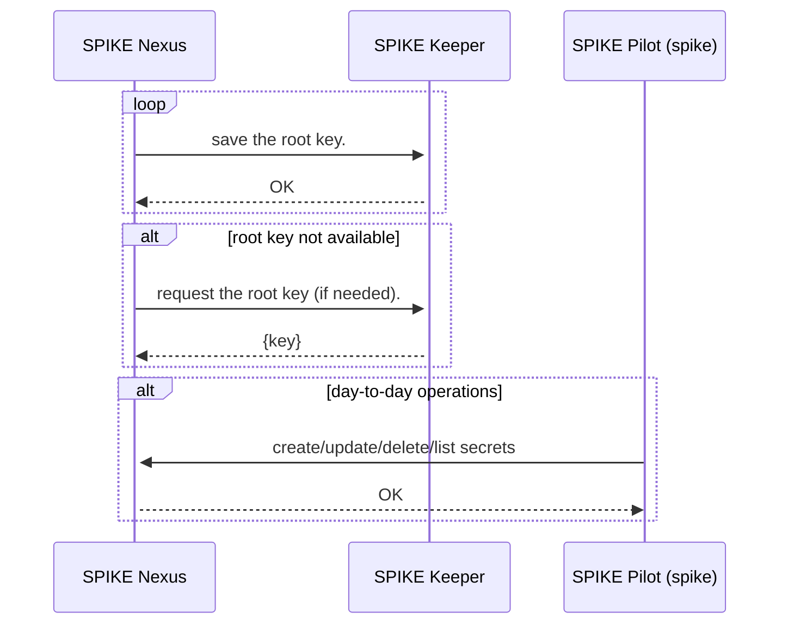

## SPIKE Components

**SPIKE** has the following system components:

* **SPIKE Nexus** (`./nexus`): The secrets store
* **SPIKE Pilot** (`./spike`): The CLI
* **SPIKE Keeper** (`./keeper`): The redundancy mechanism

The system provides high availability for secret storage with a manual recovery
mechanism in case of irrecoverable failure.

Here is an overview of each **SPIKE** component:

### SPIKE Nexus

* **SPIKE Nexus** is the primary component responsible for secrets management.
* It creates and manages the root encryption key.
* It handles secret encryption and decryption.
* It syncs to root encryption key with **SPIKE Keeper** regularly.
* It provides an admin interface for key management.

### SPIKE Keeper

* It is designed to be simple and reliable.
* Its only goal is to keep a copy of the root key in memory.
* It enables automatic recovery if **SPIKE Nexus** crashes.
* It is co-located with **SPIKE Nexus** (on the same machine/node).

### SPIKE Pilot

* It is the CLI to the system.
* It converts CLI commands to RESTful mTLS API calls to **SPIKE Nexus**.
* It is the only management entry point to the system.
* Deleting/disabling/removing **SPIKE Pilot** reduces the attack surface
  of the system since admin operation will not be possible without
  **SPIKE Pilot**.

## High-Level Component Communication

